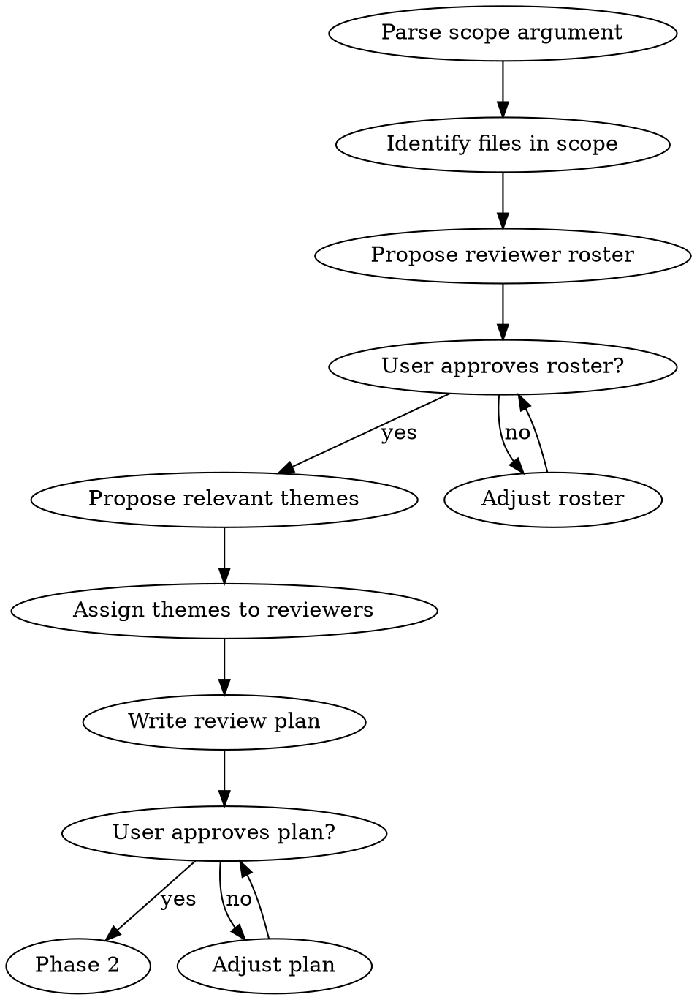
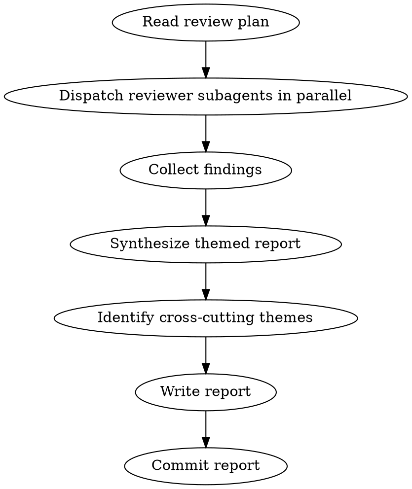

# Triage Review

## Overview

Comprehensive codebase review with selectable expert reviewer personas. Two phases: generate a review plan (scope + reviewers + themes), then dispatch parallel reviewer subagents and synthesize a themed report.

**Announce at start:** "I'm using the triage-review skill to orchestrate this codebase review."

**Read-only:** This skill produces review reports. It does NOT modify code.

## When to Use

- Explicit: user invokes `/triage-review <scope>`
- Auto-suggest after `/refactor` completes Phase 4
- Auto-suggest when 10+ commits accumulate on a feature branch since last review

**Don't use for:**
- PR-level code review (use `requesting-code-review`)
- Fixing issues (user decides what to act on, possibly via `/refactor`)
- Implementation planning (use `writing-plans`)

## Scope Types

| Scope | Argument | What's reviewed |
|-------|----------|----------------|
| Full workspace | `full` | All crates |
| Single crate | `<crate-name>` | One crate (e.g., `kirin-ir`) |
| Subsystem | `<subsystem>` | Related crates (see table below) |
| Recent changes | `recent` | `git diff` since last review or merge to main |

### Subsystem Mapping

| Subsystem | Crates |
|-----------|--------|
| `interpreter` | kirin-interpreter, kirin-derive-interpreter |
| `parser` | kirin-chumsky, kirin-chumsky-derive, kirin-chumsky-format |
| `derive` | kirin-derive-core, kirin-derive, kirin-chumsky-derive, kirin-derive-interpreter, kirin-prettyless-derive |
| `ir` | kirin-ir |
| `dialects` | kirin-cf, kirin-scf, kirin-constant, kirin-arith, kirin-bitwise, kirin-cmp, kirin-function |
| `printer` | kirin-prettyless, kirin-prettyless-derive |

## Reviewer Pool

Read persona files from `../../team/` directory.

| Reviewer | File | Expertise | Default for |
|----------|------|-----------|-------------|
| PL Theorist | `../../team/pl-theorist.md` | Formalism, abstraction design, trait boundaries | Abstractions & Type Design |
| Compiler Engineer | `../../team/compiler-engineer.md` | Build graph, error quality, scalability | Performance & Scalability |
| Rust Engineer | `../../team/implementer.md` | Code quality, idioms, safety, patterns | Code Quality & Idioms, Correctness & Safety |
| Physicist | `../../team/physicist.md` | API clarity, naming, learning curve | API Ergonomics & Naming |

**Default roster:** All four for `full` scope. For narrower scopes, propose a relevant subset based on content.

## Review Themes

| Theme | Primary Reviewer | Description |
|-------|-----------------|-------------|
| Correctness & Safety | Rust Engineer | Bugs, unsoundness, missing error handling, unsafe usage |
| Abstractions & Type Design | PL Theorist | Trait boundaries, type-level invariants, compositionality |
| Performance & Scalability | Compiler Engineer | Compilation time, runtime efficiency, build graph, scaling |
| API Ergonomics & Naming | Physicist | API clarity, concept naming, learning curve, composability |
| Code Quality & Idioms | Rust Engineer | Rust patterns, readability, maintainability |

Not all themes apply to every review. Phase 1 proposes which are relevant.

## Phase 1: Review Plan



**Output:** `docs/plans/YYYY-MM-DD-<scope>-review-plan.md`

Plan contents:
1. **Scope**: files in scope, line counts, module structure summary
2. **Reviewer roster**: which reviewers and why
3. **Themes**: which themes apply, assigned primary + optional secondary reviewer
4. **File assignments**: which files each reviewer should focus on
5. **Design context**: which AGENTS.md convention sections are relevant to this scope (will be included in reviewer prompts to prevent false positives on intentional design decisions)

## Phase 2: Execute Review



**REQUIRED SUB-SKILL:** Use superpowers:dispatching-parallel-agents to run reviewers concurrently.

### Reviewer Subagent Prompt Template

For each reviewer, dispatch a subagent with:
1. The reviewer's persona file content (read from `../../team/<persona>.md`)
2. Their assigned themes
3. The files to review (from the plan)
4. **Design context** (see below)
5. Output format instructions (see below)

#### Design context block

Before dispatching, read the project's `AGENTS.md` (specifically the conventions sections relevant to the scope — e.g., "IR Design Conventions", "Interpreter Conventions", "Derive Infrastructure Conventions"). Include the relevant sections verbatim in each reviewer's prompt as a **Design Context** block. This gives reviewers visibility into documented design decisions so they don't flag intentional patterns as issues.

#### Output format instructions

```
You are reviewing the following files as the [Reviewer Name].

Your assigned themes: [theme list]

## Design Context

The following design decisions are documented in AGENTS.md. Do NOT flag
these as issues — they are intentional:

[paste relevant AGENTS.md convention sections here]

## Confidence Requirement

For each finding, you MUST classify your confidence:

- **confirmed**: You are certain this is an issue (e.g., demonstrable bug,
  clear violation of Rust idioms, provably incorrect logic). Use for P0/P1.
- **likely**: You believe this is an issue but there may be a design reason
  you're not aware of. Use for P1/P2.
- **uncertain**: This looks unusual but could be intentional. You cannot
  rule out a valid design reason. Use for P2/P3 only.

Do NOT assign P0 or P1 severity to findings with "uncertain" confidence.
When uncertain, phrase the finding as a question (e.g., "Is X intentional?
If not, consider Y.").

## Output Format

For each finding:
[severity] [confidence] finding description — file:line

Severity levels:
- P0: Must fix (bugs, unsoundness, correctness issues)
- P1: Should fix (significant improvements, design issues)
- P2: Nice to have (minor improvements, ergonomic tweaks)
- P3: Informational (observations, notes for future)

Keep your review to 200-400 words. Focus on your assigned themes.
```

### Report Synthesis

After all reviewers return, synthesize into themed report.

#### Pre-filter step

Before writing the report, cross-reference every finding against:
1. `AGENTS.md` design conventions — drop findings that contradict documented decisions
2. `CLAUDE.md` project instructions — drop findings that conflict with stated conventions
3. Previous review reports in `docs/reviews/` — drop findings already marked `[Won't Fix]` in prior reviews

For each dropped finding, note it in a `## Filtered Findings` section at the end of the report (collapsed by default) so the user can audit what was removed and why.

#### Synthesis steps

1. Group findings by theme (not by reviewer)
2. Within each theme, sort by severity (P0 first)
3. Include reviewer attribution and confidence inline: `[P1] [confirmed] finding — file:line [PL Theorist]`
4. Identify cross-cutting themes (patterns across 2+ reviewers/themes)
5. Write summary counts (separately for confirmed vs uncertain findings)

**Output:** `docs/reviews/YYYY-MM-DD-<scope>-review.md`

### Report Format

```markdown
# <Scope> Review — YYYY-MM-DD

**Scope:** <description>
**Reviewers:** <list>
**Plan:** docs/plans/YYYY-MM-DD-<scope>-review-plan.md

## Correctness & Safety
[P0] [confirmed] <finding> — <file:line> [Reviewer]
[P1] [likely] <finding> — <file:line> [Reviewer]

## Abstractions & Type Design
...

## Performance & Scalability
...

## API Ergonomics & Naming
...

## Code Quality & Idioms
...

## Cross-Cutting Themes
1. <theme> — identified by <N> reviewers across <themes>

## Summary
- P0: N issues (must fix)
- P1: N issues (should fix)
- P2: N improvements (nice to have)
- P3: N notes (informational)

Confirmed: N | Likely: N | Uncertain: N

## Filtered Findings

<details>
<summary>N findings filtered (click to expand)</summary>

- <finding> — filtered because: <reason (e.g., "contradicts AGENTS.md IR Design Conventions: deleted flag needed for rewrite framework")>
- ...
</details>
```

## Red Flags — STOP

- Modifying any code (this skill is read-only)
- Skipping Phase 1 (user must approve plan before expensive review)
- Dispatching reviewers sequentially instead of in parallel
- Writing findings without file:line references
- Proceeding with review after user rejects the plan
- Assigning P0/P1 to a finding with "uncertain" confidence
- Omitting design context from reviewer prompts (causes false positives on intentional patterns)
- Skipping the pre-filter step (causes findings that contradict documented decisions)

## Integration

**Skills this skill uses:**
- `dispatching-parallel-agents` — run reviewer subagents concurrently
- Persona files from `../../team/` — reviewer role definitions

**Skills that call this skill:**
- `/refactor` Phase 4 — auto-suggests `/triage-review` after refactor completes
- `/finishing-a-development-branch` — could auto-suggest `/triage-review recent` before merge

**Related but distinct:**
- `requesting-code-review` — PR-level review (not codebase-wide)
- `writing-plans` — implementation planning (not review)
