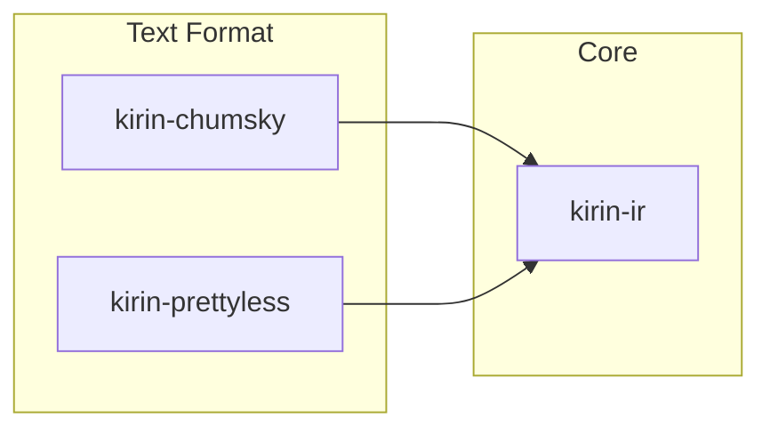

# Kirin Design

Design documentation for the Kirin compiler infrastructure.

## Overview

Kirin is a modular compiler infrastructure where **any Rust type can be a dialect**. Dialects compose through standard Rust enums.

## Design Notes

- [IR Design](./ir.md) — Dialect composability and type system design
- [Text Format](./text-format.md) — Parser and pretty printer overview

## Crate Map

- **`kirin-ir`** — Core IR: `Dialect`, `Context`, `Statement`, `Block`, `Region`
- **`kirin-chumsky`** — Parser traits: `HasParser`, `HasRecursiveParser`, `EmitIR`
- **`kirin-prettyless`** — Pretty printer: `PrettyPrint`
- **`kirin-chumsky-derive`** — `#[derive(HasParser, PrettyPrint)]`
