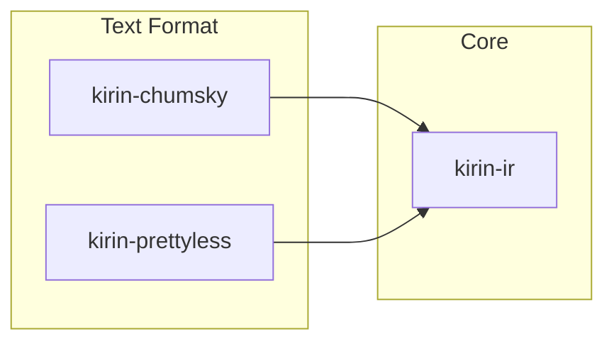

# Kirin Design

Design documentation for the Kirin compiler infrastructure.

!!! note
    The design document are mostly generated by coding agents, but humans are welcome to contribute and review.
    The role of design documents is to provide a high-level guide to the design decisions and architecture of Kirin.

## Overview

Kirin is a modular compiler infrastructure where **any Rust type can be a dialect**. Dialects compose through standard Rust enums.

## Design Notes

- [IR Design](./ir.md) — Dialect composability and type system design
- [Text Format](./text-format.md) — Parser and pretty printer overview
- [Functions](./function.md) — Multi-stage function model and specialization
- [Function Parser Interface](./function-parser-interface.md) — Parser API dual to function pretty printing

## Crate Map

- **`kirin-ir`** — Core IR: `Dialect`, `StageInfo`, `Statement`, `Block`, `Region`
- **`kirin-chumsky`** — Parser traits: `HasParser`, `HasRecursiveParser`, `EmitIR`
- **`kirin-prettyless`** — Pretty printer: `PrettyPrint`
- **`kirin-chumsky-derive`** — `#[derive(HasParser, PrettyPrint)]`
