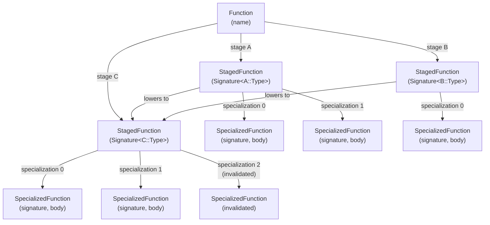
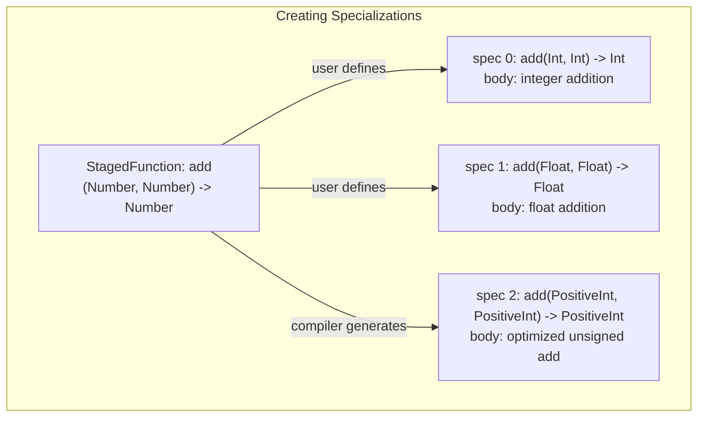
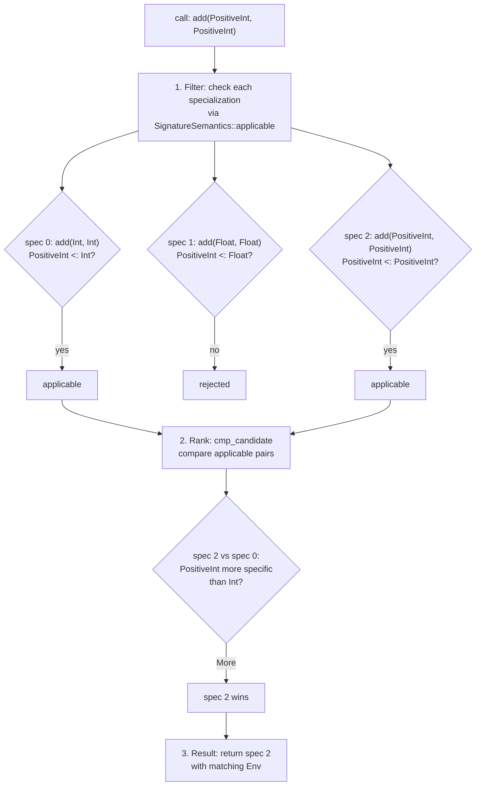
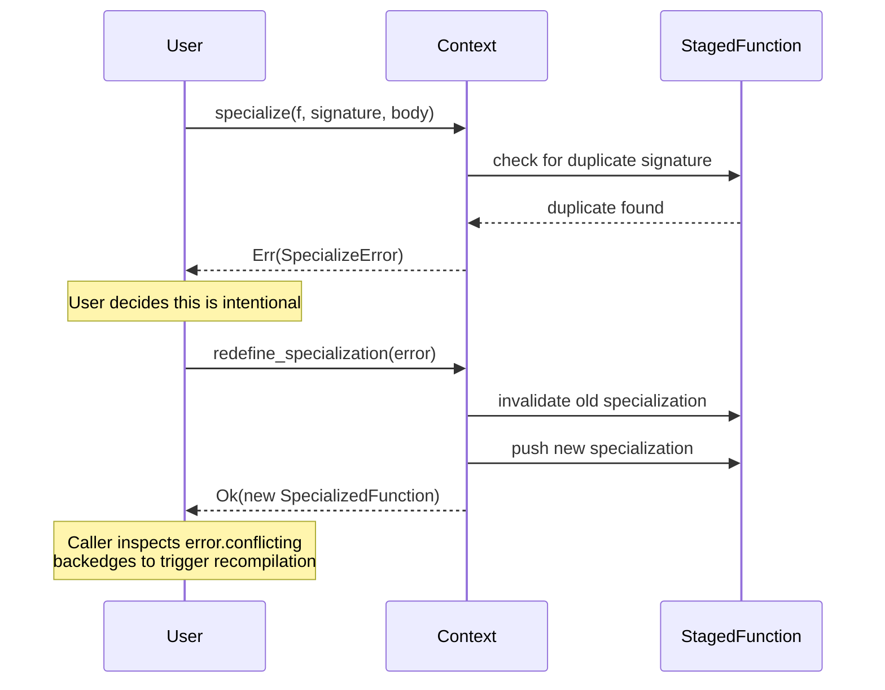

# Functions in Kirin

Functions are the central abstraction in Kirin. A function is a callable object that exists across multiple compilation stages and can be specialized into different implementations based on input types.

## Function Hierarchy



The three levels:

- **`Function`** -- an abstract callable identified by name. Maps each `CompileStage` to a `StagedFunction`. Stages do not form a linear pipeline -- they are a directed graph. Multiple high-level stages can lower to the same target stage (e.g., both A and B lower to C), and a user can choose which abstraction to program in. Stages that are no longer needed after lowering may be discarded to save memory.

- **`StagedFunction`** -- a function at one compilation stage. Owns the user-declared `Signature<L::Type>` using that stage's type system. Contains zero or more `SpecializedFunction`s and tracks backedges (callers) for inter-procedural analysis. A staged function with no specializations represents an extern function (signature only, no body). A user who prefers to work at a lower level of abstraction can define a staged function directly at a later stage, bypassing earlier stages entirely.

- **`SpecializedFunction`** -- a concrete implementation for a specific input signature that is a subset of its parent staged function's signature. Contains a `Signature<L::Type>` (defaults to the staged signature if not provided), a body `Statement` defined by dialect, and backedges. Dispatch among specializations is governed by `SignatureSemantics` (see [signature.md](signature.md)).

## How Specialization Works

When a function is called, the runtime or compiler needs to find the best implementation for the given argument types. This is specialization dispatch.

### Creating specializations

A staged function starts with a general signature. Specializations are created to provide concrete implementations for specific input types:

1. **From user code.** A user writes multiple method bodies for different type combinations. Each becomes a `SpecializedFunction` under the same staged function.

2. **From the compiler.** During compilation, the compiler may generate specializations automatically. For example, a JIT compiler observing that `add` is always called with `(Int, Int)` may compile a specialized version for that signature.



### Dispatch

Given a call signature, `StagedFunctionInfo::all_matching` finds the best-matching specialization(s):



The three steps in detail:

1. **Filter.** Each non-invalidated specialization is tested via `SignatureSemantics::applicable`. For exact semantics, the call types must match exactly. For lattice semantics, the call types must be subtypes of the specialization's parameter types.

2. **Rank.** When multiple specializations are applicable, `SignatureSemantics::cmp_candidate` compares them pairwise. More specific candidates (tighter types or constraints) are preferred. Only the most specific candidates survive -- any candidate that is strictly less specific than another applicable candidate is eliminated.

3. **Result.** The caller receives the winning specialization(s) along with matching environments (e.g., solved type-variable bindings). If no specialization matches, the caller falls back to interpretation, compilation, or an error, depending on the context.

### Exact semantics example

```
staged function: add(Number, Number) -> Number

specialization 0: add(Int, Int) -> Int         -- user-provided
specialization 1: add(Float, Float) -> Float   -- user-provided

call: add(Int, Int)
  -> applicable: spec 0 (exact match), spec 1 (not applicable)
  -> result: spec 0

call: add(Float, Float)
  -> applicable: spec 0 (not applicable), spec 1 (exact match)
  -> result: spec 1
```

### Lattice semantics example

With a subtype hierarchy (`PositiveInt <: Int <: Number`):

```
specialization 0: add(Int, Int) -> Int
specialization 2: add(PositiveInt, PositiveInt) -> PositiveInt

call: add(PositiveInt, PositiveInt)
  -> applicable: spec 0 (PositiveInt <: Int), spec 2 (exact match)
  -> cmp_candidate: spec 2 is more specific
  -> result: spec 2
```

## Why Invalidation Exists

Functions in Kirin can be redefined. This happens in two distinct scenarios:

### Replacing a specialization

A compiler may automatically generate a specialization that works but is not optimal. The user (or a later optimization pass) may want to replace it with a better version.

For example, the compiler auto-generates `add(Int, Int) -> Int` using a generic lowering path. The user knows that for their target architecture, a SIMD-based implementation is faster. They define a new specialization with the same signature `add(Int, Int) -> Int` and a different body.

Without invalidation, creating a second specialization with the same signature would be ambiguous -- the system cannot tell whether this is an accidental duplicate (a bug) or an intentional replacement. The duplicate detection catches this and returns an error. The user then explicitly calls `redefine_specialization` to signal their intent: invalidate the old one and register the new one.

### Replacing a staged function entirely

A user may want to rewrite an entire function implementation at a given compile stage. Perhaps the original definition was a prototype, or the user wants to change the function's signature entirely.

For example, a staged function `process(Stream) -> Result` was defined during an earlier compilation pass. The user decides the function should instead be `process(Stream, Config) -> Result`. They create a new staged function with the updated signature. The system detects the name conflict and returns an error. The user calls `redefine_staged_function` to invalidate the old definition and register the new one.

### How invalidation works

Invalidated entries are not deleted. They remain in the IR with their backedge information intact. This is important because other functions may have been compiled against the old definition. The backedges on the invalidated entry tell the system exactly which callers need to be recompiled.



This design follows Julia's method invalidation model: old definitions are not erased but marked invalid, and the backedge graph identifies the transitive closure of what needs recompilation.

## Specialization vs. Multiple Dispatch

Kirin's specialization mechanism resembles Julia's multiple dispatch on the surface, but the design intent is different.

In Julia, multiple dispatch is a first-class language feature: users freely define many methods with the same name but different signatures, and the runtime selects the best match at each call site. The set of methods for a given name is open-ended -- any module can add a new method with a novel signature.

Kirin does **not** aim to be a multiple dispatch system. The key distinction:

- **A function has one semantic signature.** All staged functions with the same name are expected to represent the same abstract operation with semantically equivalent signatures. The signatures may be expressed in different type systems (because different stages use different types), but they must describe the same input/output contract. For example, `add(Number, Number) -> Number` at stage A and `add(i64, i64) -> i64` at stage C are different type-level representations of the same operation.

- **Specialization is subsetting, not overloading.** Specializations refine a single declared signature into more specific implementations. `add(Int, Int) -> Int` is a subset of `add(Number, Number) -> Number`. This is specialization -- choosing a better implementation for a narrower input. It is not defining a fundamentally different operation that happens to share a name.

- **Duplicate name + different signature is an error.** Currently, creating a staged function with the same name but a different signature as an existing one is rejected. This is intentional: it prevents accidental overloading and keeps the function model simple.

### Future: optional multiple dispatch

The infrastructure could naturally support multiple dispatch, since it is just specialization with disjoint (non-subset) signatures under the same name. A future extension could add an opt-in flag that relaxes the same-name/same-signature constraint, allowing users to define staged functions with the same name but different signatures. This would enable Julia-style open method tables for languages that want it, without imposing the complexity on languages that don't.

## Key Code Locations

- **Function hierarchy** -- `kirin-ir/src/node/function.rs`
- **Builder API** (`specialize`, `staged_function`, `redefine_*`) -- `kirin-ir/src/builder/context.rs`
- **Error types** (`SpecializeError`, `StagedFunctionError`) -- `kirin-ir/src/builder/error.rs`
- **Signature and dispatch semantics** -- `kirin-ir/src/signature.rs`, see also [signature.md](signature.md)
