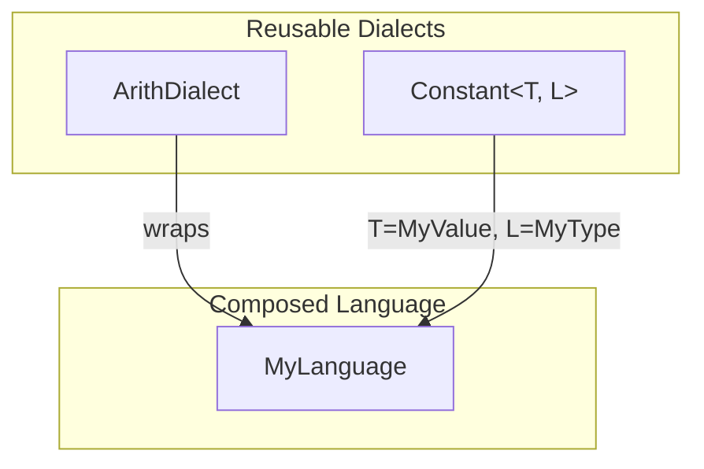

# Kirin IR Design

## Core Insight

**Any Rust type can be a dialect.** Composing dialects means composing small languages using standard Rust type definitions.

## Dialect Composability

Each dialect is a small language with:
- An instruction set (the Rust type's variants/fields)
- A type (`Dialect::Type: CompileTimeValue + Default`)
- Compile-time values (`CompileTimeValue` trait)

New languages are created by wrapping dialects in a Rust enum:

```rust
#[derive(Dialect)]
#[kirin(type = MyType)]
pub enum MyLanguage {
    #[kirin(wraps)]
    Arith(ArithDialect),
    #[kirin(wraps)]
    Constant(Constant<MyValue, MyType>),
}
```



## Parameterized Dialects

Some dialects are generic over the type system:

```rust
// Works with any type that has TypeLattice (lattice ops + CompileTimeValue + Default)
pub struct Constant<T: CompileTimeValue + Typeof<Ty>, Ty: TypeLattice> { ... }
```

This allows the same dialect to be reused across languages with different type systems.

## Design Highlights

- **No dialect registry** — Composition happens at compile time via Rust's type system, not runtime registration
- **Zero-overhead dispatch** — Enum variants compile to efficient match statements
- **Type-safe field access** — `Statement<L>` gives typed access to dialect-specific data
- **Flexible type systems** — `Dialect::Type` only requires `CompileTimeValue + Default`; lattice operations are opt-in via `TypeLattice`
- **Customizable specialization** — `SignatureSemantics` trait allows languages to define their own dispatch logic (see [signature.md](signature.md))

## Key Code Locations

- **`Dialect` trait** — `kirin-ir/src/language.rs`
- **`TypeLattice` trait** — `kirin-ir/src/lattice.rs`
- **Signature & specialization** — `kirin-ir/src/signature.rs` (see [signature.md](signature.md))
- **`Context<L>`** — `kirin-ir/src/context.rs`
- **`#[derive(Dialect)]`** — `kirin-derive/`
- **Example dialect** — `kirin-constant/src/lib.rs`
