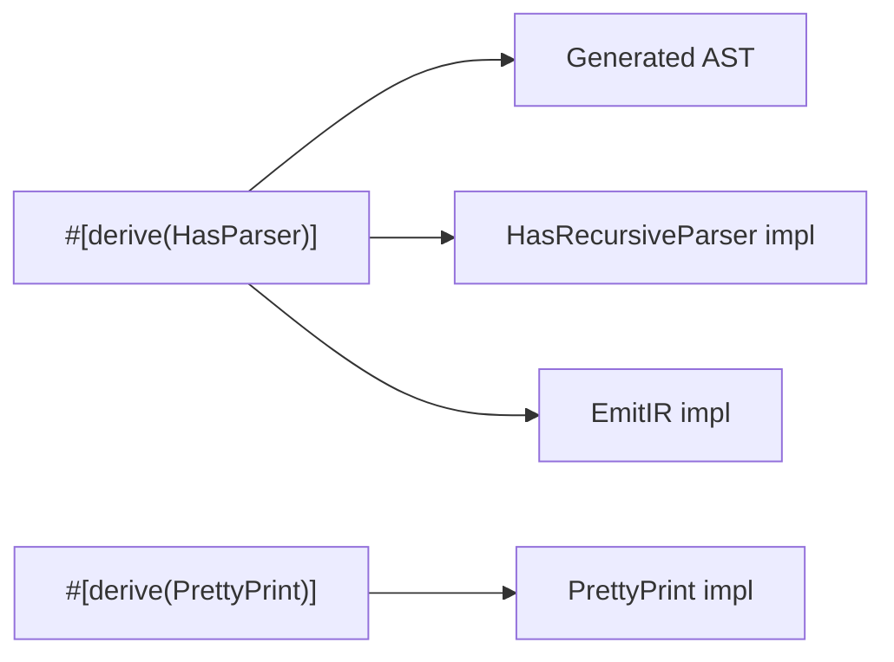

# Text Format

Parser and pretty printer integration for Kirin IR.

## Roundtrip Pipeline

```
Source Text → Parser → AST → EmitIR → IR → PrettyPrint → Source Text
```

## Usage

```rust
#[derive(Dialect, HasParser, PrettyPrint)]
#[kirin(type_lattice = MyType)]
#[chumsky(crate = kirin_chumsky)]
pub enum MyDialect {
    #[chumsky(format = "{res:name} = add {lhs} {rhs}")]
    Add { res: ResultValue, lhs: SSAValue, rhs: SSAValue },
}
```

## Format String Syntax

### General Syntax
- **`{field}`** — Parse/print with default format
- **`{0}`, `{1}`** — Positional fields

### SSA/Result Value Fields
- **`{field:name}`** — Name only (for SSA/Result)
- **`{field:type}`** — Type only (for SSA/Result)

### Block Fields
For `Block` fields, the format is `{field}`, which will parse/print the block header and the block body using the default format.

### Region Fields
For `Region` fields, the format is `{field}`, which will parse/print the region header and the region body using the default format. The region body is a list of blocks, so the format for blocks is `{field}`.

### Successor Fields
For `Successor` fields, the format is `{field}`, which will parse/print the successor block label.

### Value Fields
For `Value` fields, the format is `{field}`, which will parse/print the value using the default format.

## Architecture



## Design Highlights

- **Two-phase parsing** — Parser produces AST, then `EmitIR` converts to IR. This separation enables AST inspection and better error messages.

- **Generic AST over Language** — `MyDialectAST<'t, 's, Language>` allows the same AST to be used when parsing composed dialects.

- **AST types generic over TypeOutput** — `SSAValue<'src, TypeOutput>` avoids requiring `TypeLattice: HasParser` at struct definition time.

- **Method-level trait bounds** — The `TypeLattice: HasParser` bound is on `recursive_parser()` method, not the `HasRecursiveParser` trait, to avoid circular resolution.

- **Roundtrip fidelity** — SSA names from source (e.g., `%x`) are preserved in IR for exact roundtrip.

## Key Code Locations

- **Parser traits** — `kirin-chumsky/src/traits.rs`
- **AST types** — `kirin-chumsky/src/ast.rs`
- **Parser combinators** — `kirin-chumsky/src/parsers.rs`
- **Derive macros** — `kirin-chumsky-format/src/generate/`
- **Tests** — `kirin-chumsky-derive/tests/`
