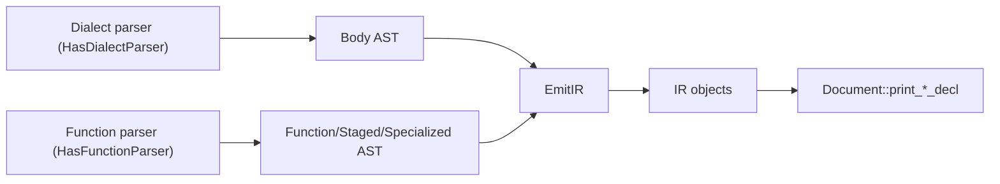

# Text Format

Parser and pretty printer integration for Kirin IR.

This design now covers both:

- statement/dialect text format (`Statement`, `Block`, `Region`)
- first-class function objects (`Function`, `StagedFunction`, `SpecializedFunction`)

## Roundtrip Pipeline

```
Source Text
  -> Parser
  -> AST
  -> EmitIR
  -> IR (Function/StagedFunction/SpecializedFunction/Statement)
  -> PrettyPrint
  -> Source Text
```

## Statement-Level Usage

```rust
#[derive(Dialect, HasParser, PrettyPrint)]
#[kirin(type = MyType)]
#[chumsky(crate = kirin_chumsky)]
pub enum MyDialect {
    #[chumsky(format = "{res:name} = add {lhs} {rhs}")]
    Add { res: ResultValue, lhs: SSAValue, rhs: SSAValue },
}
```

## Statement Format String Syntax

### General syntax

- **`{field}`**: parse/print with default format
- **`{0}`, `{1}`**: positional fields

### SSA/Result value fields

- **`{field:name}`**: name only (for SSA/Result)
- **`{field:type}`**: type only (for SSA/Result)

### Block fields

For `Block` fields, the format is `{field}`. It parses/prints the block header and body with default behavior.

### Region fields

For `Region` fields, the format is `{field}`. It parses/prints the region header and body with default behavior.

### Successor fields

For `Successor` fields, the format is `{field}`. It parses/prints the successor block label.

### Value fields

For compile-time value fields, the format is `{field}`.

## Function-Level Text Model

Kirin has three function objects:

- `Function`: abstract callable symbol (across stages)
- `StagedFunction`: function at one compile stage with a declared signature
- `SpecializedFunction`: concrete implementation for a refined signature

The text format should represent all three, while preserving that the body is still a dialect statement.

## Proposed Concrete Syntax

### Signature

```
(T1, T2, ...) -> R
```

Optional constraints:

```
(T1, T2, ...) -> R where <constraint-expr>
```

### Function

```text
func @add {
  stage @frontend (Int, Int) -> Int {
    spec (Int, Int) -> Int {
      body = function {
        ^entry(%x: Int, %y: Int) {
          %z = add %x %y;
          return %z;
        }
      };
    }

    spec (Float, Float) -> Float {
      body = function {
        ^entry(%x: Float, %y: Float) {
          %z = add %x %y;
          return %z;
        }
      };
    }
  }

  stage @llvm (i64, i64) -> i64 extern;
}
```

### StagedFunction

```text
stage @stage_name (T1, T2) -> R {
  spec ... { ... }
}
```

Extern staged function (signature only):

```text
stage @stage_name (T1, T2) -> R extern;
```

### SpecializedFunction

```text
spec (T1, T2) -> R {
  body = <dialect-statement>;
}
```

### Invalidation (optional in text)

Invalidated entries are typically hidden by default, but can be represented explicitly for debugging/serialization:

```text
stage invalidated @frontend (Int, Int) -> Int { ... }
spec invalidated (Int, Int) -> Int { ... }
```

### Notes

- `body` is a statement, not a separate function AST language.
- backedges and arena IDs are IR-internal metadata and are not part of default textual syntax.
- this format cleanly supports dialects like `SimpleFunction` where body is just a `Region`.

## Proposed Grammar (EBNF-style)

```text
FunctionDecl        ::= "func" Symbol "{" { StagedDecl } "}"
StagedDecl          ::= "stage" [ "invalidated" ] StageName Signature [WhereClause]
                        ( "extern" ";" | "{" { SpecializedDecl } "}" )
SpecializedDecl     ::= "spec" [ "invalidated" ] Signature [WhereClause]
                        "{" "body" "=" Statement ";" "}"
Signature           ::= "(" [Type {"," Type}] ")" "->" Type
WhereClause         ::= "where" ConstraintExpr
```

## Parser Interface Proposal

Current parser APIs focus on statement-level dialect parsing. To support first-class functions, add a function-layer parser that composes with existing statement parsers.

### Proposed AST nodes

```rust
pub struct FunctionAst<T, C, BodyAst> {
    pub name: String,
    pub staged: Vec<StagedFunctionAst<T, C, BodyAst>>,
}

pub struct StagedFunctionAst<T, C, BodyAst> {
    pub stage: String,
    pub signature: Signature<T, C>,
    pub is_invalidated: bool,
    pub is_extern: bool,
    pub specializations: Vec<SpecializedFunctionAst<T, C, BodyAst>>,
}

pub struct SpecializedFunctionAst<T, C, BodyAst> {
    pub signature: Signature<T, C>,
    pub is_invalidated: bool,
    pub body: BodyAst,
}
```

### Proposed traits

```rust
pub trait HasFunctionParser<'tokens, 'src: 'tokens, L: Dialect>: Sized {
    type TypeOutput: Clone + PartialEq + 'tokens;
    type ConstraintOutput: Clone + PartialEq + Default + 'tokens;
    type BodyOutput: Clone + PartialEq + 'tokens;
    type StageOutput: Clone + PartialEq + 'tokens;

    fn function_parser<I>(
        body: RecursiveParser<'tokens, 'src, I, Self::BodyOutput>,
    ) -> BoxedParser<'tokens, 'src, I, FunctionAst<Self::TypeOutput, Self::ConstraintOutput, Self::BodyOutput>>
    where
        I: TokenInput<'tokens, 'src>;

    fn staged_function_parser<I>(
        body: RecursiveParser<'tokens, 'src, I, Self::BodyOutput>,
    ) -> BoxedParser<'tokens, 'src, I, StagedFunctionAst<Self::TypeOutput, Self::ConstraintOutput, Self::BodyOutput>>
    where
        I: TokenInput<'tokens, 'src>;

    fn specialized_function_parser<I>(
        body: RecursiveParser<'tokens, 'src, I, Self::BodyOutput>,
    ) -> BoxedParser<'tokens, 'src, I, SpecializedFunctionAst<Self::TypeOutput, Self::ConstraintOutput, Self::BodyOutput>>
    where
        I: TokenInput<'tokens, 'src>;

    fn stage_parser<I>() -> BoxedParser<'tokens, 'src, I, Self::StageOutput>
    where
        I: TokenInput<'tokens, 'src>;
}
```

### Emit interface

Add `EmitIR` impls for these AST nodes:

- `FunctionAst -> Function`
- `StagedFunctionAst -> StagedFunction`
- `SpecializedFunctionAst -> SpecializedFunction`

Emission uses existing `StageInfo::{staged_function, specialize}` APIs and policy checks.

## Pretty Printing Interface Proposal

Current pretty printer has `print_staged_function` and `print_specialized_function`, but output is summary-only. Move to full declarative syntax.

### Proposed `Document` methods

```rust
impl<'a, L: Dialect + PrettyPrint> Document<'a, L>
where
    L::Type: std::fmt::Display,
{
    pub fn print_function(&'a self, func: &Function) -> ArenaDoc<'a>;
    pub fn print_staged_function_decl(&'a self, func: &StagedFunction) -> ArenaDoc<'a>;
    pub fn print_specialized_function_decl(&'a self, func: &SpecializedFunction) -> ArenaDoc<'a>;
}
```

### Proposed config knobs

```rust
pub struct FunctionPrintOptions {
    pub show_invalidated: bool, // default: false
    pub show_backedges: bool,   // default: false
    pub compact: bool,          // default: false
}
```

Attach these options to `pretty::Config` so users can switch between human-friendly and debug-oriented output.

### Pretty print behavior

- `Function`: prints all staged entries in deterministic order.
- `StagedFunction`: prints stage name, signature, extern marker or specialization block.
- `SpecializedFunction`: prints signature and `body = <statement>;`.
- invalidated entries are omitted unless `show_invalidated = true`.

## Architecture



## Design Highlights

- Two-phase parsing remains: parse AST first, then emit IR.
- Function-layer parsing composes with existing statement parsers.
- Body remains dialect-owned; metadata remains function-layer owned.
- Roundtrip fidelity includes staged signatures and specialization structure.

## Key Code Locations

- Parser traits: `kirin-chumsky/src/traits.rs`
- Statement AST types: `kirin-chumsky/src/ast.rs`
- Pretty printer core: `kirin-prettyless/src/document.rs`
- Function model: `kirin-ir/src/node/function.rs`
- Function body statement example: `crates/kirin-function/src/lib.rs`
