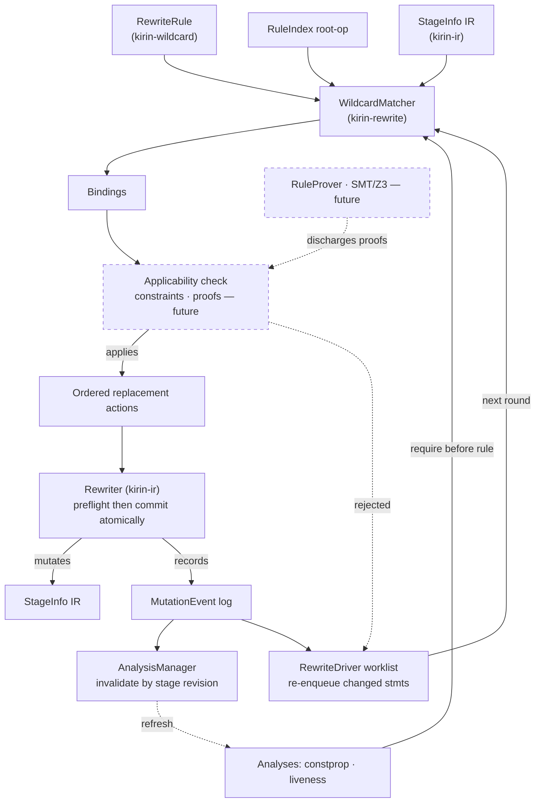
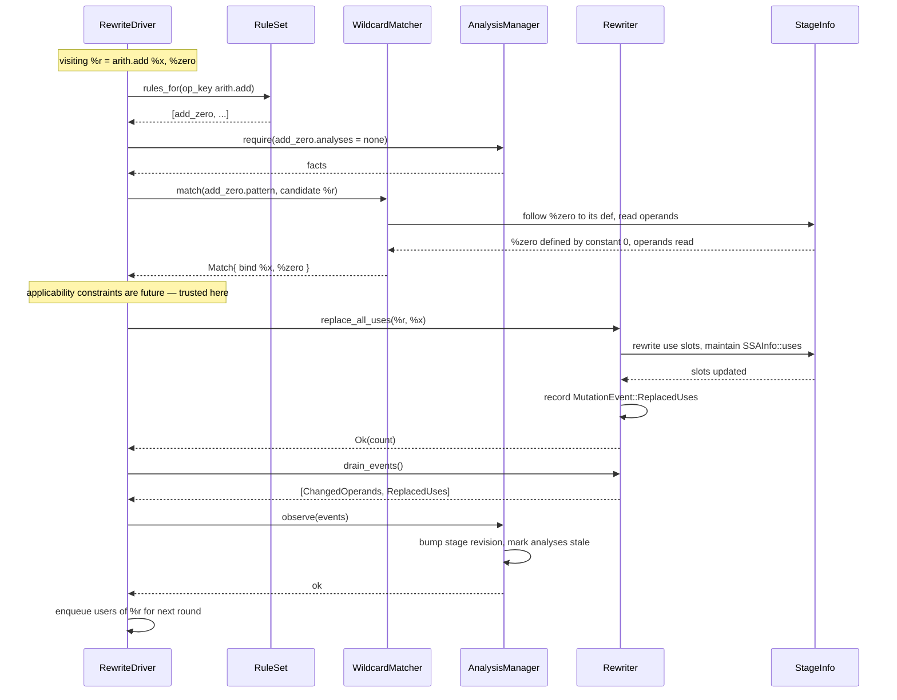

# Rewrite Engine

Status: **draft; first-draft scope decided; M0A landed; M1 is partial**.
Branch: `dl/rewrite-engine`.

Companion design note: [Dialect and DSL Integration Contract](rewrite-engine-dialect-integration.md).
That note defines the proposed dialect-facing contract. Downstream compiler
integration details are outside its scope.

This document proposes a Kirin 2.0 rewrite framework. The core design is:

> Rewrites are separate from the interpreter framework. The interpreter
> framework computes typed facts. The rewrite framework matches patterns and
> mutates IR using those facts.

The rewrite engine should not be modeled as `Interpretable<I, DCE>` or
`Interpretable<I, ConstantFold>` as its primary extension point. That would
make rewrites opaque statement-local code again, which is the main limitation
of Kirin-python. The primary rewrite representation should be **rules as data**:
Kirin-like pattern IR plus wildcard/capture operations and ordered replacement
actions. Applicability constraints and semantic proof backends are future
extensions, not requirements for the first draft.

The first implementation should be conservative:

1. Define the complete SSA use-site contract.
2. Build safe mutation APIs over finalized arena IR.
3. Bootstrap native Rust rules with a simple walk/fixpoint scheduler.
4. Add structural single-statement wildcard matching and ordered replacements.
5. Invalidate cached analyses by stage revision when analysis integration is
   introduced.
6. Leave rule constraints, semantic proofs, SMT integration, CFG-wide matching,
   graph matching, and equality saturation as later layers.

### Explicit first-draft exclusions

Do not implement any of the following while building the first draft:

- a `Constraint` data model or constraint-expression language;
- a native constraint registry or constraint evaluator;
- a `RuleProver`, `ProofEvidence`, proof obligations, or proof policy;
- an SMT/Z3 dependency or solver integration;
- solver-backed rule acceptance;
- generalized statement, block, attribute, type, or graph wildcards;
- fine-grained mutation-event-to-analysis invalidation.

First-draft rewrite rules are structurally matched and trusted compiler rules:
their authors are responsible for semantic correctness. `kirin-ir` must still
validate structural mutation safety, including live ids, types, ownership,
visibility, dominance, and synchronized derived graph metadata. Those checks
protect the IR representation; they are not semantic proofs of a rewrite.

## Diagrams

Source-of-truth diagrams for onboarding. They render on GitHub and in VS Code
(with the "Markdown Preview Mermaid Support" extension); import the same source
into Lucidchart on demand when a hand-arranged export is needed — do not
maintain a separate copy.

**Who owns what.** `kirin-ir` guarantees *structural* mutation safety — every
edit is checked for live ids, types, ownership, visibility, dominance, and
synchronized graph metadata, so the IR can never be left malformed. It
deliberately does **not** prove a rewrite is *semantically* correct: preserving
program meaning is the rule author's responsibility today, and the deferred
constraint/proof tier (top of Diagram A) is what would automate that later.
That split — structural validity below, semantic correctness above — is the
boundary the layering enforces.

**Updating status:** as a milestone lands, flip a node's status token in
Diagram A — `:::planned` → `:::partial` → `:::done`. Colors come from the
`classDef` lines at the bottom of Diagram A; `:::future` (dashed lavender)
marks deferred work. Diagrams B and C are intentionally status-neutral.

### Diagram A — Architecture & responsibilities

Three crate layers (dependencies point upward only), what each owns, and build
status per the legend; deferred constraint/proof work sits in the top tier.

```mermaid
flowchart TB
  legend["Legend:  done ✅   partial 🟡   planned ⬜   future 🔮"]:::legend

  subgraph LF["Future — deferred: constraints and semantic proofs"]
    CON["Constraint · constraint registry"]:::future
    RP["RuleProver · ProofEvidence · proof obligations"]:::future
    SMT["SMT / Z3 backend"]:::future
  end

  subgraph L3["kirin-rewrite — matching &amp; scheduling"]
    RD["RewriteDriver<br/>Walk · Chain · Fixpoint"]:::planned
    WM["WildcardMatcher"]:::planned
    RI["RuleIndex<br/>root-op indexing"]:::planned
    BND["Bindings"]:::planned
    AM["AnalysisManager<br/>stage-revision cache"]:::planned
  end

  subgraph L2["kirin-wildcard — rule data"]
    RR["RewriteRule (inspectable data)"]:::planned
    WC["Wildcards: %_ anonymous · %x capture"]:::planned
    RA["Ordered replacement actions"]:::planned
  end

  subgraph L1["kirin-ir — core IR + safe mutation"]
    IR["StageInfo<br/>arenas: statements · blocks · cfgs · graphs · ssas"]:::done
    UES["SSAInfo::uses — def-use index<br/>operands + DiGraph yields, built at finalize"]:::done
    RW["Rewriter<br/>operands · replace_all_uses<br/>erase · insert · replace_statement"]:::partial
    EV["MutationEvent · RewriteError"]:::done
  end

  LF -.->|gates rule applicability, later| L3
  L3 -->|depends on| L2
  L2 -->|depends on| L1
  RW -.maintains.-> UES
  RW -.emits.-> EV

  %% ---- callout note shapes (dotted, no-arrow connectors) ----
  nDeps["💭 dependencies point upward only — core IR never<br/>depends on rules/scheduling, so layers stay swappable"]:::note
  nRW["💭 Rewriter lives in kirin-ir for private arena access; operand/use +<br/>erase/insert/replace land, index-maintaining &amp; precondition-checked;<br/>legality preflight + stage-revision bump still planned"]:::note
  nEV["💭 structured change-log replaces a global dirty bit →<br/>precise analysis invalidation + worklist re-enqueue"]:::note
  nFut["💭 today's rules are trusted; structural match alone<br/>decides applicability. Proofs/SMT are deferred"]:::note
  nOwn["💭 kirin-ir enforces STRUCTURAL validity;<br/>rule authors own SEMANTIC correctness (proofs deferred)"]:::note

  IR -.- nDeps
  RW -.- nRW
  RW -.- nOwn
  EV -.- nEV
  RP -.- nFut

  classDef done    fill:#d7f5dd,stroke:#1a7f37,color:#0b2b16;
  classDef partial fill:#fff3cd,stroke:#b78103,color:#3d2c00;
  classDef planned fill:#eceff3,stroke:#8a94a6,color:#2b2f36;
  classDef future  fill:#efe7fb,stroke:#7d5bbe,color:#2e1a4d,stroke-dasharray:4 3;
  classDef note    fill:#fff9c4,stroke:#e0c000,color:#4a3f00;
  classDef legend  fill:#ffffff,stroke:#c2c8d0,color:#2b2f36;
```



### Diagram B — Rewrite pipeline / lifecycle

A high-level overview of the rewrite loop — **not** a strict dataflow graph: its
edges deliberately mix data dependency, control order, event production, and
iteration. Dotted nodes are future applicability constraints / proofs. For the
precise call mechanics — who calls whom, and where events actually go — see
Diagram C.



### Diagram C — Call mechanics (one `add_zero` rewrite)

Who calls whom, in order, for a single rewrite of `%r = arith.add %x, %zero`
where `%zero = constant 0`. Solid arrows are calls; dashed are returns. Note
the three things the pipeline view blurs: the rule **calls** the `Rewriter`; the
`Rewriter` **records** the event itself (the self-message); and the driver —
not the dialect — routes events to the `AnalysisManager`.

The "applicability constraints are future — trusted here" note reflects the
first-draft stance: applicability (whether a matched rule may fire) is decided
entirely by the structural pattern, and rules are trusted; non-structural
applicability *constraints* are deferred — see
[Constraints and Semantic Proofs](#constraints-and-semantic-proofs-design-implementation-deferred),
which defines a constraint as deciding "whether a rule is applicable to one
candidate match."



## Crate Boundaries

The rewrite stack is split into three layers with one-way dependencies:

```text
kirin-ir
  Core IR, SSA, bodies, verifier, safe mutation primitives
       ^
kirin-wildcard
  Wildcards, match/replacement fragments, RewriteRule data, printing/diffing
       ^
kirin-rewrite
  Matching, RuleIndex, scheduling, fixpoints, analysis integration
```

The arrows mean "depends on": `kirin-wildcard` depends on `kirin-ir`, and
`kirin-rewrite` depends on both lower layers. Dependencies must never point in
the other direction.

### `kirin-ir`

Owns the invariants of concrete IR:

- SSA definitions and uses;
- body ownership and visibility;
- block lists and graph topology;
- tombstones and live-id checks;
- the low-level `Rewriter`, `RewriteError`, and mutation records;
- structural verification.

The low-level `Rewriter` stays here because it needs crate-private access to
arena internals. Moving it to another crate would force `kirin-ir` to expose
raw mutation internals publicly.

### `kirin-wildcard`

Owns inspectable rule data rather than mutation or scheduling:

- wildcard/capture operations and bindings;
- match and replacement IR fragments;
- `RewriteRule` (renamed from the earlier `PatternRule` proposal);
- parsing, printing, serialization, inspection, and diffing.

Constraint and proof data may be added here in a later milestone after the
structural rule representation is working.

This crate builds on `kirin-ir`, but concrete IR does not know wildcard
semantics.

### `kirin-rewrite`

Owns execution of rewrite rules:

- root-operation indexing and matching;
- native-rule escape hatches;
- walk, chain, worklist, and fixpoint scheduling;
- analysis acquisition and conservative cache invalidation;
- application of `RewriteRule` through `kirin_ir::Rewriter`.

Constraint evaluation and optional proof backends are future responsibilities
of this layer, not first-draft APIs.

Concrete analyses may integrate through registered keys or traits. Do not make
`kirin-ir` depend on the interpreter or the rewrite scheduler.

---

## Glossary

| Term | Meaning |
|---|---|
| **rewrite** | A compiler edit that replaces, inserts, deletes, or rewires IR. |
| **rewrite rule** | A description of when an edit applies and what edit to perform. |
| **rules as data** | Rewrite rules represented as inspectable data instead of opaque Rust/Python functions. |
| **pattern IR** | A Kirin IR fragment used as the left-hand side of a rule. It may contain wildcard/capture operations. |
| **anonymous wildcard** | `%_`: a pattern hole that matches any SSA value and deliberately records no binding. Each `%_` occurrence is independent. |
| **named capture** | A pattern variable such as `%x` that matches an SSA value and records a binding so structural patterns and replacement actions can refer to it. Future constraints may also inspect it. Repeated `%x` occurrences require the same concrete SSA value. |
| **binding** | A map from named captures to concrete IR ids. Example: pattern `%x` binds to real `SSAValue(17)`. Anonymous `%_` has no binding. |
| **root op** | The operation where a pattern is anchored. Example: `arith.add` for an add-zero rule. |
| **constraint hook (future)** | A named native predicate used by a later pattern system for non-structural conditions, such as `is_power_of_two`. It is outside the first draft. |
| **scheduler** | The driver that decides which rules to try, where, in what order, and when to stop. |
| **analysis manager** | A component that runs, caches, and invalidates typed analyses. |
| **mutation event** | A structured summary of an edit, such as `ErasedStatement`, `ReplacedUses`, or `ChangedCfg`. |
| **tombstone** | A deleted arena slot retained until a later compaction pass. |
| **IdMap** | The old-id to new-id map returned by arena compaction/GC. |
| **Use** | An element of the def-use index (`SSAInfo::uses`): `StatementOperand { stmt, index }` or `DiGraphYield { graph, index }`. |
| **`WildcardOp`** | The pattern-arena producer ops realizing holes under Option A: `Any` (prints `%_`) and `Capture` (prints `%x`). |
| **`RewriteDialect`** | The generated per-dialect rewrite-facing view (Gap 2): `kind()` for root-op indexing, `match_view()` for typed structural comparison, `instantiate()` to build an op from a template. |
| **`Kind`** | A fieldless mirror of an operation's variant; equality is id-independent, so it keys the root-op index (`HashMap<Kind, _>`). |
| **`NativeRule`** | An executable Rust rule (metadata + checked mutation through `Rewriter`) for transformations not expressible as declarative data; a permanent escape hatch, not scaffolding. |
| **`RuleSet`** | An explicitly assembled, deterministically ordered collection of declarative and native rules available to one driver run. |

---

## Goals

- Provide a rewrite framework for Kirin-rust that is safe over arena-based IR.
- Preserve Kirin-python's useful composition model: walk, chain, fixpoint.
- Avoid Kirin-python's opaque-rule limitation by making common rewrites
  inspectable and declarative.
- Make analysis dependencies explicit: a rewrite can require constprop, demand,
  liveness, type, dominance, or other facts.
- Avoid per-rule analysis invalidation burden. Rules should report what they
  mutated; analyses should decide whether those mutation kinds invalidate them.
- Support gradual matcher complexity:
  - single statement;
  - rooted SSA producer DAG;
  - contiguous statement sequence;
  - whole block;
  - CFG fragment;
  - `DiGraph`;
  - `UnGraph`.
- Leave room for future equality saturation without requiring it in the first
  engine.

## Non-Goals

- Do not implement rewrite rules as interpreter semantics by default.
- Do not require every rewrite rule to know every analysis it invalidates.
- Do not start with graph sub-isomorphism as the first milestone.
- Do not compact arenas during every rewrite. Tombstone during a pass; compact
  at controlled boundaries.
- Do not require equality saturation to solve phase ordering in the initial
  framework.

---

## Kirin-python Baseline

Kirin-python's rewrite framework is useful because it is small and direct.

Conceptually:

```text
Fixpoint(
  Walk(
    Chain(rule1, rule2, rule3)
  )
)
```

The loop is:

```text
repeat until a full pass changes nothing:
    walk every statement/block/region:
        try each rule in order
```

Rules are Python classes with hooks:

```python
class RewriteRule:
    def rewrite_Statement(self, node): ...
    def rewrite_Block(self, node): ...
    def rewrite_Region(self, node): ...
```

Mutation is easy because Kirin-python is a mutable object graph:

```python
old_value.replace_by(new_value)
stmt.insert_before(other_stmt)
stmt.replace_by(new_stmt)
stmt.delete()
```

Python objects point directly at each other, and use-lists are updated by local
object mutation. Python's garbage collector reclaims unreachable objects.

The costs are structural:

- Rules are opaque functions. The framework cannot inspect what they match.
- Every rule is tried at every visited node unless the rule itself returns early.
- Multi-statement patterns are hand-written operand chasing.
- Analysis facts are commonly smuggled through `SSAValue.hints`.
- Freshness is maintained by convention and broad reruns, not by an analysis
  manager.
- Phase ordering is handled locally by fixpoints and pass ordering, not solved
  globally.

### Kirin-python Phase Ordering

Kirin-python handles:

```text
run A
run B
B exposes more opportunities for A
```

only when A and B are inside the same fixpoint or the pass author wraps the
pipeline in a larger fixpoint.

Example:

```text
Fixpoint(Walk(Chain(ConstantFold, InlineGetItem, Call2Invoke, DCE)))
```

If `Call2Invoke` exposes a new constant-fold opportunity, the next full
fixpoint round may catch it. If two passes are not placed in a shared fixpoint,
Kirin-python does not automatically discover that the earlier pass should rerun.

Kirin-rust should preserve the simple fixpoint driver as a baseline, but it
should add explicit analysis freshness and mutation-aware scheduling.

---

## Relationship to the Interpreter Framework

The rewrite framework should be separate from the interpreter framework.

The interpreter framework answers:

```text
What facts or values does this IR compute?
Which values are demanded?
Which values are live at this point?
What constant facts hold?
```

The rewrite framework answers:

```text
Can this IR fragment be replaced with a better fragment?
How do we mutate the IR safely?
Which rules should be retried after an edit?
Which analyses are stale after an edit?
```

The dependency direction should be:

```text
RewriteDriver -> AnalysisManager -> interpreter-based analyses
RewriteDriver -> PatternMatcher
RewriteDriver -> Rewriter
```

Not:

```text
Interpreter -> performs rewrites
```

### What to Reuse

The rewrite framework should reuse these interpreter-adjacent ideas:

- `SemanticKey` discipline: analysis meanings are explicit and typed.
- Fixpoint/worklist driver patterns: convergence and re-enqueueing are already
  important concepts in the interpreter.
- `StageQuery`-style structural queries: definitions, uses, block topology,
  terminators, body ownership, graph topology.
- Derived dialect dispatch patterns: generic code needs a way to inspect and
  compare dialect statements without hand-writing one matcher per language enum.

### What Not to Reuse Directly

Do not make the main rewrite extension point:

```rust
Interpretable<I, DCE>
Interpretable<I, ConstantFold>
Interpretable<I, Inline>
```

That can be supported later as a native escape hatch for dialect-specific
canonicalization, but it should not be the primary rewrite model. The main
model should be pattern data plus a small number of native predicates/actions.

---

## Rules as Data

A Kirin-python rule is opaque code:

```python
if isinstance(stmt, Add):
    if rhs_is_zero(stmt):
        replace_with_lhs(stmt)
```

A Kirin-rust pattern rule should be inspectable data:

```text
rule add_zero
match:
  %zero = constant 0
  %r = arith.add %x, %zero
rewrite:
  replace %r with %x
```

Because the rule is data, the framework can inspect:

```text
root op: arith.add
captures: %x, %zero, %r
structural pattern: %zero is produced by constant 0
replacement: replace root result with %x
required analyses: none
```

`%x`, `%zero`, and `%r` are named captures, not anonymous wildcards. They
initially match SSA values and retain those values in the match bindings.
In this first-draft example, the ordinary `%zero = constant 0` producer pattern
structurally requires `%zero` to be produced by that constant operation; no
general constraint engine is involved. `%_` is the actual anonymous wildcard
and cannot be referenced by a replacement or by a future constraint:

```text
%r = arith.add %x, %_  // match and discard the second operand
```

Two `%_` occurrences may match different values. Two `%x` occurrences require
the same value:

```text
%r = arith.add %x, %x  // both operands must be the same SSA value
```

This gives several concrete benefits.

### Root-op Indexing

Rules can be filed under their root operation:

```text
arith.add -> [add_zero, fold_add_constants, reassociate_add]
arith.mul -> [mul_one, mul_zero, strength_reduce]
func.call -> [call_to_invoke]
any       -> [pure_not_demanded_dce]
```

When the scheduler visits an `arith.mul`, it only tries `arith.mul` rules plus
the `any` bucket. Kirin-python cannot generally do this because the root op is
hidden inside the rule's Python code.

### Print and Diff

Pattern rules can be printed as text and reviewed in PRs:

```diff
- %r = arith.mul %x, 2
-   => %new = arith.add %x, %x
+ %r = arith.mul %x, 2
+   => %new = bitwise.shl %x, 1
```

This should reuse the parser/printer infrastructure that Kirin dialects already
derive.

### Scheduler Independence

The same rule set can be used by:

- a simple walk/fixpoint scheduler;
- a mutation-aware worklist scheduler;
- a future equality-saturation scheduler for pure expression islands.

This is only possible if the scheduler can inspect the pattern. It cannot ask an
opaque Rust function "what would you have matched?".

---

## Wildcard and Pattern Dialect

The pattern language should be built on top of Kirin IR, not by changing core IR
semantics.

The first pattern-value model should distinguish an anonymous wildcard from a
named capture:

```text
%_     anonymous value wildcard: match but do not bind
%x     named value capture: match and bind as "x"
```

Under the decided **Option A** representation (see [Gap 1](#gap-1--pattern-representation--resolved-option-a)
and companion §6), wildcards are ordinary *producer operations* in the pattern
arena, not a lifted operand field. Operand slots stay ordinary pattern-arena SSA
ids; the `%_`-vs-`%x` distinction is realized by *which op defines* a pattern
value:

```rust
// kirin-wildcard: the wildcard producer ops. Their results are ordinary
// pattern-arena SSA values; other ops reference them through normal operands.
pub enum WildcardOp {
    Any,                // defines a fresh `%_`: matches any value, binds nothing
    Capture(CaptureId), // defines `%x` / `%zero`: matches and binds under a name
}
```

Then a rule is an IR fragment using ordinary dialect operations whose operands
may refer to `WildcardOp` results:

```text
%c = wildcard.capture "c"     // defines %c
%r = arith.mul %x, %c
where is_power_of_two(%c)
```

The matcher treats ordinary operations structurally, binds captures defined by
`wildcard.capture`, and discards anonymous `wildcard.any` values. A name is not
a literal: `%zero` means "capture this value under the name `zero`" until a
structural pattern or constraint says that it must be zero.

Initial wildcard kinds:

- anonymous SSA value wildcard `%_`;
- named SSA value captures such as `%x`;
- structural matching of ordinary statement kinds, operands, results, and
  literal attributes needed for single-statement rules.

Later wildcard kinds:

- attributes;
- types;
- any statement;
- statement sequence;
- block;
- block sequence;
- graph node;
- graph edge;
- graph substructure.

---

## Constraints and Semantic Proofs (design; implementation deferred)

This section is a design exploration, not an early-milestone deliverable. The
constraint layer is the mechanism by which a declarative rule depends on a
*non-structural* fact — a value's numeric payload, a type, an analysis result,
or target configuration — without collapsing into an opaque `NativeRule`. It is
designed here so the earlier layers do not accidentally block it. Structural
matching, safe IR mutation, and simple scheduling still ship first (M1–M5); the
constraint and proof machinery is implemented in a later milestone (after M4).

Patterns can describe shape:

```text
%r = arith.mul %x, %c
```

They cannot describe every semantic condition. For example:

```text
%c is a power of two
```

The pattern engine therefore needs constraints, including named native
predicates:

```text
%r = arith.mul %x, %c
where is_power_of_two(%c)
```

Every initial `Constraint` is a pure predicate over the completed candidate
match and its analysis context. A rule may have zero or more constraints. Zero
means that structural matching is sufficient; otherwise all constraints must
hold before the replacement is accepted. In other words, the initial
`Vec<Constraint>` has implicit AND semantics.

Constraint order must not affect whether a rule is accepted. An implementation
may short-circuit after a failed constraint and may later reorder cheap and
expensive checks. If OR/NOT composition becomes necessary, add an explicit
boolean constraint expression rather than giving `Vec` order hidden meaning.

For example:

```rust
Constraint::ConstantInteger {
    value: CaptureId::named("zero"),
    expected: 0,
}
```

is an inspectable description of the predicate "the concrete SSA value bound
to `%zero` is known to be integer zero." Its evaluator may establish that fact
from a directly matched constant statement or from constant-propagation facts.
It does not make `zero` a special wildcard name.

Native constraint predicates are registered Rust functions. They may read:

- matched attributes;
- SSA types;
- constprop results;
- target information;
- effect/purity traits;
- local IR structure.

This keeps most of a rule inspectable while allowing controlled native logic for
non-structural conditions.

Constraint checking would also be distinct from proving that a rewrite is
semantics-preserving. Constraints decide whether a rule is applicable to one
candidate match. A proof backend, including a future SMT backend, establishes a
separate proof obligation for the old and replacement expressions. Solver
results may be three-valued (`Proved`, `Disproved`, or `Unknown`); an unproved
rule application must be skipped when proof is required.

None of `Constraint`, `ConstraintRegistry`, `RuleProver`, `ProofEvidence`, or an
SMT backend should be implemented in the first draft. The design, however, is
settled enough to build against once the structural engine works.

### Worked example: strength-reduce multiply by a power of two

This end-to-end example exercises both non-structural capabilities the layer
adds: a predicate that reads a value's payload, and a replacement that computes
a new payload.

```text
rule mul_pow2
match:
  %r = arith.mul %x, %c
where:
  is_power_of_two(%c)            // predicate over %c's integer payload
rewrite:
  %k = constant log2(%c)         // value computed from %c's payload
  %s = bitwise.shl %x, %k
  replace_all_uses %r with %s
```

Two named, registered native hooks do the non-structural work while the rest of
the rule stays inspectable data:

- **constraint predicate** `is_power_of_two(%c)` — a registered
  `Fn(&Match, &RuleContext) -> bool`. It resolves `%c`'s bound value to a
  concrete integer (from a directly matched `constant` producer, or from a
  constprop fact exposed by `RuleContext`) and tests it. The rule stores only
  the predicate name and its arguments; the driver resolves the body through a
  `ConstraintRegistry`.
- **replacement compute function** `log2(%c)` — a registered function evaluated
  during replacement planning that produces `%k`'s constant payload. Same
  registry idea, applied to *building* a value rather than *deciding*
  applicability.

Both are typed and inspectable at the rule level; only their bodies are native.
This is how a rule reads and computes over compile-time payloads (integers,
angles, matrices, symbols) without becoming a whole `NativeRule`. A dialect owns
and registers the hooks for its own payloads: `kirin-constant` would register
integer predicates and folders; a quantum dialect would register angle addition
or unitary composition.

`RuleContext` is where analysis results (constprop, liveness, types) enter a
constraint. This is the promotion path from the native reasons above: an
analysis-dependent rule that must be a `NativeRule` today (because nothing
declarative can read constprop) becomes ordinary declarative data plus a named
analysis-backed constraint once this layer exists. The rule's structure and
intent stay inspectable; only the predicate body is native.

### Ordered Replacement Actions

Rust `Vec<T>` preserves insertion order and iteration order. Therefore an
initial `replacement: Vec<RewriteActionTemplate>` can and should define an
ordered action program. For example, "replace all uses" must be interpreted
before "erase the now-unused statement" when that is the declared order.

The `kirin-ir` planner evaluates these actions in order against a projected
stage, without mutating the real stage. Once the entire sequence validates, the
commit implementation may group low-level writes for safety or efficiency, but
the final result must be equivalent to executing the declared action sequence
in order.

---

## Analysis Dependencies and Invalidation

The rewrite framework should make analysis dependencies explicit:

```text
rule fold_known_constant:
  requires: constprop

rule dce_not_demanded:
  requires: demand
```

However, rewrite rules should **not** be responsible for naming every analysis
they invalidate. That does not scale: adding a new analysis would require
auditing every existing rewrite rule.

Instead:

1. Rewrites report mutation events.
2. Analyses declare which mutation events invalidate them.
3. The analysis manager handles freshness.

### Mutation Events

The `Rewriter` should record events such as:

```rust
pub enum MutationEvent {
    InsertedStatement { stmt: Statement },
    ErasedStatement { stmt: Statement },
    ReplacedStatement { stmt: Statement },
    ReplacedUses { old: SSAValue, new: SSAValue },
    ChangedOperands { stmt: Statement },
    ChangedAttributes { stmt: Statement },
    ChangedResultTypes { stmt: Statement },
    ChangedTerminator { block: Block },
    ChangedCfg { body: Cfg },
    ChangedBlockList { body: Cfg },
    ChangedDiGraphTopology { graph: DiGraph },
    ChangedUnGraphTopology { graph: UnGraph },
    ChangedBodyNesting { owner: Statement },
}
```

The exact enum should follow current IR naming (`Block`, `Cfg`, `DiGraph`,
`UnGraph`) and can be split by module when implemented. The important point is
that this event vocabulary belongs to mutation, not to any one analysis.

Mutation events are not required for the first scheduling baseline. A
Kirin-python-style fixpoint can use a single `changed` bit and rerun a complete
walk until no rule changes the IR. Events are retained because they can later
name affected statements and bodies for a smaller worklist and better
diagnostics.

The first `AnalysisManager` must not attempt fine-grained event-to-analysis
mapping. Its safe policy is:

```text
any successful IR mutation
    -> increment the stage revision
    -> mark every cached analysis for that stage stale
```

An analysis requested at an older revision is rerun. Fine-grained invalidation
is an optimization for later, after concrete analysis clients demonstrate
which distinctions are useful. Analyses, rather than individual rewrite
rules, should eventually decide whether an event invalidates them.

Kirin-python has no general freshness manager. `RewriteResult` carries a
`has_done_something` bit for brute-force fixpoints. Analysis-driven passes run
their analysis explicitly (for example, `HintConst` runs constant propagation
before folding) and commonly copy results into `SSAValue.hints`. A later
rewrite does not centrally invalidate those hints; correctness relies on pass
ordering, rerunning the analysis by convention, or manually propagating hints
to replacement values. Kirin-rust should keep the simple fixpoint baseline but
must not treat cached results from an older IR revision as fresh.

### Analysis Invalidation Policy

Each analysis defines invalidation behavior:

```text
constprop invalidated by:
  InsertedStatement
  ErasedStatement
  ReplacedUses
  ChangedOperands
  ChangedAttributes
  ChangedCfg

demand/liveness invalidated by:
  InsertedStatement
  ErasedStatement
  ReplacedUses
  ChangedOperands
  ChangedCfg
  ChangedBlockList

dominance invalidated by:
  ChangedCfg
  ChangedBlockList
  ChangedTerminator

type info invalidated by:
  ChangedResultTypes
  InsertedStatement where result types are not known
```

Start coarse. A first implementation may invalidate all cached analyses after
any successful rewrite. Refine only after the basic engine is correct.

### Ensuring Fresh Analyses

The driver should ask the analysis manager for required analyses:

```text
for rule in candidate_rules:
    facts = analysis_manager.require(rule.required_analyses)
    if matcher.matches(rule, facts):
        rewriter.apply(rule)
        analysis_manager.observe(rewriter.drain_events())
```

If an analysis is missing or stale, the manager reruns it or rejects the rule
depending on policy.

This is the generalization of Kirin-python's manual `HintConst` pattern:

```text
Kirin-python:
  Fold manually runs HintConst before ConstantFold.

Kirin-rust:
  Constant-folding rule declares constprop as a requirement.
  AnalysisManager ensures constprop is available and fresh.
```

---

## Phase Ordering

The classic problem:

```text
run A
run B
B creates new patterns for A
therefore A should run again
```

Example:

```text
A = constant folding
B = inlining

Before B:
  %x = call @foo()
  %y = arith.add %x, 1

After B:
  %x = constant 2
  %y = arith.add %x, 1

Now A can fold %y.
```

Kirin-python handles this only when A and B are wrapped in a shared fixpoint.
Kirin-rust should provide two levels:

### Pass-level Fixpoint

Simple and robust:

```text
repeat:
    run canonicalize
    run inline
    run fold
    run dce
until no pass changes IR
```

This is the first correctness baseline.

### Mutation-aware Worklist

More precise:

```text
worklist = all statements
while worklist not empty:
    stmt = worklist.pop()
    for rule in rules_for(stmt.root_op):
        if rule applies:
            apply rewrite through Rewriter
            enqueue affected producers/users/neighbors
            invalidate analyses by mutation events
```

This avoids whole-program rescans when only a small area changed.

### Equality Saturation

Equality saturation can help with pure equational rewrite ordering, but it is
not the general phase-ordering solution for Kirin.

It is useful for:

- algebraic expression rewrites;
- reassociation/commutation;
- strength reduction;
- local pure expression optimization.

It does not directly solve:

- analysis invalidation;
- DCE;
- inlining with side effects;
- CFG mutation;
- arena tombstone/GC discipline;
- linear quantum values;
- graph-body rewrites with ownership constraints.

Treat equality saturation as a future scheduler over rules-as-data, not as the
first rewrite engine.

---

## SSA Definitions, Uses, and Graph Metadata

An SSA definition creates a value. An SSA use is a semantic input slot that
refers to an already-defined value.

```text
%result = arith.add %lhs, %rhs
^ definition          ^     ^ uses
```

Responsibility is divided by where the slot is declared:

| IR location | Who declares the meaning? | Initial classification |
|---|---|---|
| Statement `ResultValue` fields | Dialect author through `HasResults` | Definition |
| Statement `SSAValue` fields | Dialect author through `HasArguments` | Use |
| Block arguments | `kirin-ir` block model | Definition visible in that block |
| Graph ports | `kirin-ir` graph model | Boundary definition, analogous to a block argument |
| `DiGraph` body yields | `kirin-ir` graph model | Use exported from the graph body |
| DiGraph/UnGraph petgraph edge weights | `kirin-ir` graph model | Derived topology mirroring statement uses, not a second semantic use |

The derive-generated `HasArguments` and `HasResults` traits are the dialect
author's declaration to generic compiler code. A dialect author does not
manually register each use at runtime. For example:

```text
%r = arith.add %x, %y       # %x and %y are statement uses
cf.br ^next(%r)             # %r is a forwarded statement use
scf.yield [%r]              # %r is a terminator statement use
func.return [%r]            # %r is a terminator statement use
```

`Cfg` adds no separate SSA-use category: it owns blocks, and branch arguments
remain operands of terminator statements.

### DiGraph

A `DiGraph` is a data-dependency view of statements. In a generic example:

```text
%a = source
%b = negate %a
%c = add %a, %b
```

the semantic uses are the operand slots in `negate` and `add`. The graph edges
mirror those uses:

```text
source -%a-> negate
source -%a-> add
negate -%b-> add
```

`source`, `negate`, and `add` stand for operations from any dialect whose
statements are placed in a directed graph body; they are not special built-in
operations. Replacing an operand changes the dependency graph, so the edge
metadata must be rebuilt or updated even though the edge is not counted as an
additional semantic use. A value in `DiGraph::yields`, however, is a semantic
use because the graph body exports that value.

### UnGraph

An `UnGraph` represents symmetric connectivity. A typical shape is:

```text
%wire = make_wire
gate_a %wire
gate_b %wire

gate_a -- %wire -- gate_b
```

The two node operand slots are semantic uses of `%wire`. The undirected
petgraph edge is derived topology connecting those users. Rewriting one of the
operand slots may change or remove that connection, so graph metadata and its
degree constraints must be updated in the same mutation.

### Unified use-site contract

`kirin-ir` must provide one internal way to enumerate semantic use sites
without asking rewrite authors to understand every dialect or body kind. The
initial model should distinguish at least:

```rust
enum UseSite {
    StatementOperand { stmt: Statement, index: usize },
    DiGraphYield { graph: DiGraph, index: usize },
}
```

This initial model has landed as the public `Use` enum. The design task remains
to inventory all semantic SSA reference positions and separately list the
derived metadata that each mutation must synchronize. The reverse
`SSAValue -> uses` index (`SSAInfo::uses`) records statement operands and
`DiGraph` yields. `StageInfo::finalize` populates it through
`rebuild_use_index`, and every current `Rewriter` edit (`set_operand`,
`replace_all_uses`, `erase_statement`, `insert_before`/`insert_after`,
`replace_statement`) maintains it incrementally.

The index is derived metadata over authoritative statement/yield slots, not a
substitute for them. A verifier must be able to recompute the index because raw
legacy mutation paths can still bypass `Rewriter`. The current rewriter also
does not yet provide the complete type, visibility, dominance, graph-topology,
and atomic compound-action contract described below.

The verifier must recompute uses from the authoritative slots and check that:

- cached reverse use-lists agree;
- no use refers to a tombstone;
- every use is visible at its location;
- graph topology agrees with graph-owned statement operands;
- graph yields obey body-boundary rules.

---

## IR Validity Invariants

"Valid IR" is not one property; it is a set of invariants ordered from cheap
local bookkeeping to global structure and semantics. This drives the whole
`Rewriter` contract: the engine assumes every invariant holds on entry and only
has to prove *this edit preserves each one*. For the lower invariants that is
local bookkeeping; for the upper ones it is a global query, which is exactly why
some edits are deferred. Each invariant has a tag (I1–I7) used throughout the
`Rewriter` API section. (These are distinct from Diagram A's crate *layers* and
the Pattern-Scope *levels* below — different ladders that happen to share
numbering.)

| Invariant | Property | Scope | Maintained on each edit? |
|---|---|---|---|
| **I1** Referential | every referenced id resolves to a live (non-tombstoned) slot | local | ✅ liveness checks + tombstones |
| **I2** Def-use index | `SSAInfo::uses` matches the authoritative operand/yield slots | local | ✅ incrementally |
| **I3b** Block structure | block lists (head/tail/len + terminator cache) consistent | local | ✅ for block bodies |
| **I3g** Graph topology | `DiGraph`/`UnGraph` petgraph edge weights mirror the operands | local | ⬜ not synced on graph-body operand edits |
| **I4** Well-typed | each operand's type fits the consuming slot; results have resolved types | local | ⬜ cheap check, not yet wired |
| **I5** Dominance & visibility | every use is dominated by its def and in scope | **global** | ⬜ needs a dominator-tree / scope query |
| **I6** Terminator & CFG | every CFG block ends in exactly one terminator; successors consistent | **global** | rejected, never corrupted |
| **I7** Semantic | the rewrite preserves program meaning | — | rule author (proofs deferred) |

**Local (I1–I4) is bookkeeping.** An edit touches a bounded neighbourhood, so
"maintain" means patch the few slots it changed (I1–I3b) or compare two types
(I4). The invariant held before and the edit only perturbs its neighbourhood.
I3g is the odd one among the locals: cheap to maintain in principle, but not yet
synced when an operand edit lands on a graph body.

**Global (I5–I6) is a query, not bookkeeping.** Whether an edit preserves these
depends on pre-existing structure unrelated to the edit site. Substituting a
value introduces a use where that value was *not* used before, so prior validity
says nothing about whether its definition dominates or is visible at the new
site — the engine must consult a dominator tree / scope model. Changing a
terminator rewrites CFG edges and thus dominance for the whole function. This is
why I5/I6 are deferred: not re-verification, but a global query/repair the
inductive step needs.

**Semantic (I7) is out of scope for structural rewriting** — it is the rule
author's responsibility, with proof backends deferred (see Diagram A's
ownership split).

### Reject-before-mutate vs verify-after

Kirin-python has no per-edit gate for any invariant: it mutates a shared object
graph directly (`stmt.delete()`, `value.replace_by(new)`), so an edit may leave
the IR transiently invalid — a block with no terminator, a use not dominated by
its def — and structural correctness is re-established by a separate verification
pass and pass-author convention, not enforced per edit. Kirin-rust inverts this:
the `Rewriter` maintains I1–I3b continuously and *rejects* any edit it cannot
prove keeps them, so invalid IR is never published in the first place. A
verifier still exists as a backstop for implementation bugs and raw mutation
paths that bypass the `Rewriter`, not as the primary guarantee.

---

## Rewriter API

Kirin-rust needs a safe mutation layer before pattern rewriting can be robust.

Kirin-python primitive:

```python
old_value.replace_by(new_value)
stmt.delete()
new_stmt.insert_before(stmt)
stmt.replace_by(new_stmt)
```

Kirin-rust equivalents should be centralized:

```rust
pub struct Rewriter<'a, L: Dialect> {
    stage: &'a mut StageInfo<L>,
    events: Vec<MutationEvent>,
}
```

Methods (all implemented today):

```rust
impl<'a, L: Dialect> Rewriter<'a, L> {
    // --- Operand / use rewriting (index-maintaining) ---
    pub fn set_operand(
        &mut self,
        stmt: Statement,
        index: usize,
        value: impl Into<SSAValue>,
    ) -> Result<SSAValue, RewriteError>;

    pub fn replace_all_uses(
        &mut self,
        old: impl Into<SSAValue>,
        new: impl Into<SSAValue>,
    ) -> Result<usize, RewriteError>;

    // --- Block-body statement surgery (tombstone-based, precondition-checked) ---
    pub fn erase_statement(
        &mut self,
        stmt: Statement,
    ) -> Result<(), RewriteError>;

    pub fn insert_before(
        &mut self,
        anchor: Statement,
        definition: L,
    ) -> Result<Statement, RewriteError>;

    pub fn insert_after(
        &mut self,
        anchor: Statement,
        definition: L,
    ) -> Result<Statement, RewriteError>;

    pub fn replace_statement(
        &mut self,
        stmt: Statement,
        definition: L,
    ) -> Result<(), RewriteError>;

    // --- Event log ---
    pub fn events(&self) -> &[MutationEvent];
    pub fn drain_events(&mut self) -> Vec<MutationEvent>;
}
```

#### Method behavior

Each method validates all preconditions *before* mutating, so a rejected edit
leaves the stage byte-for-byte unchanged, and each maintains
[`SSAInfo::uses`](#unified-use-site-contract) incrementally (no rebuild needed).

| Method | Effect | Emits | Notes / current limits |
|---|---|---|---|
| `set_operand` | Rewrite one operand slot; move its use record `old → new`. | `ChangedOperands` (none if slot unchanged) | operand-index and live-value checked |
| `replace_all_uses` | Rewrite every operand **and `DiGraph` yield** reading `old` to `new`; transfer use records. | one `ChangedOperands` per affected statement, then one `ReplacedUses` | returns count of slots rewritten; self-replace is `Ok(0)` |
| `erase_statement` | Tombstone the statement, unlink it from its block list, drop its operand uses, tombstone its (unused) result values. | `ErasedStatement` | block-parented, non-terminator, no live result uses |
| `insert_before` / `insert_after` | Allocate a statement, splice it adjacent to `anchor`, add operand uses; return the new id. | `InsertedStatement` | anchor is block-parented non-terminator; `definition` is a non-terminator with **no results**; operands must be live |
| `replace_statement` | Swap the definition in place, keeping id, block position, and result SSA identity; fix operand uses. | `ReplacedStatement` | same result arity and terminator-ness as the original |

Deferred to later slices (each is rejected, not silently mishandled):
terminator and `DiGraph`/`UnGraph`-body surgery, result-defining insertion
(needs fresh result SSA values with types), and the full cross-block
type/visibility/dominance preflight plus the stage-revision bump described under
[Replacement Legality and Atomicity](#replacement-legality-and-atomicity).

#### Which invariants each method preserves or violates

Every method is checked against the [IR validity invariants](#ir-validity-invariants).
✅ = preserved (still holds after, given it held before); ❌ = **not checked**, a
caller can leave it violated; ⚠️ = conditional (see notes); ➖ = cannot affect it.

| Method | I1 | I2 | I3b | I3g | I4 | I5 | I6 | I7 |
|---|---|---|---|---|---|---|---|---|
| `set_operand` | ✅ | ✅ | ✅ | ⚠️ | ❌ | ❌ | ✅ | ❌ |
| `replace_all_uses` | ✅ | ✅ | ✅ | ⚠️ | ❌ | ❌ | ✅ | ❌ |
| `erase_statement` | ✅ | ✅ | ✅ | ✅ | ✅ | ✅ | ✅ | ⚠️ |
| `insert_before` / `insert_after` | ✅ | ✅ | ✅ | ✅ | ❌ | ❌ | ✅ | ❌ |
| `replace_statement` | ✅ | ✅ | ✅ | ⚠️ | ❌ | ❌ | ✅ | ❌ |

- **The value-introducing edits** (`set_operand`, `replace_all_uses`,
  `insert_*`, `replace_statement`) install a value at a site where it was not
  used before, so they can violate **I4** (type may not fit the slot) and **I5**
  (definition may not dominate / be visible). They check only I1 liveness + slot
  existence, so a caller can hand them an ill-typed or non-dominating value and
  produce invalid SSA.
- **I3g ⚠️** on `set_operand` / `replace_all_uses` / `replace_statement`: these
  do not check body kind, so on a `DiGraph`/`UnGraph`-owned statement they
  rewrite the operand (and `replace_all_uses` also the yields, which *are*
  maintained) but do **not** update the petgraph edge weights that mirror
  operands — graph topology desyncs. Safe on block bodies. `insert_*` avoids
  this by refusing non-block bodies (`NotInBlockBody`).
- **`erase_statement` is the only edit that preserves I1–I6.** Removing a use
  can't make anything ill-typed or non-dominated, and it refuses graph bodies,
  terminators, and statements whose results are still used. Its only exposure is
  **I7 ⚠️**: it checks results are *unused*, not that the statement is *pure*, so
  erasing an impure/observable statement changes meaning — the author's call.
- **I7 is never the Rewriter's job** (proofs deferred).

##### Before/after a single edit

*Precondition:* the stage holds every invariant on entry. *Guaranteed after:*
**I1, I2, I3b, I6** still hold — and because every precondition is checked before
any write, a *rejected* edit leaves the stage byte-for-byte unchanged (no
transient invalid state). *Caller's responsibility:* **I4, I5, I7** (and **I3g**
if a graph body was touched) may be left violated; the method will not detect it.

##### After a whole rewrite pass

A pass (`Fixpoint(Walk(Chain(rules)))` in Kirin-python terms) applies many edits.
An invariant survives the pass **iff every individual edit preserves it**:

- **Hold continuously — during *and* after the pass:** **I1, I2, I3b, I6.** They
  are per-edit invariants, so induction over the edit sequence carries them to
  the end.
- **Not restored by the pass** — true only if every applied rule was correct; the
  **verifier** is the pass-boundary backstop that recomputes and checks them:
  **I4, I5, I7**, plus **I3g** when any operand edit touched a graph body.
- **Pass-boundary housekeeping:** erasures tombstone (ids stay stable, worklists
  skip dead ids); compaction runs only at boundaries and returns an `IdMap` every
  stored id must be remapped through — so **ids are stable within a pass, may be
  remapped between passes**. Analysis freshness is meant to follow a
  stage-revision bump per edit (design), but that bump and the `AnalysisManager`
  are not implemented yet (M1/M3), so caches are **not** auto-invalidated across a
  pass today.

This is why first-draft rules are *trusted compiler rules*: the machinery
guarantees **I1, I2, I3b, I6** end-to-end, while **I4, I5, I3g, I7** rest on rule
correctness until the type check, the I5 dominator/scope query, graph-topology
sync, and the verifier land.

#### `RewriteError`

`RewriteError` is a typed rejection, never a partial mutation. The **Category**
column marks whether a rejection is permanent or will lift as the engine grows:
**liveness** = a referential/bounds check, always enforced; **deferred** = a
capability not yet implemented that will become legal in a later slice (a tool
may treat these as "retry once supported"); **guard** = a permanent invariant
protection (never retry). The variant *names* encode the condition, not this
axis — hence the column.

| Variant | Category | Meaning | Raised by |
|---|---|---|---|
| `UnknownStatement(stmt)` | liveness | id does not resolve to a live (non-tombstoned) statement | all statement methods |
| `UnknownValue(value)` | liveness | SSA id does not resolve to a live value | `set_operand`, `replace_all_uses`, `insert_*`, `replace_statement` |
| `OperandIndexOutOfRange { stmt, index }` | liveness | operand index past the statement's operand list | `set_operand` |
| `NotInBlockBody(stmt)` | deferred | statement is owned by a `DiGraph`/`UnGraph` (or nothing), not a block — graph surgery deferred | `erase_statement`, `insert_*` |
| `CannotEraseTerminator(stmt)` | deferred | erasing a block terminator would need control-flow repair, deferred | `erase_statement` |
| `StatementResultsInUse(stmt)` | guard | a result of the statement is still used elsewhere; replace those uses first | `erase_statement` |
| `AnchorIsTerminator(stmt)` | deferred | insertion relative to a terminator is deferred | `insert_*` |
| `CannotInsertTerminator` | guard | the inserted definition is a terminator (not spliced mid-block) | `insert_*` |
| `CannotInsertWithResults` | deferred | the inserted definition declares results (fresh result allocation deferred) | `insert_*` |
| `ResultArityMismatch { stmt, expected, found }` | guard | replacement changes the result count, orphaning/inventing result SSA values | `replace_statement` |
| `TerminatorKindMismatch(stmt)` | guard | replacement changes terminator-ness, desyncing the block's terminator cache | `replace_statement` |

The `MutationEvent` vocabulary emitted by these methods is
`ChangedOperands`, `ReplacedUses`, `InsertedStatement`, `ErasedStatement`, and
`ReplacedStatement`; the remaining documented event kinds (CFG/graph/attribute
events) grow in as the corresponding mutation capability lands (see
[Gap 3](#gap-3--mutationevent-vocabulary-vs-implementation)).

The design requirement is that all rewrite mutation flows through this object so
it can:

- maintain use-lists;
- maintain SSA definition metadata;
- maintain block linked lists;
- maintain terminator caches;
- maintain region/body membership;
- tombstone deleted arena slots;
- emit mutation events;
- reject illegal mutations early.

### Tombstone and GC Policy

During a rewrite pass:

- erase by tombstoning;
- leave ids stable;
- have worklists skip dead ids;
- invalidate ID-keyed analyses conservatively.

At controlled pass boundaries:

- optionally compact arenas;
- receive an `IdMap`;
- remap every surviving id stored in IR;
- invalidate or remap external caches;
- never run compaction while active pattern bindings or worklists are in use.

The first implementation can avoid compaction entirely. Correct tombstoning plus
lookup failure is more important than memory reclamation.

### Replacement Legality and Atomicity

The public low-level API should be safe by default. It must not knowingly
publish invalid IR and ask a later verifier to discover the damage.

`replace_all_uses(old, new)` should therefore operate in two phases:

```text
1. Plan/preflight
   - resolve the complete set of old's use sites;
   - check that old and new are live;
   - check type compatibility;
   - check that new is visible and dominates every replaced use;
   - check that graph metadata can be synchronized;

2. Apply/commit
   - update every semantic use site;
   - update reverse use-lists;
   - update graph metadata;
   - emit mutation records and increment the stage revision.
```

If any preflight check fails, the method returns `RewriteError` without
changing the stage. Callers never observe the temporary intermediate state of
a compound mutation.

The first implementation may be conservative: when it cannot establish that a
cross-block or cross-body replacement is structurally legal, it should reject
it even if a future dominance query could establish legality. Core visibility
and dominance needed
for SSA well-formedness belong in `kirin-ir`; they must not require
`kirin-rewrite` or the interpreter.

A verifier remains necessary as a backstop for implementation bugs, raw legacy
mutation paths, and whole-IR invariants. It complements operation preconditions;
it does not replace them. Do not expose a public unchecked replacement API in
the first milestone.

---

## Pattern Matching Scope

Matching should grow in stages. Do not start with graph matching.

### Two axes: pattern scope versus stateful traversal

The levels below grow one axis only — the **size of the fragment a rule
matches**. Every level is declarative-representable; larger levels are simply
later milestones, not harder-to-express-in-principle. A block, CFG, or graph
pattern is still "match this shape," just a bigger shape.

A second, orthogonal axis is **whether the transformation carries state across
the traversal**. Some transformations are not about matching a bigger fragment
at all; they accumulate information as they walk a body:

- common-subexpression elimination and global value numbering (remember every
  expression already seen);
- loop-invariant code motion (track what is invariant across a loop body);
- numbering, coalescing, and symbol-table-building passes.

These cannot be expressed as a fixed-shape pattern *regardless of how large
patterns grow*, because a pattern describes a fragment's shape, not memory
accumulated over a walk. Making the pattern language stateful would recreate the
opaque-rule problem the design avoids. Therefore:

- **bigger fragment** (block, CFG, graph) → declarative, arriving at Levels 4–7;
- **stateful whole-body algorithm** → `NativeRule` (its state and traversal are
  intrinsic), **except** the pure equational subset (CSE, GVN, reassociation,
  strength reduction), which the equality-saturation island (M8) can express
  declaratively over an e-graph.

So "not declarative yet" means one of two very different things: a larger
pattern level that is merely unimplemented, or a stateful algorithm that is
native by nature. Only the first is a matter of milestone ordering.

### Level 1: Single Statement

Example:

```text
%r = arith.add %x, %zero
```

The matcher checks:

- candidate op kind;
- operand count;
- result count;
- attributes;
- types if specified;
- wildcard/capture consistency.

This enables root-op indexing and simple canonicalization rules.

### Level 2: Rooted SSA Producer DAG

Example:

```text
%m = arith.mul %a, %b
%r = arith.add %m, %c
```

The matcher anchors at `%r`, sees `arith.add`, then follows `%m` to its unique
defining statement through SSA metadata. This is deterministic for block SSA:
each value has one definition.

This supports common multi-statement rewrites such as:

```text
add(mul(a, b), c) -> fma(a, b, c)
```

Safety issue: inner matched producers may have external uses.

Example:

```text
%m = arith.mul %a, %b
%r = arith.add %m, %c
%s = arith.sub %m, %d
```

If the rewrite replaces `%r` with `fma`, it must not delete `%m` because `%s`
still uses it. The rule either:

- in the first draft, replaces only `%r` and leaves `%m`; or
- in a future constraint-capable engine, requires a condition such as
  `has_one_use(%m)` before deleting `%m`.

### Level 3: Contiguous Statement Sequence

Example:

```text
%a = op1 ...
%b = op2 %a
%c = op3 %b
```

The first sequence matcher should require adjacency in one block:

```text
stmt.next == expected_next
```

Allowing gaps requires side-effect and dependency reasoning:

```text
op1
unrelated_but_impure_op
op2
```

That is a later refinement.

### Level 4: Whole Block

A block pattern includes:

- block arguments;
- ordered statements;
- terminator;
- successors;
- edge arguments.

Example:

```text
^bb(%x):
  %cond = cmp.eq %x, 0
  cf.cond_br %cond, ^then, ^else
```

Whole-block rewriting must preserve:

- block argument arity;
- edge argument arity;
- terminator legality;
- external predecessor constraints;
- dominance/CFG invariants.

### Level 5: CFG Fragment

CFG matching treats blocks as graph nodes and terminator successor edges as graph
edges.

Example:

```text
^entry:
  cf.br ^middle

^middle:
  cf.br ^exit
```

Rewrite:

```text
^entry:
  cf.br ^exit
```

This requires:

- predecessor/successor queries;
- block argument remapping;
- edge payload matching;
- dominance invalidation;
- CFG mutation events.

### Level 6: DiGraph

`DiGraph` pattern matching is subgraph matching over directed edges.

Example:

```text
A -> B -> C
```

inside a larger directed graph.

This is not a statement walk. It needs graph matching over the graph body
storage and graph-specific constraints.

### Level 7: UnGraph

`UnGraph` matching is harder:

- edges are undirected;
- there may be no natural root;
- ZX-style rules are often multi-rooted;
- hyperedges may need explicit edge-node modeling.

Example:

```text
two same-color spiders connected by a wire
```

This is future work. It should not block the statement/block rewrite engine.

---

## Architecture

Recommended components:

```text
kirin-ir
  rewrite
    Rewriter
    MutationEvent
    RewriteError
    Use
    Verifier

kirin-wildcard
  rule
    RewriteRule
  wildcard
    WildcardDialect
    Bindings
  format
    Parse
    Print
    Diff

kirin-rewrite
  matcher
    WildcardMatcher
  rule
    NativeRule
    RuleSet
  analysis
    AnalysisManager
    AnalysisKey
    InvalidationPolicy
  schedule
    RewriteDriver
    Worklist
    Fixpoint
```

This module layout is illustrative. Keep `mod.rs` files declarative and split
substantial logic into sibling files.

Future constraint registries and proof backends are intentionally absent from
this first-draft module layout.

### `RewriteRule`

Owns:

- left-hand-side [pattern IR](#wildcard-and-pattern-dialect) (`WildcardOp`
  producers over ordinary dialect ops — the Option A model, see
  [Gap 1](#gap-1--pattern-representation--resolved-option-a));
- an ordered replacement action template;
- root-op metadata.

A later version may add applicability constraints and analysis requirements.

### `NativeRule`

An executable Rust rule used when matching or replacement cannot yet be
expressed as declarative `RewriteRule` data. It must publish driver metadata
such as its name, candidate root operation kinds, match scope, and later its
analysis requirements. Native rules remain subject to checked mutation through
`Rewriter`; “native” is not an unchecked arena-mutation escape hatch.

Native rules are a supported long-term extension point for stateful,
algorithmic, analysis-driven, and larger-scope transformations, even though
they also bootstrap the engine before wildcard matching lands.

### `RuleSet`

The explicit, deterministically ordered collection of declarative and native
rules available to one driver invocation or pipeline phase. A `RuleSet` does
not own traversal or mutation. The compiler/pipeline statically assembles all
rule sets; v1 has no dynamic global rule discovery.

`RuleSet` is not the same as Kirin-python's executable `Chain` combinator. The
driver may index a rule set by root operation and apply its buckets under a
walk, worklist, or fixpoint scheduling policy.

The detailed dialect-facing contract and illustrative APIs are in
[Dialect and DSL Integration Contract](rewrite-engine-dialect-integration.md).

### `WildcardMatcher`

Inputs:

- stage;
- candidate root;
- pattern;

Output:

```rust
pub struct Match {
    pub root: Statement,
    pub bindings: Bindings,
}
```

The matcher inspects each candidate through its `RewriteDialect` view — `kind()`
for root-op indexing, `match_view()` for typed operand/result/attribute
comparison — and builds replacements through `instantiate()`. That contract is
the resolution of
[Gap 2](#gap-2--rewrite-facing-matching-contract--resolved-dedicated-derive)
(illustrative types in companion §1).

### `Bindings`

Maps pattern entities to concrete IR ids:

```text
pattern SSA value -> real SSA value
pattern statement -> real statement
pattern block     -> real block
pattern attr      -> real attr
```

Start with SSA values, attributes, and statements. Add blocks and graph elements
when those matchers exist.

### `Rewriter`

Owns all mutation. Rules should not mutate `StageInfo` directly.

### `AnalysisManager`

Owns:

- cached typed results;
- freshness state;
- invalidation from mutation events;
- rerun policy.

Start with conservative invalidation:

```text
any successful rewrite invalidates all cached analyses
```

Then refine.

### `RewriteDriver`

Owns:

- rule indexing by root op;
- worklist/fixpoint scheduling;
- analysis requirement checks;
- mutation event forwarding;
- dead-id skipping.

---

## Example Rules

### Add Zero

```text
rule add_zero
match:
  %zero = constant 0
  %r = arith.add %x, %zero
rewrite:
  replace %r with %x
```

No analysis required.

### Strength Reduction

Future example; not part of the first draft because it needs a constraint and
possibly a proof or target-legality policy.

```text
rule mul_power_of_two
match:
  %c = pattern.any_constant
  %r = arith.mul %x, %c
where:
  is_power_of_two(%c)
rewrite:
  %shift = constant log2(%c)
  %new = bitwise.shl %x, %shift
  replace %r with %new
```

Requires a native constraint. May require target/legalization information.

### Constant Folding from Constprop

Future example; not part of the first draft because it needs analysis-backed
constraints.

```text
rule fold_known_result
requires:
  constprop
match:
  %r = pattern.any_value
where:
  constprop_is_known(%r)
rewrite:
  %c = constant constprop_value(%r)
  replace %r with %c
```

This generalizes Kirin-python's `HintConst` plus `ConstantFold` without storing
facts in `SSAValue.hints`.

### Demand-based DCE

Future example; not part of the first draft because it needs statement
wildcards and analysis-backed constraints. A native Rust DCE rule may still be
used during the bootstrap phase.

```text
rule dce_not_demanded
requires:
  demand
match:
  %results... = pattern.any_statement
where:
  is_pure(statement)
  none_demanded(%results...)
rewrite:
  erase statement
```

This is not rooted at a specific op; it belongs in the `any` rule bucket.

---

## Implementation Milestones

### M0: Design Constraints

- [x] Confirm branch-level naming and current IR terminology (`Cfg`, `Block`,
  `DiGraph`, `UnGraph`).
- [x] Keep the low-level `Rewriter` in `kirin-ir`.
- [x] Put wildcard IR and `RewriteRule` data in `kirin-wildcard`.
- [x] Put matching, scheduling, fixpoints, and analysis integration in
  `kirin-rewrite`.
- [x] Defer applicability constraints, semantic proof APIs, and SMT integration
  until after the first structural rewrite engine works.

### M0A: Def-Use Contract — landed

- [x] Inventory authoritative SSA definitions and semantic use positions in
  `Block`, `Cfg`, `DiGraph`, `UnGraph`, and nested bodies.
- [x] Classify graph edge weights as derived topology and `DiGraph` yields as
  semantic uses.
- [x] Add the public `Use` representation for statement operands and directed-
  graph yields.
- [x] Populate `SSAInfo::uses` at finalize through `rebuild_use_index`.
- [x] Maintain the index in the first `set_operand` / `replace_all_uses`
  rewriter slice.
- [ ] Add the independent verifier that recomputes uses and graph topology from
  authoritative IR slots (tracked by the next foundation phase).

### M1: Mutation Layer

- [x] Implement `Rewriter`.
- [x] Implement `set_operand` / `replace_all_uses` (index-maintaining over
  statement operands and `DiGraph` yields).
- [x] Implement `erase_statement` with tombstones (block body; unlink + drop
  operand uses + tombstone unused results).
- [x] Implement insertion before/after a statement (block body, result-less
  definitions).
- [x] Implement `replace_statement` (in-place definition swap preserving id and
  result identity).
- [x] Emit mutation events (`ChangedOperands`, `ReplacedUses`,
  `InsertedStatement`, `ErasedStatement`, `ReplacedStatement`).
- [x] Precondition-check every edit and reject with typed `RewriteError`
  instead of publishing invalid IR; tests cover use-lists, block-list surgery,
  and index-equals-rebuild.
- [ ] Full preflight legality (type/visibility/dominance) and atomic
  cross-block `replace_all_uses` over the complete use-site contract.
- [ ] Stage-revision bump on successful mutation (feeds M3 invalidation).
- [ ] Terminator, `DiGraph`/`UnGraph`-body surgery, and result-defining
  insertion.
- [ ] Independent verifier as backstop (shared with Phase 1B).

### M2: Native Rule Driver

- Implement `RewriteResult` / `RewriteChange`.
- Implement `Walk`, `Chain`, `Fixpoint` equivalents over arena ids.
- Support native Rust rules as the bootstrap and permanent checked escape
  hatch for transformations outside the declarative matcher's current scope.
- Ensure dead ids in worklists are skipped.

This provides a Kirin-python-equivalent baseline over Kirin-rust.

### M3: Analysis Manager

- Add typed analysis cache.
- Associate cached results with a stage revision.
- Invalidate all cached analyses after any successful mutation initially.
- Support `require(AnalysisKey)` before a rewrite rule runs.
- Wire constprop and demand/liveness as first clients.
- Defer fine-grained event-to-analysis policies until concrete clients justify
  them.

### M4: Wildcard IR MVP

- Add anonymous SSA value wildcard `%_` and named SSA value captures such as
  `%x` in `kirin-wildcard`.
- Defer statement, block, attribute, type, and graph wildcards until concrete
  use cases establish their matching semantics.
- Represent rules as inspectable `RewriteRule` data.
- Parse/print basic rewrite rules.
- Match single-statement patterns.
- Index by root op.
- Build ordered replacement action templates.
- Accept only rules whose applicability is completely described by the
  structural pattern. Treat their semantic correctness as trusted compiler
  code.

### M5: Rooted Producer DAG Patterns

- Follow SSA definitions from operands.
- Support nested producer patterns.
- Conservatively preserve matched producers that still have external uses.
- Implement `add(mul(a, b), c) -> fma(a, b, c)`-style examples.

### Future milestone: Constraints and Proof Backends

- Add inspectable applicability constraints only after M0A through M4 work.
- Decide boolean composition and unknown-result policy from real rule needs.
- Add analysis-backed and native constraint evaluation.
- Investigate optional semantic proof and SMT backends without adding solver
  dependencies to `kirin-ir` or `kirin-wildcard`.
- Keep proof policy separate from structural mutation validation.

### M6: Block and CFG Patterns

- Add contiguous sequence patterns.
- Add whole-block pattern support.
- Add CFG fragment support.
- Invalidate dominance/CFG analyses by mutation events.

### M7: Graph Body Patterns

- Add `DiGraph` pattern matching.
- Add `UnGraph` pattern matching.
- Investigate VF2-style subgraph matching and hyperedge representation.

### M8: Equality Saturation Island

- Identify pure expression/body subsets where e-graph scheduling is legal.
- Reuse rules-as-data where possible.
- Keep arena mutation and analysis invalidation outside the e-graph core.

---

## Known Specification Gaps

Specification points found during design review, recorded here for shared
review rather than owned by one author. Gaps 1 and 2 are now **resolved**
(direction decided and specified; only M4 implementation remains); Gaps 3 and 4
remain open. Severity is relative to the milestone each blocks.

### Gap 1 — Pattern representation — RESOLVED (Option A)

**Decision:** patterns are stored the **Option A** way — a pattern arena that
reuses ordinary dialect ops plus `wildcard.any` / `wildcard.capture` producer
ops. Rejected: **Option B** (generated lifted mirror types per op). Option A
reuses the dialect defs/builder/printer and matches the "rules as Kirin-like IR"
goal; its costs are the `L` + wildcard composition and a dedicated pattern
verifier. Pattern IR is intentionally non-executable and lives in
`kirin-wildcard`, never in `kirin-ir`, so it need not satisfy `kirin-ir`'s
finalize/type invariants — which is why it gets its own relaxed container and
verifier.

**Composition type (was open):** the concrete type combining a language `L`
with the wildcard ops is a generic wrapper in `kirin-wildcard`:

```rust,ignore
pub enum PatternLanguage<L: RewriteDialect> {
    Op(L),                 // reuse the real dialect ops as-is
    Wildcard(WildcardOp),  // %_ / %x capture producers
}
```

Because pattern IR is a relaxed container, `PatternLanguage<L>` does **not** use
the full `#[derive(Dialect)]`; `kirin-wildcard` hand-writes the small structural
delegation it needs (kind, operands/results, printing) by forwarding to `L`'s
`RewriteDialect` view and handling the two wildcard ops directly. No per-language
codegen and no pattern-only variants leak into executable languages.

The design side is settled and the two documents are reconciled (the
"Wildcard and Pattern Dialect" section now describes the `WildcardOp` producer
model, not a lifted `PatternValue` operand field). **Remaining M4 work, not a
spec gap:** the four-case type-level prototype in companion §6 (represent and
print the four sample patterns) is a required gate *before* implementation
lands, with the standing instruction to revisit Option B only if it forces
invasive changes to every ordinary dialect.

### Gap 2 — Rewrite-facing matching contract — RESOLVED (dedicated derive)

`Dialect` exposes operand/result ids (`HasArguments` / `HasResults`) but not an
id-independent operation kind, typed literal attributes, or op instantiation
from a replacement template. `PartialEq` / `Debug` / text on the statement are
not substitutes: `PartialEq` is contractually full structural equality, so it
compares concrete ids, while the matcher needs kind equality *then* id binding.
The fix is a fieldless **kind** mirror carrying the ordinary
`PartialEq`/`Eq`/`Hash`/`Debug` derives — kind equality is plain `==`, the
root-op index is an ordinary `HashMap<Kind, _>`, and `{:?}` prints a readable
op identity.

**Decision:** add a **dedicated `#[derive(RewriteDialect)]`** (its own
rewrite-facing derive crate, named after the trait per the house derive-naming
rule) that generates, together, the associated `type Kind` + `kind()`, the typed
`match_view()`, and `instantiate()`. Rejected: folding this into the central
`StageMeta` / `ParseDispatch` / `InterpDispatch` derives, which would couple
rewrite-only concerns into an already-central derive. The `Kind` enum nests
through composite `#[wraps]` languages. Concrete types (`MatchView`,
`OperationTemplate`, `TemplateEnv`, `TemplateError`) are specified in
companion §1. Note that rules are **not** attached to operations: `kind()` is
only an index into an externally assembled `RuleSet`; the matcher checks a
rule's pattern against the statement. **Remaining M4 work, not a spec gap:**
implement the derive and the `match_view` / `instantiate` bodies.

### Gap 3 — MutationEvent vocabulary vs implementation

The documented `MutationEvent` enum lists the full target vocabulary; the
implementation currently emits **five** — `ChangedOperands`, `ReplacedUses`,
`InsertedStatement`, `ErasedStatement`, `ReplacedStatement` — covering operand
and yield rewriting plus block-body statement surgery (erase/insert/replace).
The remaining documented variants (CFG, terminator, graph-topology, attribute,
and result-type events) are not emitted because that surgery is not yet
implemented, so an analysis-invalidation policy written against them would
subscribe to events that never fire. Resolution: keep growing the enum in
lockstep with mutation capability (CFG/graph events as that surgery lands in
M6/M7), keep coarse stage-revision invalidation until the granular events exist,
and mark the documented variants implemented-vs-planned.

### Gap 4 — Native-rule stateful lifecycle (blocks stateful rule ports)

Stateful native rules (state carried across statements or a whole body) have no
defined construction/reset contract, and behaviour under a repeated fixpoint
walk is unspecified — persistent state can reference tombstoned ids or make
application order-dependent. Options: fresh construction per driver run; explicit
`begin_scope` / `end_scope` hooks; and whether those hooks live on `NativeRule`,
a pass wrapper, or a separate native driver. Must be decided before porting any
stateful downstream rule (companion §7, §12.8).

---

## Prior Art

Two existing systems inform the two open gaps above. Neither replaces the
destructive `kirin-ir::Rewriter`; each is prior art for one *input* to matching.

### `egg` (Rust e-graphs / equality saturation) — rules as data, and M8

- `egg` represents a pattern as `Pattern<L> = RecExpr<ENodeOrVar<L>>`, where
  `ENodeOrVar::Var` holds a pattern variable `?x` and `ENodeOrVar::ENode`
  holds an ordinary language node. That is exactly **Option A**: a pattern is an
  ordinary program AST plus one wildcard/capture node kind. This is concrete
  precedent for **Gap 1** and for the recommended pattern storage.
- `Rewrite { searcher, applier }` ≈ `RewriteRule { pattern, replacement }`; a
  custom `Applier` ≈ `NativeRule`; `Analysis` (`make` / `merge` / `modify`,
  monotone e-class data) ≈ `AnalysisManager`.
- `egg` is non-destructive, value/expression-level, and assumes operations are
  pure and congruent. It has no SSA-external-use, CFG, dominance, effect, linear
  value, or arena-mutation model. It therefore maps to the **M8** equality-
  saturation island over pure expression subsets, not to the M1–M5 destructive
  core. In M8 `egg` is a *decision procedure* over a lifted pure DAG; the chosen
  result is still committed as ordered replacement actions through `Rewriter`.

### `Moshi.jl` `src/data/repr.jl` (Roger Luo) — operations as data (Gap 2)

- Its `TypeDef { variants }`, `Variant { kind, name, fields }`, and
  `Field { type }` / `NamedField { name, type, .. }` are a reflective descriptor
  of a sum type: a variant's name/kind is the **operation kind**, and its
  ordered typed fields are a **structural match view**. This is the Julia
  analogue of the proposed generated `RewriteDialect { type Kind; kind(),
  match_view, instantiate }`
  (companion §1).
- Moshi keeps this descriptor separate from the generated concrete type and its
  `@match` support. That mirrors this note's argument that `Debug` / `PartialEq`
  / text are not a stable matching ABI: the rewrite-facing view should be
  *generated from a type descriptor*, not scraped off the concrete op. It is the
  matchee-side prior art for **Gap 2**.

Summary: `egg` answers Gap 1 (rule storage) and is the eventual M8 scheduler;
Moshi's descriptor answers Gap 2 (structural view). Both are *inputs* to
matching. The checked destructive mutation that neither models remains
`kirin-ir`'s responsibility.

---

## Open Questions

1. What is the smallest stable rule text syntax for wildcard IR and replacement
   templates?
2. Should rewrite rules be stored as normal parsed functions, or as a distinct
   rule artifact?
3. How should replacement templates reference newly built SSA values?
4. What is the first public API for analysis keys? Reuse `SemanticKey` directly,
   wrap it in an `AnalysisKey`, or introduce a separate registry?
5. Which mutation events are worth distinguishing after the coarse stage-
   revision policy is working?
6. What invariants must be checked after each rewrite in debug mode versus only
   at pass boundaries?
7. After the structural first draft is complete, what is the smallest useful
   constraint model? Do not answer this as part of M0A through M4.
8. Does the initial classification of graph edges as derived topology cover all
   current and planned graph dialect semantics?
9. Which graph-body rewrite examples are representative enough for the first
   `DiGraph`/`UnGraph` matcher design?

---

## Design Position

The rewrite engine should become:

```text
rules-as-data + wildcard IR + safe arena mutation + analysis-aware scheduling
```

The interpreter framework should remain:

```text
typed execution and analysis framework
```

The two systems meet through typed analysis results and shared structural query
infrastructure. Keeping them separate preserves the main advantage of the new
rewrite design: common rewrites are inspectable, printable, indexable,
scheduleable, and not hidden behind opaque `Interpretable` implementations.
