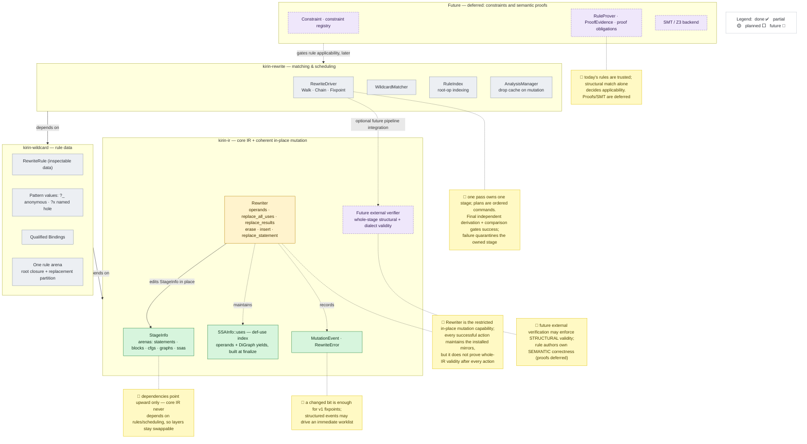
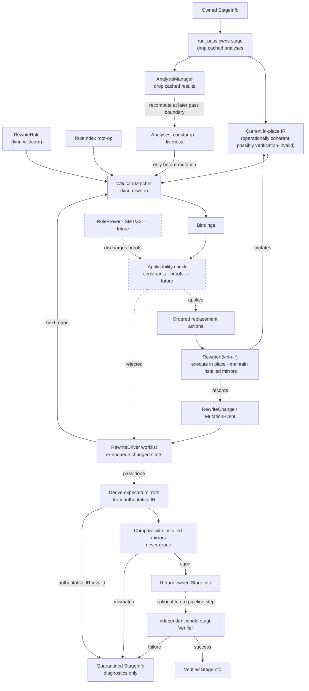
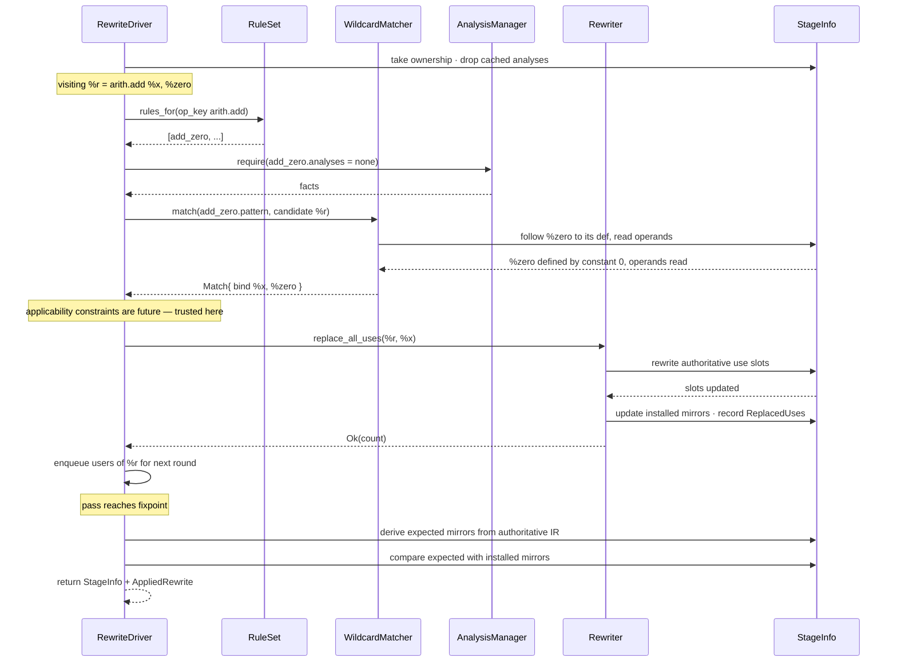

# Rewrite Engine

Status: **draft; first-draft scope decided; M0A landed; M1 is partial**.
Branch: `dl/rewrite-engine`.

Implementation-scope update (2026-07-29): the rewrite-engine milestone ends at
operationally coherent in-place mutation plus independently derived mirror
comparison and ownership-enforced quarantine.
Whole-stage verifier implementation is a separate future subsystem. Sections
below that discuss verifier integration describe the eventual pipeline
boundary, not a current rewrite-engine deliverable.

Companion design note: [Dialect and DSL Integration Contract](rewrite-engine-dialect-integration.md).
That note defines the proposed dialect-facing contract. Downstream compiler
integration details are outside its scope.

This document proposes a Kirin 2.0 rewrite framework. The core design is:

> Rewrites are separate from the interpreter framework. The interpreter
> framework computes typed facts. The rewrite framework matches patterns and
> mutates IR using those facts.

The rewrite engine should not be modeled as `Interpretable<I, DCE>` or
`Interpretable<I, ConstantFold>` as its primary extension point. That would
make rewrites opaque statement-local code again, which is the main limitation
of Kirin-python. The primary rewrite representation should be **rules as data**:
Kirin-like pattern IR plus wildcard producer operations and ordered replacement
actions. Applicability constraints and semantic proof backends are future
extensions, not requirements for the first draft.

The first implementation should be conservative:

1. Define the complete SSA use-site contract.
2. Give one pass ownership of one stage, mutate it through restricted APIs,
   and verify its incrementally maintained derived mirrors before returning it.
3. Add the permanent native-rule path with a simple walk/fixpoint scheduler.
4. Add structural single-statement wildcard matching and ordered replacements.
5. Drop cached analyses when mutation begins; defer persistent revision-based
   caching.
6. Leave rule constraints, semantic proofs, SMT integration, CFG-wide matching,
   graph matching, and equality saturation as later layers.

### Explicit first-draft exclusions

Do not implement any of the following while building the first draft:

- a `Constraint` data model or constraint-expression language;
- a native constraint registry or constraint evaluator;
- a `RuleProver`, `ProofEvidence`, proof obligations, or proof policy;
- an SMT/Z3 dependency or solver integration;
- solver-backed rule acceptance;
- generalized statement, block, value-field, type, or graph wildcards;
- fine-grained mutation-event-to-analysis invalidation;
- a whole-stage verifier and verifier-specific dialect hooks.

First-draft rewrite rules are structurally matched and trusted compiler rules:
their authors are responsible for semantic correctness. `kirin-ir` continuously
preserves the operational structure and derived mirrors needed to keep
rewriting. At the boundary, pure derivation recomputes the expected mirrors and
verification compares them without repair. On a rewrite, driver, panic,
derivation, or mismatch failure, ownership moves into a diagnostic-only
`Quarantined<StageInfo<L>>`; the caller can never regain ordinary access to the
failed stage. The rewrite engine does not certify whole-stage semantic validity
or equivalence.

## Diagrams

Source-of-truth diagrams for onboarding. They render on GitHub and in VS Code
(with the "Markdown Preview Mermaid Support" extension); import the same source
into Lucidchart on demand when a hand-arranged export is needed — do not
maintain a separate copy.

**Who owns what.** `kirin-ir` keeps in-place mutation operationally coherent.
A pass takes ownership of one `StageInfo` and edits it through `Rewriter`; the
stage may temporarily fail whole-IR validity while remaining traversable and
safe to edit. Every successful action keeps the installed def-use, block, and
graph mirrors current. At the pass boundary, the driver independently derives
the expected mirrors and compares them with the installed ones; it never
repairs a mismatch. Success returns the owned stage. Any rewrite, driver,
derivation, mismatch, or panic failure transfers it into diagnostic-only
`Quarantined<StageInfo<L>>`; v1 does not roll back. A future independent
verifier may be integrated at a higher pipeline boundary. `kirin-ir`
deliberately does **not** prove a rewrite is *semantically* correct: preserving
program meaning is the rule author's responsibility today, and the deferred
constraint/proof tier (top of Diagram A) is what would automate that later.

**Updating status:** as a milestone lands, flip a node's status token in
Diagram A — `:::planned` → `:::partial` → `:::done`. Colors come from the
`classDef` lines at the bottom of Diagram A; `:::future` (dashed lavender)
marks deferred work. Diagrams B and C are intentionally status-neutral.

### Diagram A — Architecture & responsibilities

Three crate layers (dependencies point upward only), what each owns, and build
status per the legend; deferred constraint/proof work sits in the top tier.



### Diagram B — Rewrite pipeline / lifecycle

A high-level overview of the rewrite loop — **not** a strict dataflow graph: its
edges deliberately mix data dependency, control order, event production, and
iteration. Dotted nodes are future applicability constraints / proofs. For the
precise call mechanics — who calls whom, and where events actually go — see
Diagram C.



### Diagram C — Call mechanics (one `add_zero` rewrite)

Who calls whom, in order, for a single rewrite of `%r = arith.add %x, %zero`
where `%zero = constant 0`, followed by derived-metadata verification. Solid
arrows are calls; dashed are returns. The action mutates the stage in place.

The "applicability constraints are future — trusted here" note reflects the
first-draft stance: applicability (whether a matched rule may fire) is decided
entirely by the structural pattern, and rules are trusted; non-structural
applicability *constraints* are deferred — see
[Constraints and Semantic Proofs](#constraints-and-semantic-proofs-design-implementation-deferred),
which defines a constraint as deciding "whether a rule is applicable to one
candidate match."



## Crate Boundaries

The rewrite stack is split into three layers with one-way dependencies:

```text
kirin-ir
  Core IR, SSA, bodies, in-place mutation primitives
       ^
kirin-wildcard
  Wildcards, match/replacement fragments, RewriteRule data, printing/diffing
       ^
kirin-rewrite
  Matching, RuleIndex, scheduling, fixpoints, analysis integration
```

The arrows mean "depends on": `kirin-wildcard` depends on `kirin-ir`, and
`kirin-rewrite` depends on both lower layers. Dependencies must never point in
the other direction.

### `kirin-ir`

Owns the invariants of concrete IR:

- SSA definitions and uses;
- body ownership and visibility;
- block lists and graph topology;
- tombstones and live-id checks;
- low-level `Rewriter`, action errors, exact mirror maintenance, and mutation records;
- pure mirror derivation, finalize-only installation, and pass-boundary comparison.

The low-level `Rewriter` stays here because it needs crate-private access to
arena internals. Moving it to another crate would force `kirin-ir` to expose
raw mutation internals publicly. Placement of the future verifier is deferred
with that subsystem.

### `kirin-wildcard`

Owns inspectable rule data rather than mutation or scheduling:

- wildcard producer operations and bindings;
- the frozen rule arena, rooted match closure, and replacement partition;
- `RewriteRule` (renamed from the earlier `PatternRule` proposal);
- parsing, printing, serialization, inspection, and diffing.

Constraint and proof data may be added here in a later milestone after the
structural rule representation is working.

This crate builds on `kirin-ir`, but concrete IR does not know wildcard
semantics.

### `kirin-rewrite`

Owns execution of rewrite rules:

- root-operation indexing and matching;
- native-rule escape hatches;
- walk, chain, worklist, and fixpoint scheduling;
- analysis acquisition and conservative cache invalidation;
- ownership of the pass boundary and application of `RewriteRule` actions
  through `kirin_ir::Rewriter`.

Constraint evaluation and optional proof backends are future responsibilities
of this layer, not first-draft APIs.

Concrete analyses may integrate through registered keys or traits. Do not make
`kirin-ir` depend on the interpreter or the rewrite scheduler.

---

## Glossary

| Term | Meaning |
|---|---|
| **rewrite** | A compiler edit that replaces, inserts, deletes, or rewires IR. |
| **rewrite rule** | A description of when an edit applies and what edit to perform. |
| **rules as data** | Rewrite rules represented as inspectable data instead of opaque Rust/Python functions. |
| **pattern IR** | A Kirin IR fragment used as the left-hand side of a rule. It may contain wildcard producer operations. |
| **`?` vs `%` sigil** | `?name` marks a value in `kirin-wildcard` **pattern** text; `%name` marks a concrete `kirin-ir` SSA value. The sigil identifies which arena the text describes, not whether the value is a hole. Unlike `egg`/`Semgrep`, `?` is **not** a hole marker — every pattern value carries it. |
| **pattern value** | Any value inside a pattern, written `?name`. Matching binds every named pattern value to a concrete IR value. |
| **binding** | A map from pattern entities to concrete IR ids, produced by a successful match. Example: matching `?r = arith.add ?x, ?zero` yields `?x → SSAValue(4)`, `?zero → SSAValue(7)`, `?r → SSAValue(9)`. Anonymous `?_` is the only pattern value with no binding. |
| **matched value** | A pattern value with a defining line in the pattern (`?zero = constant 0`). Its defining statement is part of the match, so the rule may erase or rewrite it. |
| **hole** | A pattern value defined in the arena by a `WildcardOp` producer. Shorthand text may show it only as an operand and omit that producer line. The matcher accepts whatever value occupies the slot without inspecting its concrete definition, so the rule may read the value but must not touch what defines it. |
| **anonymous hole** | `?_`: a hole that deliberately records no binding, so nothing can refer to it. Each `?_` occurrence is independent. |
| **root op** | The operation where a pattern is anchored. Example: `arith.add` for an add-zero rule. |
| **constraint hook (future)** | A named native predicate used by a later pattern system for non-structural conditions, such as `is_power_of_two`. It is outside the first draft. |
| **policy helper** | A reusable checked transformation condition plus general mutation actions, such as “no remaining result uses + `IsPure`, then erase.” It narrows common rule-author mistakes but is not a proof of arbitrary equivalence. |
| **trivially dead** | A statement implements `IsPure` as true and every result has no remaining syntactic uses, so the general `erase_statement` primitive can remove it without a larger coordinated rewrite. |
| **semantic preservation** | Preservation of observable program meaning under the compiler's declared equivalence or refinement relation, including values, effects, control behavior, memory/concurrency, and domain protocols. |
| **verification condition** | A logical obligation generated from a proposed rewrite and discharged before mutation by a future solver or proof checker. Structural IR verification is a different concern. |
| **scheduler** | The driver that decides which rules to try, where, in what order, and when to stop. |
| **analysis manager** | A component that runs, caches, and invalidates typed analyses. |
| **action contract** | What must still hold between two `Rewriter` calls, so the next call can traverse and edit the stage. Weaker than whole-IR validity by design. |
| **authoritative IR** | Arena fields that directly express program structure and semantics. Derived structures must be reproducible from them. |
| **derived mirror** | An incrementally maintained query representation of authoritative IR, such as reverse uses, block summaries, or petgraph topology. |
| **derivation** | Pure computation of the expected mirrors from authoritative IR. It may return `DeriveError` for dangling or structurally unrepresentable input. |
| **derived verification** | Comparison of installed mirrors with a fresh derivation. It reports `VerifyError::Mismatch` and never repairs a finalized stage. |
| **rewrite-pass contract** | A pass owns the stage exclusively, preserves operational coherence and mirrors after every successful action, and returns it only after derived verification succeeds. |
| **rewrite pass** | One ownership-scoped mutation run. Success returns the same stage by value; any error or panic returns a diagnostic-only quarantined stage. |
| **quarantined stage** | A non-`Clone`, non-`Default` owner of failed `StageInfo` plus cause and mutation events. It exposes diagnostic rendering but no `Deref`, `GetInfo`, or safe extraction. |
| **rewrite plan** | An ordered command program applied to the current stage. It is not a transaction, rollback boundary, or proof of validity. |
| **mutation event** | A structured summary of an edit, such as `ErasedStatement`, `ReplacedUses`, or `ChangedCfg`; v1 may consume it immediately for worklist scheduling. |
| **tombstone** | A deleted arena slot retained until a later compaction pass. |
| **IdMap** | The old-id to new-id map returned by arena compaction/GC. |
| **Use** | An element of the def-use index (`SSAInfo::uses`): `StatementOperand { stmt, index }` or `DiGraphYield { graph, index }`. |
| **`WildcardOp`** | The pattern-arena producer ops realizing holes under Option A: `Anonymous` (prints `?_`) and `Named` (prints `?x`). |
| **`RewriteDialect`** | The generated per-dialect rewrite-facing contract: `kind()` for root-op indexing and field-wise matching/remapping over the ordinary typed operation fields. |
| **`Kind`** | A fieldless mirror of an operation's variant; equality is id-independent, so it keys the root-op index (`HashMap<Kind, _>`). |
| **`NativeRule`** | An executable Rust rule (metadata + restricted in-place mutation through `Rewriter`) for transformations not expressible as declarative data; a permanent escape hatch, not scaffolding. |
| **`RuleSet`** | An explicitly assembled, deterministically ordered collection of declarative and native rules available to one driver run. |

### Design principle: remove the bad capability

Prefer a type boundary that makes misuse unrepresentable over a runtime rule
that merely forbids it:

- no `Interpretable`/stage dispatch for wildcard ops means patterns cannot run;
- no `Identifier`, `GetInfo`, raw-id conversions, or forwarded `Display` on
  `PatternRef` means pattern ids cannot index or masquerade as concrete ids;
- no `PatternValue` in an executable plan means unresolved wildcards cannot
  reach mutation;
- no repair method on finalized `StageInfo` means verification cannot launder a
  missed mirror update.

Apply this principle to new boundaries before adding flags, validation modes, or
escape hatches.

---

## Goals

- Provide a rewrite framework for Kirin-rust that is safe over arena-based IR.
- Preserve Kirin-python's useful composition model: walk, chain, fixpoint.
- Avoid Kirin-python's opaque-rule limitation by making common rewrites
  inspectable and declarative.
- Make analysis dependencies explicit: a rewrite can require constprop, demand,
  liveness, type, dominance, or other facts.
- Avoid per-rule analysis invalidation burden. Rules should report what they
  mutated; analyses should decide whether those mutation kinds invalidate them.
- Support gradual matcher complexity:
  - single statement;
  - rooted SSA producer DAG;
  - contiguous statement sequence;
  - whole block;
  - CFG fragment;
  - `DiGraph`;
  - `UnGraph`.
- Leave room for future equality saturation without requiring it in the first
  engine.

## Non-Goals

- Do not implement rewrite rules as interpreter semantics by default.
- Do not require every rewrite rule to know every analysis it invalidates.
- Do not start with graph sub-isomorphism as the first milestone.
- Do not compact arenas during every rewrite. Tombstone during a pass; compact
  at controlled boundaries.
- Do not require equality saturation to solve phase ordering in the initial
  framework.

---

## Kirin-python Baseline

Kirin-python's rewrite framework is useful because it is small and direct.

Conceptually:

```text
Fixpoint(
  Walk(
    Chain(rule1, rule2, rule3)
  )
)
```

The loop is:

```text
repeat until a full pass changes nothing:
    walk every statement/block/region:
        try each rule in order
```

Rules are Python classes with hooks:

```python
class RewriteRule:
    def rewrite_Statement(self, node): ...
    def rewrite_Block(self, node): ...
    def rewrite_Region(self, node): ...
```

Mutation is easy because Kirin-python is a mutable object graph:

```python
old_value.replace_by(new_value)
stmt.insert_before(other_stmt)
stmt.replace_by(new_stmt)
stmt.delete()
```

Python objects point directly at each other, and use-lists are updated by local
object mutation. Python's garbage collector reclaims unreachable objects.
The mutation surface is therefore permissive at whole-IR level but not
bookkeeping-free: operand replacement updates use sets, insertion updates
parents and linked-list neighbors, and safe deletion rejects live result uses.

Kirin-python's `Pass.__call__` runs `unsafe_run` and then calls structural
`verify`; `Pass.fixpoint` verifies after its repeated unsafe runs converge.
This is the precedent for “mutable during a pass, checked at a later
boundary.” It is not a transaction: verification failure does not restore the
pre-pass object graph, and type verification is separate. Kirin-rust initially
adopts the in-place mutation mechanics; its independent verifier is deferred.

The costs are structural:

- Rules are opaque functions. The framework cannot inspect what they match.
- Every rule is tried at every visited node unless the rule itself returns early.
- Multi-statement patterns are hand-written operand chasing.
- Analysis facts are commonly smuggled through `SSAValue.hints`.
- Freshness is maintained by convention and broad reruns, not by an analysis
  manager.
- A failed verification has no automatic rollback.
- Rules receive direct mutable object access rather than a restricted mutation
  capability.
- Phase ordering is handled locally by fixpoints and pass ordering, not solved
  globally.

### Kirin-python Phase Ordering

Kirin-python handles:

```text
run A
run B
B exposes more opportunities for A
```

only when A and B are inside the same fixpoint or the pass author wraps the
pipeline in a larger fixpoint.

Example:

```text
Fixpoint(Walk(Chain(ConstantFold, InlineGetItem, Call2Invoke, DCE)))
```

If `Call2Invoke` exposes a new constant-fold opportunity, the next full
fixpoint round may catch it. If two passes are not placed in a shared fixpoint,
Kirin-python does not automatically discover that the earlier pass should rerun.

Kirin-rust should preserve the simple fixpoint and in-place mutation model as a
baseline, while adding a restricted mutation capability, independently derived
mirror verification, ownership-enforced quarantine on failure, and
mutation-aware scheduling.
Automatic rollback and the independent verifier are deferred.

---

## Relationship to the Interpreter Framework

The rewrite framework should be separate from the interpreter framework.

The interpreter framework answers:

```text
What facts or values does this IR compute?
Which values are demanded?
Which values are live at this point?
What constant facts hold?
```

The rewrite framework answers:

```text
Can this IR fragment be replaced with a better fragment?
How do we mutate the IR safely?
Which rules should be retried after an edit?
Which analyses are stale after an edit?
```

The dependency direction should be:

```text
RewriteDriver -> AnalysisManager -> interpreter-based analyses
RewriteDriver -> PatternMatcher
RewriteDriver -> Rewriter
```

Not:

```text
Interpreter -> performs rewrites
```

### What to Reuse

The rewrite framework should reuse these interpreter-adjacent ideas:

- `SemanticKey` discipline: analysis meanings are explicit and typed.
- Fixpoint/worklist driver patterns: convergence and re-enqueueing are already
  important concepts in the interpreter.
- `StageQuery`-style structural queries: definitions, uses, block topology,
  terminators, body ownership, graph topology.
- Derived dialect dispatch patterns: generic code needs a way to inspect and
  compare dialect statements without hand-writing one matcher per language enum.

### What Not to Reuse Directly

Do not make the main rewrite extension point:

```rust
Interpretable<I, DCE>
Interpretable<I, ConstantFold>
Interpretable<I, Inline>
```

That can be supported later as a native escape hatch for dialect-specific
canonicalization, but it should not be the primary rewrite model. The main
model should be pattern data plus a small number of native predicates/actions.

---

## Rules as Data

A Kirin-python rule is opaque code:

```python
if isinstance(stmt, Add):
    if rhs_is_zero(stmt):
        replace_with_lhs(stmt)
```

A Kirin-rust pattern rule should be inspectable data:

```text
rule add_zero
match:
  ?zero = constant 0
  ?r = arith.add ?x, ?zero
rewrite:
  replace ?r with ?x
```

Because the rule is data, the framework can inspect:

```text
root op: arith.add
bindings: ?x, ?zero, ?r
structural pattern: ?zero is produced by constant 0
replacement: replace root result with ?x
required analyses: none
```

### The `?` sigil marks pattern text

**Every value in a rewrite pattern is written `?name`.** The sigil says "this
text is `kirin-wildcard` pattern IR, not `kirin-ir`" — nothing more. Concrete
IR keeps `%`, so a reader never has to guess which arena a fragment belongs to:

```text
?r = arith.add ?x, ?zero     // a pattern (kirin-wildcard)
%9 = arith.add %4, %7        // concrete IR (kirin-ir)
```

This deliberately differs from `egg` and `Semgrep`, which put their sigil
(`?x` / `$X`) on *holes only* and leave everything else bare. Those languages
write patterns in the same surface syntax as programs, so an unmarked
identifier is ambiguous between "a hole" and "a literal part of the program",
and the sigil resolves that. Kirin has no such ambiguity — a pattern operand
slot always means "match whatever value is here" and never names a literal SSA
id. The ambiguity Kirin *does* have is pattern-text versus IR-text, which is
what `?` resolves here.

**Matching binds every named pattern value.** When `add_zero` matches
`%9 = arith.add %4, %7` (with `%7 = constant 0`), the bindings are `?x → %4`,
`?zero → %7`, `?r → %9`. Being bound is therefore not what distinguishes one
pattern value from another.

**A defining line is what distinguishes them**, and it decides what the rule may
do:

| In the pattern | Means | The rule may |
|---|---|---|
| appears on the left of a `=` (`?zero`, `?r`) | the pattern matched a statement to determine it, so that statement is part of the match | read it **and** erase or rewrite its statement (subject to other uses) |
| appears only as an operand (`?x`) | a hole — no pattern statement describes it; the matcher took whatever was in the slot | only read it; its defining statement is outside the match and must not be touched |

So in `add_zero` the `constant 0` statement may be erased once nothing else
uses it, while whatever defines `?x` is off limits — the rule never matched it
and knows nothing about it.

`?_` is the anonymous hole: it matches but records no binding, so it cannot be
referenced by a replacement or by a future constraint:

```text
?r = arith.add ?x, ?_  // match and discard the second operand
```

Two `?_` occurrences may match different values. Two `?x` occurrences require
the same value:

```text
?r = arith.add ?x, ?x  // both operands must be the same SSA value
```

This gives several concrete benefits.

### Root-op Indexing

Rules can be filed under their root operation:

```text
arith.add -> [add_zero, fold_add_constants, reassociate_add]
arith.mul -> [mul_one, mul_zero, strength_reduce]
func.call -> [call_to_invoke]
any       -> [dce_not_demanded (native)]
```

When the scheduler visits an `arith.mul`, it only tries `arith.mul` rules plus
the native-only `any` bucket. Declarative rules always derive a concrete root
kind from their validated pattern root. Kirin-python cannot generally do this
because the root op is hidden inside the rule's Python code.

### Print and Diff

Pattern rules can be printed as text and reviewed in PRs:

```diff
- ?r = arith.mul ?x, 2
-   => ?new = arith.add ?x, ?x
+ ?r = arith.mul ?x, 2
+   => ?new = bitwise.shl ?x, 1
```

This should reuse the parser/printer infrastructure that Kirin dialects already
derive.

### Scheduler Independence

The same rule set can be used by:

- a simple walk/fixpoint scheduler;
- a mutation-aware worklist scheduler;
- a future equality-saturation scheduler for pure expression islands.

This is only possible if the scheduler can inspect the pattern. It cannot ask an
opaque Rust function "what would you have matched?".

---

## Wildcard and Pattern Dialect

The pattern language should be built on top of Kirin IR, not by changing core IR
semantics.

Every pattern value is written `?name` (see
[The `?` sigil marks pattern text](#the--sigil-marks-pattern-text)). Within that,
the first pattern-value model distinguishes a named hole from an anonymous one:

```text
?_     anonymous hole: match but record no binding
?x     named hole: match and bind as "x"
```

Under the decided **Option A** representation (see [Gap 1](#gap-1--pattern-representation--resolved-option-a)
and companion §6), wildcards are ordinary *producer operations* in the pattern
arena, not a lifted operand field. Operand slots stay ordinary pattern-arena SSA
ids; the `?_`-vs-`?x` distinction is realized by *which op defines* a pattern
value:

```rust
// kirin-wildcard: the wildcard producer ops. Their results are ordinary
// pattern-arena SSA values; other ops reference them through normal operands.
pub enum WildcardOp {
    Anonymous { result: ResultValue }, // defines a fresh `?_`
    Named { result: ResultValue },     // defines `?x` / `?c`
}
```

The result's pattern-arena `SSAValue` is its semantic identity. `SSAInfo::name`
remains optional syntax/debug metadata: parsing resolves textual names to
pattern SSA ids through the existing scope mechanism, and bindings are keyed by
`PatternValue`, never by a name. A named hole may be used repeatedly. An
anonymous hole must have `name == None` and exactly one pattern use; zero uses
is a dead hole, while multiple uses would accidentally impose identity between
occurrences that `?_` promises are independent.

Then a rule is an IR fragment using ordinary dialect operations whose operands
may refer to `WildcardOp` results. Because the pattern arena is SSA, **every**
pattern value needs something that defines it — so every hole gets a producer
line, not just the ones a constraint mentions:

```text
?x = wildcard.named "x"     // blank: the pattern does not say where ?x comes from
?c = wildcard.named "c"     // blank: same, but a constraint inspects it below
?r = arith.mul ?x, ?c         // ?r is the result of the pattern's OWN arith.mul
where is_power_of_two(?c)
```

**Every line above is pattern IR — none of it is concrete IR.** The `arith.mul`
here describes an `arith.mul`: it reuses the real `Arith` operation
type (that is what Option A buys) but it lives in the pattern arena, holds
pattern-arena SSA ids, and is never executed. So `?r` being "not a hole" does not
make it concrete IR; it means the pattern itself says where `?r` comes from,
namely that mul. `?x` is a hole because the pattern says nothing at
all about where `?x` comes from.

Because the pattern reuses real operation names, `arith.mul` appears in both
pattern text and IR text. The `?`-versus-`%` sigil on the *values* is the only
thing that tells the two apart — which is why every pattern value carries `?`.

The matcher treats ordinary operations structurally, binds values defined by
`wildcard.named`, and discards anonymous `wildcard.anonymous` values.

**`named` versus `anonymous` is one question: will the rule mention this value
again?** If yes it needs a name, so use `wildcard.named`. If the rule never
refers to it, use `wildcard.anonymous` and it prints as `?_`:

```text
?r = arith.mul ?x, ?_         // second operand matched, discarded, unnameable
```

Nothing else decides it — in particular a `where` predicate does not make a hole
named. `?x` above carries no predicate and is still named, because the
replacement refers to it.

Putting the four cases together:

| Value | Defined by | Hole? | Bound? | Can be named later? |
|---|---|---|---|---|
| `?x` | `wildcard.named "x"` | yes | yes | yes |
| `?c` | `wildcard.named "c"` | yes | yes | yes |
| `?r` | the pattern's own `arith.mul` | **no** | yes | yes |
| `?_` | `wildcard.anonymous` | yes | **no** | **no** |

Three of the four are bound, so being bound is *not* what `Named` means — it is
one specific producer op. `?r` is bound without being a `Named` hole; `?_` is a
hole without being one either. (The variant was called `Capture` in earlier
drafts; it was renamed because "capture" both suggested "anything that gets
bound" and collided with `kirin-ir`'s unrelated graph-body `capture(...)`
clause.)

Matching the pattern above against concrete IR shows what each kind costs the
matcher:

```text
%4 = call @f()
%7 = constant 8
%9 = arith.mul %4, %7
```

| Pattern | Binds to | How the matcher got it |
|---|---|---|
| `?r` | `%9` | the result of the one statement it matched |
| `?x` | `%4` | read straight out of operand slot 0; `call @f()` was never examined |
| `?c` | `%7` | read straight out of slot 1; `constant 8` was never examined |

The pattern describes one operation, so it matches one statement. `?x` and `?c`
mark where the pattern stops looking — which is exactly why the rule may erase
the matched `arith.mul` but must not touch `call @f()` or `constant 8`. A pattern
that describes two operations, like `add_zero`'s `constant 0` plus `arith.add`,
matches two statements and may erase both.

**Full form versus shorthand.** The block above is the *full* form: it spells out
every producer, and it is what the pattern arena actually stores. Most examples
in this document use a **shorthand** that omits the producer lines, where any
value appearing only as an operand is implicitly a named hole:

```text
?r = arith.mul ?x, ?c         // shorthand for the four lines above
where is_power_of_two(?c)
```

Write one or the other consistently within an example. Spelling out some holes
but not others reads as if the explicit ones were special, which is the most
likely way to mislead someone learning the model.

**The first draft has exactly two producer spellings.** Rule text must not
invent others; anything else is a later wildcard kind and marks the rule as
deferred:

| Spelling | `WildcardOp` variant | Prints as | Status |
|---|---|---|---|
| `wildcard.anonymous` | `Anonymous { result }` | `?_` | first draft |
| `wildcard.named "name"` | `Named { result }` | `?name` | first draft |
| `wildcard.any_statement` | — | — | deferred (statement-level; no representation yet) |
| value-field / type / block / graph forms | — | — | deferred |

In particular there is no `any_constant` or `any_value` producer. "Any value" is
already what `wildcard.named` matches, and requiring a *constant* payload is a
constraint's job, not a producer's.

A name never constrains a value. In the rule above, `?c` is a hole labelled
`c`; the label only identifies the binding, and `is_power_of_two(?c)` is what
actually restricts what it may match. Renaming it `?pow` would not change the
rule's meaning. What *does* constrain a pattern value is its defining
operation — compare the two ways to require a constant:

```text
// mul_pow2 — ?c has no defining line; the where clause does the work
?r = arith.mul ?x, ?c
where is_power_of_two(?c)

// add_zero — ?zero has a defining line; its producer does the work
?zero = constant 0
?r = arith.add ?x, ?zero
```

Both bind a value the replacement can name. The difference is that `add_zero`
matched the `constant 0` statement, so the rule may erase it; `mul_pow2` never
matched whatever defines `?c`, so it may only read the value.

Initial wildcard kinds:

- anonymous SSA value wildcard `?_`;
- named SSA value holes such as `?x`;
- structural matching of ordinary statement kinds, operands, results, and
  typed value fields needed for single-statement rules.

Later wildcard kinds:

- value fields;
- types;
- any statement;
- statement sequence;
- block;
- block sequence;
- graph node;
- graph edge;
- graph substructure.

---

## Constraints and Semantic Proofs (design; implementation deferred)

This section is a design exploration, not an early-milestone deliverable. The
constraint layer is the mechanism by which a declarative rule depends on a
*non-structural* fact — a value's numeric payload, a type, an analysis result,
or target configuration — without collapsing into an opaque `NativeRule`. It is
designed here so the earlier layers do not accidentally block it. Structural
matching, safe IR mutation, and simple scheduling still ship first (M1–M5); the
constraint and proof machinery is implemented in a later milestone (after M4).

Patterns can describe shape:

```text
?r = arith.mul ?x, ?c
```

They cannot describe every semantic condition. For example:

```text
?c is a power of two
```

The pattern engine therefore needs constraints, including named native
predicates:

```text
?r = arith.mul ?x, ?c
where is_power_of_two(?c)
```

Every initial `Constraint` is a pure predicate over the completed candidate
match and its analysis context. A rule may have zero or more constraints. Zero
means that structural matching is sufficient; otherwise all constraints must
hold before the replacement is accepted. In other words, the initial
`Vec<Constraint>` has implicit AND semantics.

Constraint order must not affect whether a rule is accepted. An implementation
may short-circuit after a failed constraint and may later reorder cheap and
expensive checks. If OR/NOT composition becomes necessary, add an explicit
boolean constraint expression rather than giving `Vec` order hidden meaning.

For example:

```rust
Constraint::ConstantInteger {
    value: pattern_zero,
    expected: 0,
}
```

is an inspectable description of the predicate "the concrete SSA value bound
to `?zero` is known to be integer zero." Its evaluator may establish that fact
from a directly matched constant statement or from constant-propagation facts.
It does not make `zero` a special wildcard name.

Here `pattern_zero: PatternValue` is resolved after parsing; constraints never
use textual names as semantic keys. Native constraint predicates are registered
Rust functions. They may read:

- matched typed value fields;
- SSA types;
- constprop results;
- target information;
- effect/purity traits;
- local IR structure.

This keeps most of a rule inspectable while allowing controlled native logic for
non-structural conditions.

Constraint checking would also be distinct from proving that a rewrite is
semantics-preserving. Constraints decide whether a rule is applicable to one
candidate match. A proof backend, including a future SMT backend, establishes a
separate proof obligation for the old and replacement expressions. Solver
results may be three-valued (`Proved`, `Disproved`, or `Unknown`); an unproved
rule application must be skipped when proof is required.

None of `Constraint`, `ConstraintRegistry`, `RuleProver`, `ProofEvidence`, or an
SMT backend should be implemented in the first draft. The design, however, is
settled enough to build against once the structural engine works.

### Worked example: strength-reduce multiply by a power of two

This end-to-end example exercises both non-structural capabilities the layer
adds: a predicate that reads a value's payload, and a replacement that computes
a new payload.

```text
rule mul_pow2
match:
  ?r = arith.mul ?x, ?c
where:
  is_power_of_two(?c)            // predicate over ?c's integer payload
rewrite:
  ?k = constant log2(?c)         // value computed from ?c's payload
  ?s = bitwise.shl ?x, ?k
  replace_all_uses ?r with ?s
```

Two named, registered native hooks do the non-structural work while the rest of
the rule stays inspectable data:

- **constraint predicate** `is_power_of_two(?c)` — a registered
  `Fn(&Match, &RuleContext) -> bool`. It resolves `?c`'s bound value to a
  concrete integer (from a directly matched `constant` producer, or from a
  constprop fact exposed by `RuleContext`) and tests it. The rule stores only
  the predicate name and its arguments; the driver resolves the body through a
  `ConstraintRegistry`.
- **replacement compute function** `log2(?c)` — a registered function evaluated
  during replacement planning that produces `?k`'s constant payload. Same
  registry idea, applied to *building* a value rather than *deciding*
  applicability.

Both are typed and inspectable at the rule level; only their bodies are native.
This is how a rule reads and computes over compile-time payloads (integers,
angles, matrices, symbols) without becoming a whole `NativeRule`. A dialect owns
and registers the hooks for its own payloads: `kirin-constant` would register
integer predicates and folders; a quantum dialect would register angle addition
or unitary composition.

`RuleContext` is where analysis results (constprop, liveness, types) enter a
constraint. This is the promotion path from the native reasons above: an
analysis-dependent rule that must be a `NativeRule` today (because nothing
declarative can read constprop) becomes ordinary declarative data plus a named
analysis-backed constraint once this layer exists. The rule's structure and
intent stay inspectable; only the predicate body is native.

### Ordered Replacement Actions

Rust `Vec<T>` preserves insertion order and iteration order. Therefore the
replacement partition lowers to an ordered `Vec<RewriteAction<L>>`. For
example, "replace all uses" must be interpreted
before "erase the now-unused statement" when that is the declared order.

The `kirin-rewrite` planner evaluates these actions in order against the
in-place stage through `kirin_ir::Rewriter`. Rule construction proves every
precondition determined by the rule's kinds and action order. The pattern (and,
later, explicit constraints) must establish applicability; the engine does not
build a projected per-match state to compensate for an underspecified rule. A
native rule retains the direct fallible path and accepts quarantine as the cost
of a late mistake.

#### `RewritePlan` and plan-local handles

```rust,ignore
pub struct RewritePlan<L: Dialect> {
    actions: Vec<RewriteAction<L>>,
}

pub enum RewriteAction<L: Dialect> {
    // M1 reference-only subset, after every PatternRef has been resolved.
    ReplaceOperands { edits: Vec<(StatementRef, usize, ValueRef)> },
    ReplaceAllUses { old: ValueRef, new: ValueRef },
    ReplaceResults { stmt: StatementRef, replacements: Vec<ValueRef> },
    EraseStatement { stmt: StatementRef },

    // M4 construction subset. `definition` is an ordinary typed L value;
    // generated remapping installs Existing/Local operand and result refs.
    InsertBefore { anchor: StatementRef, definition: L, operands: Vec<ValueRef> },
    InsertAfter { anchor: StatementRef, definition: L, operands: Vec<ValueRef> },
    ReplaceStatement { stmt: StatementRef, definition: L, operands: Vec<ValueRef> },
}

pub enum StatementRef { Existing(Statement), Local(LocalStatement) }
pub enum ValueRef { Existing(SSAValue), Local(LocalValue) }
```

`RewritePlan` and its existing/local handles live in `kirin-rewrite`, not
`kirin-ir`. `LocalStatement` / `LocalValue` are plan-relative positions for
entities that do not exist before execution; they are not wrappers around arena
ids. Pattern ids use the distinct `PatternRef<I>` newtype in `kirin-wildcard`,
with current aliases `PatternStatement` and `PatternValue`. `PatternRef` has
resolution methods pinned to `StageInfo<PatternLanguage<L>>` and deliberately
implements neither `Identifier`, `GetInfo`, raw-id conversions, nor `Display`.

The LHS and RHS share one frozen rule arena. The LHS is the transitive producer
closure of the rule root; the RHS is an ordered side partition of statements in
that same arena. At lowering time, `SSAKind::Result(producer, _)` plus the
partition determines whether each RHS operand is bound by the match or produced
by an earlier action. Planning resolves every `PatternRef` before the first
mutation, so the executable plan contains only `Existing` and `Local` refs.
No separate erased template or foreign-id convention is introduced.

Coordinated operand edits are one atomic action. This is required for UnGraph
endpoint swaps: no sequence of single-slot edits can preserve the binary
incidence limit when both edges begin full. `replace_operand` is the one-edit
case and `replace_all_uses` preflights and applies its complete edit set as one
operation.

A plan is **not** an independent clone, a rollback boundary, a proof of
whole-stage validity, or an externally published event batch. "Rule did not
match" and every resolvable reference failure must be decided before any action
executes. Rule construction rejects an erase whose results are neither
redirected earlier nor protected by an explicit exclusivity constraint; cleanup
that is merely opportunistic belongs to DCE. Once mutation starts, any action
error quarantines the owned stage, and the driver never falls through to another
rule against partially edited IR.

Task breakdown for implementing this is Step 2 of
[the in-place rewrite plan](../plans/2026-07-29-in-place-rewrite-plans.md).

---

## Analysis Dependencies and Invalidation

The rewrite framework should make analysis dependencies explicit:

```text
rule fold_known_constant:
  requires: constprop

rule dce_not_demanded:
  requires: demand
```

However, rewrite rules should **not** be responsible for naming every analysis
they invalidate. That does not scale: adding a new analysis would require
auditing every existing rewrite rule.

For v1:

1. Rewrites report a changed bit and may report mutation events.
2. The first mutation drops every cached whole-stage analysis.
3. New whole-stage analyses run only at a later pass boundary.

### Mutation Events

The `Rewriter` may record immediate events such as:

```rust
pub enum MutationEvent {
    InsertedStatement { stmt: Statement },
    ErasedStatement { stmt: Statement },
    ReplacedStatement { stmt: Statement },
    ReplacedUses { old: SSAValue, new: SSAValue },
    ChangedOperands { stmt: Statement },
    ChangedResultTypes { stmt: Statement },
    ChangedTerminator { block: Block },
    ChangedCfg { body: Cfg },
    ChangedBlockList { body: Cfg },
    ChangedDiGraphTopology { graph: DiGraph },
    ChangedUnGraphTopology { graph: UnGraph },
    ChangedBodyNesting { owner: Statement },
}
```

The exact enum should follow current IR naming (`Block`, `Cfg`, `DiGraph`,
`UnGraph`) and can be split by module when implemented. The important point is
that this event vocabulary belongs to mutation, not to any one analysis.

Mutation events describe edits already made in place. They are not externally
published commit records in v1. A failed pass quarantines the owned stage; its
event stream may be retained inside the diagnostic object but is never
published as a successful commit record. Mutation events are not required for the first scheduling
baseline: a Kirin-python-style fixpoint can use a single `changed` bit and rerun
a complete walk until no rule changes the IR. Events remain useful for naming
affected statements and bodies for a smaller worklist and better diagnostics.

The first `AnalysisManager` must not attempt fine-grained event-to-analysis
mapping. Its safe policy is:

```text
first in-place mutation
    -> drop every cached analysis for that stage
```

Stage revisions and persistent cross-pass caches are deferred. Fine-grained
invalidation is an optimization for later, after concrete analysis clients
demonstrate which distinctions are useful. Analyses, rather than individual
rewrite rules, should eventually decide whether an event invalidates them.

Kirin-python has no general freshness manager. `RewriteResult` carries a
`has_done_something` bit for brute-force fixpoints. Analysis-driven passes run
their analysis explicitly (for example, `HintConst` runs constant propagation
before folding) and commonly copy results into `SSAValue.hints`. A later
rewrite does not centrally invalidate those hints; correctness relies on pass
ordering, rerunning the analysis by convention, or manually propagating hints
to replacement values. Kirin-rust should keep the simple fixpoint baseline but
must not retain cached whole-stage facts after mutation in v1.

### Analysis Invalidation Policy

Each analysis defines invalidation behavior:

```text
constprop invalidated by:
  InsertedStatement
  ErasedStatement
  ReplacedUses
  ChangedOperands
  ChangedCfg

demand/liveness invalidated by:
  InsertedStatement
  ErasedStatement
  ReplacedUses
  ChangedOperands
  ChangedCfg
  ChangedBlockList

dominance invalidated by:
  ChangedCfg
  ChangedBlockList
  ChangedTerminator

type info invalidated by:
  ChangedResultTypes
  InsertedStatement with fresh result definitions
```

Start coarse. The first implementation drops all cached analyses when mutation
begins. Refine only after the basic engine is correct.

### Ensuring Fresh Analyses

The driver asks the analysis manager for required analyses before it transfers
the stage into the pass:

```text
facts = analysis_manager.require(pass.required_analyses)
move stage into run_pass; drop cached analyses
for rule in candidate_rules:
    if matcher.matches(rule, facts):
        rewriter.apply(rule)  # facts become stale after mutation
derive expected mirrors and compare them with installed mirrors
```

The manager must not silently rerun a whole-IR analysis inside the mutation
phase. Split analysis and rewriting into separate pass boundaries when a
transformation needs refreshed facts.

This is the generalization of Kirin-python's manual `HintConst` pattern:

```text
Kirin-python:
  Fold manually runs HintConst before ConstantFold.

Kirin-rust:
  Constant-folding rule declares constprop as a requirement.
  AnalysisManager ensures constprop is available and fresh.
```

---

## Phase Ordering

The classic problem:

```text
run A
run B
B creates new patterns for A
therefore A should run again
```

Example:

```text
A = constant folding
B = inlining

Before B:
  %x = call @foo()
  %y = arith.add %x, 1

After B:
  %x = constant 2
  %y = arith.add %x, 1

Now A can fold %y.
```

Kirin-python handles this only when A and B are wrapped in a shared fixpoint.
Kirin-rust should provide two levels:

### Pass-level Fixpoint

Simple and robust:

```text
repeat:
    run canonicalize
    run inline
    run fold
    run dce
until no pass changes IR
```

This is the first correctness baseline.

### Mutation-aware Worklist

More precise:

```text
move StageInfo into run_pass; drop cached analyses
worklist = all statements
while worklist not empty:
    stmt = worklist.pop()
    for rule in rules_for(stmt.root_op):
        if rule applies:
            apply rewrite in place through Rewriter
            enqueue affected producers/users/neighbors from mutation events
derive expected mirrors and compare them with installed mirrors
return StageInfo on success; quarantine it on any failure
```

This avoids whole-program rescans when only a small area changed.

### Equality Saturation

Equality saturation can help with pure equational rewrite ordering, but it is
not the general phase-ordering solution for Kirin.

It is useful for:

- algebraic expression rewrites;
- reassociation/commutation;
- strength reduction;
- local pure expression optimization.

It does not directly solve:

- analysis invalidation;
- DCE;
- inlining with side effects;
- CFG mutation;
- arena tombstone/GC discipline;
- linear quantum values;
- graph-body rewrites with ownership constraints.

Treat equality saturation as a future scheduler over rules-as-data, not as the
first rewrite engine.

---

## SSA Definitions, Uses, and Graph Metadata

An SSA definition creates a value. An SSA use is a semantic input slot that
refers to an already-defined value.

```text
%result = arith.add %lhs, %rhs
^ definition          ^     ^ uses
```

Responsibility is divided by where the slot is declared:

| IR location | Who declares the meaning? | Initial classification |
|---|---|---|
| Statement `ResultValue` fields | Dialect author through `HasResults` | Definition |
| Statement `SSAValue` fields | Dialect author through `HasArguments` | Use |
| Block arguments | `kirin-ir` block model | Definition visible in that block |
| Graph ports | `kirin-ir` graph model | Boundary definition, analogous to a block argument |
| `DiGraph` body yields | `kirin-ir` graph model | Use exported from the graph body |
| DiGraph/UnGraph petgraph edge weights | `kirin-ir` graph model | Derived topology mirroring statement uses, not a second semantic use |

The derive-generated `HasArguments` and `HasResults` traits are the dialect
author's declaration to generic compiler code. A dialect author does not
manually register each use at runtime. For example:

```text
%r = arith.add %x, %y       # %x and %y are statement uses
cf.br ^next(%r)             # %r is a forwarded statement use
scf.yield [%r]              # %r is a terminator statement use
func.return [%r]            # %r is a terminator statement use
```

`Cfg` adds no separate SSA-use category: it owns blocks, and branch arguments
remain operands of terminator statements.

### DiGraph

A `DiGraph` is a data-dependency view of statements. In a generic example:

```text
%a = source
%b = negate %a
%c = add %a, %b
```

the semantic uses are the operand slots in `negate` and `add`. The graph edges
mirror those uses:

```text
source -%a-> negate
source -%a-> add
negate -%b-> add
```

`source`, `negate`, and `add` stand for operations from any dialect whose
statements are placed in a directed graph body; they are not special built-in
operations. Replacing an operand changes the dependency graph, so the edge
mirror must be updated in the same successful action even though the edge is
not counted as an additional semantic use; the pass later derives and compares
the expected topology without repair. A value in `DiGraph::yields`, however, is a semantic
use because the graph body exports that value.

### UnGraph

An `UnGraph` represents symmetric connectivity. A typical shape is:

```text
%wire = make_wire
gate_a %wire
gate_b %wire

gate_a -- %wire -- gate_b
```

The two node operand slots are semantic uses of `%wire`. The undirected
petgraph edge is derived topology connecting those users. Rewriting one of the
operand slots may change or remove that connection, so graph metadata and its
degree constraints must be updated in the same mutation.

### Unified use-site contract

`kirin-ir` must provide one internal way to enumerate semantic use sites
without asking rewrite authors to understand every dialect or body kind. The
initial model should distinguish at least:

```rust
enum UseSite {
    StatementOperand { stmt: Statement, index: usize },
    DiGraphYield { graph: DiGraph, index: usize },
}
```

This initial model has landed as the public `Use` enum. The design task remains
to inventory all semantic SSA reference positions and separately list the
derived metadata that each mutation must synchronize. The reverse
`SSAValue -> uses` index (`SSAInfo::uses`) records statement operands and
`DiGraph` yields. The current `StageInfo::finalize` populates it through
`rebuild_use_index`; the M1 target replaces that public recovery operation with
pure derivation and a finalize-only installer. Every current `Rewriter` edit (`replace_operand`,
`replace_all_uses`, `erase_statement`, `insert_before`/`insert_after`,
`replace_statement`) maintains it incrementally.

The index is derived metadata over authoritative statement/yield slots, not a
substitute for them. The pass-boundary checker must derive it independently
because raw legacy mutation paths can still bypass `Rewriter`. The current
rewriter also does not yet provide the complete ownership, graph-topology, and
derived-comparison contract described below. Type, visibility, dominance, and
dialect validity remain responsibilities of the separate future whole-stage
verifier.

The pass boundary derives expected uses from authoritative slots and compares
them with the installed index. It never installs the expected value into a
finalized stage. Derived verification checks that:

- reverse use-lists agree exactly;
- no use refers to a tombstone;
- graph membership and topology agree with parents and value-derived
  connectivity;
- block and CFG summaries agree with authoritative membership and links.

Visibility, dominance, type correctness, and graph-yield boundary legality are
left to the separate whole-stage verifier.

### Derive, install, verify — never repair

All derived services follow one split:

```rust,ignore
pub(crate) fn derive_mirrors<L: Dialect>(
    stage: &StageInfo<L>,
) -> Result<Mirrors<L>, DeriveError>;

pub(crate) fn install_mirrors<L: Dialect>(
    stage: &mut StageInfo<L>,
    mirrors: Mirrors<L>,
); // finalize only

pub fn verify_derived<L: Dialect>(
    stage: &StageInfo<L>,
) -> Result<(), VerifyError>;
```

Finalize first assembles a `StageInfo`, derives from `&StageInfo`, and installs
before the stage is published. A pass boundary derives a complete fresh mirror,
compares, and drops it. The O(n) allocation is deliberate: a streaming checker
would duplicate derivation rules and invite drift. `DeriveError` means
authoritative input is broken; `VerifyError::Mismatch` means maintained metadata
disagrees and therefore a mutation path is broken. Component derivation helpers
and installers remain crate-private; no mutating recovery entry point is public.

`derive_use_index` replaces public mutating `rebuild_use_index`. Missing or
out-of-range/tombstoned statement operands produce
`DanglingOperand { stmt, index, value }`; directed-graph yields produce
`DanglingYield { graph, index, value }`.
Later derivations apply the same rule to body ownership and mirrors. Derivation
collects independent findings rather than stopping at the first one.

For graph bodies, `StatementInfo::parent` is authoritative membership.
`StableGraph` plus `IndexMap<Statement, GraphMember>` is one derived mirror:
the map supplies stable insertion-order presentation and direct node lookup;
petgraph supplies connectivity. Verification compares member keys as sets and
edges as normalized multisets over statement weights. It excludes `NodeIndex`
and order, retains parallel-edge multiplicity, and normalizes undirected
endpoints. A dangling statement owner is
`DanglingParent { stmt, parent }`.

For blocks, membership also comes from `StatementInfo::parent`, but order is
authoritative in child `prev`/`next` links. The member set partitions into
non-terminators, which must form one reciprocal acyclic chain, and the unique
`is_terminator()` member, which is not in that chain. `head`/`tail`/`len` and
`BlockInfo::terminator` are derived mirrors. CFG block order uses the analogous
`BlockInfo::parent` plus block links. Errors distinguish cycles, forks, orphans,
cross-body links, dangling links, and multiple terminators as `ChainCycle`,
`ChainForked`, `ChainOrphan`, `ChainCrossBlock`, `DanglingLink`, and
`MultipleTerminators` findings. Iterators follow
links until `None`; cached lengths are size information, never traversal control.

`DeriveError` aggregates all independent findings found in one scan. In
particular, `UnGraphDegreeExceeded { edge_value, incidences }` retains every
offending `(Statement, operand_index)` occurrence. Finalize maps this aggregate
into `FinalizeError`; pass-boundary derivation retains it as the quarantine
cause.

---

## IR Validity Invariants

"Valid IR" is not one property; it is a set of invariants ordered from cheap
local bookkeeping to global structure and semantics. The important distinction
is no longer “local invariants are checked by every action, global invariants
are deferred.” It is:

1. the **action contract** — what must still hold *between* two `Rewriter`
   calls, so the next call can still traverse and edit the stage;
2. the **rewrite-pass contract** — what must hold when the pass hands the stage
   back to its caller;
3. **semantic correctness**, which a generic structural verifier cannot prove.

The split exists because valid transformations often need several individually
incomplete edits: swap a terminator, then fix its forwarded arguments. After the
first action the CFG is inconsistent; after the second it is fine. Requiring full
validity after every action would make that rewrite inexpressible. The action
contract is therefore not "anything goes" — it is exactly what the *next action*
needs in order to work.

Each invariant has a tag (I1–I7) used throughout the mutation API section.

| Invariant | Property | Action contract (between calls) | Rewrite-pass contract (on return) |
|---|---|---|---|
| **I1** Referential | every referenced id resolves to a live, non-tombstoned slot | required; coordinated edits redirect references before erasure | verified independently |
| **I2** Def-use service | semantic-use queries reflect authoritative operand/yield slots | maintained after every successful action | freshly derived and compared; mismatch is a mutation bug |
| **I3b** Block representation | statement links and parents are traversable; head/tail/len and terminator mirrors agree | maintained after every successful action | chains derived and mirrors compared without repair |
| **I3g** Graph topology | stored `DiGraph`/`UnGraph` topology mirrors authoritative membership and value-derived connectivity | maintained after every successful action | topology derived and compared without repair |
| **I4** Well-typed | operands/results and edge arguments satisfy type contracts | may be invalid | required |
| **I5** Dominance & visibility | every value is in scope and, in ordered `Cfg`/`Block` bodies, dominated by its definition | may be invalid | required |
| **I6** Terminator & CFG | each CFG/owned block has the required terminator role; successors and edge arguments are consistent | may be invalid during coordinated CFG surgery | required |
| **I7** Semantic | the rewrite preserves program meaning under the compiler's chosen equivalence/refinement relation | accepted rule/helper/prover before mutation; not certified by `Rewriter` | trusted rule/proof boundary; not certified by structural verification |

Operational does not mean raw or arbitrary mutation. `Rewriter` still owns
allocation, tombstones, list surgery, use queries, exact mirror maintenance,
and events.
For example, a block-removal rewrite redirects predecessor edges before
tombstoning the block; allowing a dangling block id would make every later
action and the verifier needlessly fragile.

Whole-stage semantic invariants remain centralized because valid transformations
may require several coordinated changes: replace a terminator and its forwarded
arguments, or change a block argument and every incoming edge. The stage may
temporarily fail I4–I6 between actions, but I1–I3 mirrors remain exact after each
successful `Rewriter` call. Pass-boundary derived verification detects mutation
implementation bugs; the separate whole-stage verifier, once implemented,
checks I4–I6 as one unit.

I5 dominance applies only to ordered bodies. `DiGraph` and `UnGraph` have no
control order, but their values still require body-specific visibility checks.

I7 is deliberately outside structural verification. A verifier can establish
that the output is a well-formed program; it cannot generally establish that it
means the same thing as the input.

“Semantic” is not one boolean owned by the mutation layer. Depending on the
rule, preservation obligations include:

- **value semantics:** results, overflow, rounding, invalid-input behavior, and
  target-specific arithmetic rules;
- **effects and ordering:** memory, allocation, I/O, calls, quantum operations,
  and other observable effects;
- **control behavior:** branches, termination, divergence, traps, exceptions,
  and unwinding;
- **memory and concurrency:** aliasing, lifetimes, atomics, synchronization, and
  races;
- **domain protocols:** dialect-specific resource laws such as linear
  ownership, state/token threading, measurement behavior, or equivalence up to
  a permitted quantum global phase.

A rule may justify those obligations through a trusted rewrite axiom, trusted
dialect properties, analysis-backed preconditions, or a future proof condition
discharged by an SMT solver or certificate checker. Testing and differential
execution can find mistakes but do not prove preservation. `Rewriter` neither
chooses nor validates the justification; it only applies an already accepted
edit while preserving the action contract.

Any future proof-aware path must discharge obligations before the first
in-place action:

```text
match -> proposed RewritePlan + obligations -> prove/accept -> apply via Rewriter
```

An unproved obligation is a non-match or proof failure, not a partially applied
plan that needs rollback. See the focused
[in-place rewrite plan](../plans/2026-07-29-in-place-rewrite-plans.md#mutation-primitives-policy-helpers-and-semantic-acceptance)
for the rule, helper, analysis, and solver roles.

### In-place pass boundary

One rewrite pass owns and mutates one `StageInfo`:

```text
owned StageInfo
  -> move into run_pass; drop cached analyses
  -> ordered in-place rule/plan actions through Rewriter
  -> independently derive expected mirrors and compare them
  -> return StageInfo on success, or Quarantined<StageInfo<L>> on failure
```

There is no automatic rollback. A failed action, driver, derivation,
comparison, or panic transfers the same mutated stage into a non-`Clone`,
non-`Default`, diagnostic-only quarantine. The caller cannot regain ordinary IR
access and must abandon that compilation unit. The outer ownership boundary
catches unwinds so a panic follows the same route. A future independent
verifier may be called by a higher-level pipeline after this boundary.

There is no runtime `Rewriting` state: the exclusive owned value is the pass
reservation. `Ready` is merely the absence of that reservation, and
`Quarantined` is a distinct type rather than a flag readable by ordinary IR
APIs. Pure derivation validates authoritative operands, yields, parents, and
links, then computes expected reverse uses, block summaries, member maps, and
graph topology. It never installs them at a pass boundary; rollback would
restore the old authoritative IR. This mechanism is needed for ordinary
in-place rewriting and is unrelated to the optional M8 e-graph.

---

## In-place Pass and Mutation API

Kirin-rust needs a restricted mutation capability inside an in-place pass.
Rules do not receive raw mutable arena access.

Kirin-python primitive:

```python
old_value.replace_by(new_value)
stmt.delete()
new_stmt.insert_before(stmt)
stmt.replace_by(new_stmt)
```

Kirin-rust equivalents are centralized in `Rewriter`, which borrows the owned
stage, maintains all installed mirrors, and records changes:

```rust
pub struct Rewriter<'a, L: Dialect> {
    stage: &'a mut StageInfo<L>,
    events: Vec<MutationEvent>,
}
```

This is close to the current implementation. The required property is that all
ordinary rewrite mutation flows through core operations that preserve
operational coherence.

The current standalone `Rewriter` methods are:

```rust
impl<'a, L: Dialect> Rewriter<'a, L> {
    // --- Operand / use rewriting (index-maintaining) ---
    pub fn replace_operand(
        &mut self,
        stmt: Statement,
        index: usize,
        value: impl Into<SSAValue>,
    ) -> Result<SSAValue, RewriteError>;

    pub fn replace_all_uses(
        &mut self,
        old: impl Into<SSAValue>,
        new: impl Into<SSAValue>,
    ) -> Result<usize, RewriteError>;

    // --- Block-body statement surgery (tombstone-based, precondition-checked) ---
    pub fn erase_statement(
        &mut self,
        stmt: Statement,
    ) -> Result<(), RewriteError>;

    pub fn insert_before(
        &mut self,
        anchor: Statement,
        definition: L,
    ) -> Result<Statement, RewriteError>;

    pub fn insert_after(
        &mut self,
        anchor: Statement,
        definition: L,
    ) -> Result<Statement, RewriteError>;

    pub fn replace_statement(
        &mut self,
        stmt: Statement,
        definition: L,
    ) -> Result<(), RewriteError>;

    // --- Immediate change/event log (current prototype API) ---
    pub fn events(&self) -> &[MutationEvent];
    pub fn drain_events(&mut self) -> Vec<MutationEvent>;
}
```

#### Method behavior

The current prototype validates its executable preconditions before mutating
and maintains [`SSAInfo::uses`](#unified-use-site-contract) incrementally. That
is useful operational behavior, but these methods are not proof that the whole
stage remains valid.

| Method | Effect | Buffers | Notes / current limits |
|---|---|---|---|
| `replace_operand` | Rewrite one operand slot; move its use record `old → new`. | `ChangedOperands` (none if slot unchanged) | operand-index and live-value checked |
| `replace_all_uses` | Rewrite every operand **and `DiGraph` yield** reading `old` to `new`; transfer use records. | one `ChangedOperands` per affected statement, then one `ReplacedUses` | returns count of slots rewritten; self-replace is `Ok(0)` |
| `erase_statement` | Tombstone the statement, unlink it from its block list, drop its operand uses, tombstone its (unused) result values. | `ErasedStatement` | block-parented, non-terminator, no live result uses |
| `insert_before` / `insert_after` | Allocate a statement, splice it adjacent to `anchor`, add operand uses; return the new id. | `InsertedStatement` | anchor is block-parented non-terminator; `definition` is a non-terminator with **no results**; operands must be live |
| `replace_statement` | Swap the definition in place, keeping id, block position, and result SSA identity; fix operand uses. | `ReplacedStatement` | same result arity and terminator-ness as the original |
| `replace_results` | Redirect every result of a statement at once, one replacement per result. | one `ChangedOperands` per affected statement, then one `ReplacedUses` per redirected result | exact arity; rewrites uses only, never the result list |

Deferred to later slices (each is rejected, not silently mishandled):
terminator, `Cfg` block-list, and `DiGraph`/`UnGraph`-body surgery;
result-defining insertion (needs fresh result SSA values with types); single
dead-result trimming (`remove_result`, below); the owning pass driver and
quarantine boundary; and the pure derive/install/verify split described under
[Pass Completion and Failure](#pass-completion-and-failure).

#### `replace_results` (the M1 multi-result primitive)

```rust
pub fn replace_results(
    &mut self,
    stmt: Statement,
    replacements: &[SSAValue],
) -> Result<(), RewriteError>;
```

Redirect **every** result of `stmt` at once, one replacement per result, exact
arity required. This is the primitive multi-result rewrites actually need: CSE
finds a duplicate statement, points all of its results at the original's
results, then erases the duplicate. Doing that as a hand-written loop of
`replace_all_uses` calls with index-matched pairs is the error-prone path, so it
must not be the convenient one.

Arity is unchanged — this only rewrites *uses*. Preconditions are
`UnknownStatement`, `UnknownValue` for any replacement, and an arity mismatch
between `replacements` and the statement's result list (reported as the shared
`ResultArityMismatch`).

Substitution is **simultaneous**, not a sequential loop over the pairs: every
slot is rewritten against the use lists as they stand on entry, and each moved
use list is dropped before any is installed. Naming one of the statement's own
results as a replacement therefore redirects the two independently, where a
sequential loop would let the later pair carry away the sites the earlier one
had just moved. That order-independence is the reason this is a primitive
rather than a documented calling convention over `replace_all_uses`.

#### `remove_result` (speculative — deferred past M1)

```rust
pub fn remove_result(&mut self, stmt: Statement, index: usize) -> Result<(), RewriteError>;
```

**Not an alternative to `replace_results`** — a different operation.
`replace_results` redirects uses and leaves arity alone; `remove_result` shrinks
the op's result list. Only reach for it when a statement should *keep executing*
with fewer outputs.

Trim one dead result off a statement you want to **keep**. It is distinct from
`erase_statement` (removes the whole statement) and `replace_statement` (keeps
the same result arity). Mechanically, it would tombstone the unused result,
remove it from the op's result representation, update the identities or indices
of surviving results, and record a `RemovedResult { stmt, index }` event.

Unusedness alone does **not** establish I4–I7. Result arity can be coupled to an
operation schema, call signature, region yields, loop initializers, or block
arguments. A syntactically variadic result group only says that different valid
instances may have different arities; it does not say that any result can be
removed independently. For example, trimming an `scf.for` result requires one
coordinated rewrite of its initializer, body argument, yield operand, and outer
result, plus operation-specific reasoning about loop-carried state.

Preconditions (rejected, stage untouched):

- `UnknownStatement` — `stmt` is not live.
- `StatementResultsInUse` — the targeted result still has uses; replace those first.
- **no result-erasure contract** — the operation must explicitly support the
  requested result removal, either through a core representation guarantee, a
  dialect hook/trait, or an operation-specific intent action that updates all
  coupled operands, regions, signatures, and results. Merely having variadic
  results is insufficient. A fixed-arity op such as `arith.add` rejects the
  request.

Open details before this is scheduled:

- whether removing result `index` **compacts** the remaining results (shift
  `index+1..` down and update their `SSAKind`) or leaves a **tombstoned hole**;
- whether supported result removal mutates the same statement representation or
  reconstructs a replacement operation with fewer results;
- the result-erasure trait/hook and the first operation-specific clients that
  justify adding this API.

There is no purity contradiction between result removal and statement erasure.
Removing a result keeps the operation and its effects; erasing the statement
removes them. `erase_statement` remains the general mechanical primitive and
does not consult `IsPure`. A higher-level `erase_if_trivially_dead` helper or
declarative DCE rule checks unused results plus `IsPure` before requesting
`EraseStatement`. Kirin defines `IsPure` strongly: the operation has no
observable behavior except through its SSA results, and it is referentially
transparent: the same operation kind, typed value fields, and operand values
produce interchangeable results. It may therefore be eliminated when its
results are unobservable and may participate in CSE. Nondeterminism, reading
time or hidden state, defined errors, and divergence make an operation impure.
Dialect authors classify operations according to their own semantics; the
rewrite engine does not define arithmetic corner cases. `IsSpeculatable` is the
separate movement/hoisting contract and is not part of trivial DCE. Any rule may
use the helper; its narrow checked policy, rather than the caller's identity, is
the safeguard.

#### Action contract versus rewrite-pass contract

The action API checks whether an edit can be executed safely on the stage. It
does not duplicate the whole verifier:

| Concern | Action contract | Rewrite-pass contract |
|---|---|---|
| unknown/dead id, bad index | reject with `RewriteError` | independently diagnosed if present |
| statement links and parent ownership | maintain mechanically | derive chains and compare summaries |
| use queries | incrementally maintain | derive and compare the exact index |
| graph topology | maintain `StableGraph` and ordered member map atomically | derive from membership/values and compare normalized multisets |
| types | no general preflight | verify |
| visibility/dominance | no general preflight | verify |
| terminator/CFG legality | intent-level action maintains mirrors; temporary semantic invalidity is allowed | verify whole resulting CFG |
| dialect operation constraints | no general preflight | call dialect verification hook |
| semantic preservation/refinement | accepted rule/helper/prover before mutation; not certified by the action | trusted rule/proof boundary; not certified by derived or structural verification |

The current methods are already a partial version of this model:
`replace_operand`, `replace_all_uses`, insertion, and replacement can produce an
ill-typed or non-dominating stage. Graph-owned operand changes must update the
topology mirror in the same successful operation. Boundary verification detects
mirror disagreement but does not detect type or dominance errors; those remain
the pass author's responsibility until an independent verifier exists.

`erase_statement` still rejects live results and dangling ownership because
referential/traversal integrity is an operational invariant. Erasing an unused
but impure statement remains semantically wrong despite passing structural
mutation checks; that is I7 and stays the rule author's responsibility.

#### After a whole rewrite pass

A pass (`Fixpoint(Walk(Chain(rules)))` in Kirin-python terms) applies many edits
to one in-place stage:

- I1 and traversable list/parent structure hold throughout the pass.
- I2, I3b, and I3g service mirrors are current after every successful action.
- I4–I6 may be temporarily false while coordinated actions are incomplete.
- final pure derivation and equality comparison validate the installed mirrors
  before success; they do not repair state or certify I4–I6.
- I7 is never established by the mutation layer.
- erasures tombstone and ids stay stable while bindings/worklists exist;
  optional compaction occurs only at a controlled pass boundary.
- mutation drops cached analyses; success returns the owned stage, while a
  rewrite, driver, derivation, mismatch, or panic failure quarantines it and
  requires the caller to abandon that compilation unit.

#### `RewriteError`

`RewriteError` reports that an action cannot be executed on the current stage.
The current methods preflight these mechanical failures. Once a pass has
mutated, any error aborts the pass and quarantines the owned stage. The
**Category** column marks whether a rejection is permanent or will lift as the
engine grows:
**liveness** = a referential/bounds check, always enforced; **deferred** = a
capability not yet implemented that will become legal in a later slice (a tool
may treat these as "retry once supported"); **guard** = a permanent invariant
protection (never retry). The variant *names* encode the condition, not this
axis — hence the column.

| Variant | Category | Meaning | Raised by |
|---|---|---|---|
| `UnknownStatement(stmt)` | liveness | id does not resolve to a live (non-tombstoned) statement | all statement methods |
| `UnknownValue(value)` | liveness | SSA id does not resolve to a live value | `replace_operand`, `replace_all_uses`, `insert_*`, `replace_statement` |
| `OperandIndexOutOfRange { stmt, index }` | liveness | operand index past the statement's operand list | `replace_operand` |
| `NotInBlockBody(stmt)` | deferred | statement is owned by a `DiGraph`/`UnGraph` (or nothing), not a block — graph surgery deferred | `erase_statement`, `insert_*` |
| `CannotEraseTerminator(stmt)` | deferred | erasing a block terminator would need control-flow repair, deferred | `erase_statement` |
| `StatementResultsInUse(stmt)` | guard | a result of the statement is still used elsewhere; replace those uses first | `erase_statement` |
| `AnchorIsTerminator(stmt)` | deferred | insertion relative to a terminator is deferred | `insert_*` |
| `CannotInsertTerminator` | guard | the inserted definition is a terminator (not spliced mid-block) | `insert_*` |
| `CannotInsertWithResults` | deferred | the inserted definition declares results (fresh result allocation deferred) | `insert_*` |
| `ResultArityMismatch { stmt, expected, found }` | guard | replacement changes the result count, orphaning/inventing result SSA values | `replace_statement` |
| `TerminatorKindMismatch(stmt)` | guard | replacement changes terminator-ness, desyncing the block's terminator cache | `replace_statement` |
| `EdgeRoleMismatch(stmt)` | guard | replacement changes `IsEdge`, desyncing `GraphMember` classification | `replace_statement` |

The immediate `MutationEvent` vocabulary recorded by these methods is
`ChangedOperands`, `ReplacedUses`, `InsertedStatement`, `ErasedStatement`, and
`ReplacedStatement`; the remaining documented event kinds (CFG/graph and
result-type events) grow in as the corresponding mutation capability lands (see
[Gap 3](#gap-3--mutationevent-vocabulary-vs-implementation)).

The design requirement is that all rewrite mutation flows through this object so
it can:

- maintain use-lists after every successful action;
- maintain SSA definition metadata;
- maintain block linked lists;
- maintain terminator/body mirrors;
- maintain region/body membership;
- tombstone deleted arena slots;
- record mutation events;
- maintain graph topology and membership mirrors atomically;
- reject unexecutable mutations early while leaving whole-IR legality to the
  verifier.

### Tombstone and GC Policy

During a rewrite pass:

- erase by tombstoning;
- leave ids stable;
- have worklists skip dead ids;
- drop analyses computed for the preceding verified state after mutation.

At controlled pass boundaries:

- optionally compact arenas;
- receive an `IdMap`;
- remap every surviving id stored in IR;
- invalidate or remap external caches;
- never run compaction while active pattern bindings or worklists are in use.

The first implementation can avoid compaction entirely. Correct tombstoning plus
lookup failure is more important than memory reclamation.

### Pass Completion and Failure

The public success boundary is the pass, not `replace_all_uses` or any other
individual action:

```text
1. Begin
   - move `StageInfo<L>` into `run_pass`;
   - lend `&mut StageInfo<L>` only to the closure executing the pass;
   - drop cached whole-stage analyses.

2. Rewrite
   - execute ordered actions in place through Rewriter;
   - keep referential/traversal invariants;
   - allow whole-IR type, dominance, CFG, and dialect validity to be
     temporarily false;
   - keep derived mirrors exact after each successful action;
   - record changes.

3. Finish
   - derive expected mirrors from authoritative IR and compare without repair;
   - return `(StageInfo<L>, RewriteChange)` on success;
   - on any error or panic, return `Quarantined<StageInfo<L>>` with the cause
     and event log.
```

`RewritePlan` is an ordered command program evaluated inside step 2. It is not
a stage clone, transaction, or rollback boundary. V1 aborts the whole pass and
quarantines its owned stage on an action error after mutation. A caller that
needs recoverable failure may explicitly clone the stage before `run_pass`.

The outer owner, not the pass closure, calls `catch_unwind(AssertUnwindSafe(..))`
while retaining the stage. This supersedes a pass signature that consumes the
stage itself: such a pass would drop the only diagnostic artifact during an
unwind. A free `run_pass` supports standalone stages and tests; the pipeline
wrapper localizes slot take/reinsert/poisoning to one place.

Quarantine diagnostics never call ordinary pretty-printers or linked-list
iterators. They scan every arena slot in numeric order and render
`{ slot, deleted, parent, definition }` rows plus the event log. This bounded
walk exposes tombstones and orphans and cannot cycle or trust a stale length.
Events alone are insufficient because they carry only arena ids; retaining the
arenas is what makes them meaningful. Tombstoned data from this pass remains
available, although older tombstone payloads may already have been replaced by
defaults during an earlier arena map/`with_builder` conversion.

Whole-stage visibility, dominance, CFG legality, graph semantic legality, and
dialect verification are deferred to the separate verifier effort. Raw mutable
arena access remains private because it could violate the operational
invariants inside the ownership-scoped pass.

---

## Pattern Matching Scope

Matching should grow in stages. Do not start with graph matching.

### Two axes: pattern scope versus stateful traversal

The levels below grow one axis only — the **size of the fragment a rule
matches**. Every level is declarative-representable; larger levels are simply
later milestones, not harder-to-express-in-principle. A block, CFG, or graph
pattern is still "match this shape," just a bigger shape.

A second, orthogonal axis is **whether the transformation carries state across
the traversal**. Some transformations are not about matching a bigger fragment
at all; they accumulate information as they walk a body:

- common-subexpression elimination and global value numbering (remember every
  expression already seen);
- loop-invariant code motion (track what is invariant across a loop body);
- numbering, coalescing, and symbol-table-building passes.

These cannot be expressed as a fixed-shape pattern *regardless of how large
patterns grow*, because a pattern describes a fragment's shape, not memory
accumulated over a walk. Making the pattern language stateful would recreate the
opaque-rule problem the design avoids. Therefore:

- **bigger fragment** (block, CFG, graph) → declarative, arriving at Levels 4–7;
- **stateful whole-body algorithm** → `NativeRule` (its state and traversal are
  intrinsic). Ordinary CFG-aware CSE/GVN remains in this category.

An M8 equality-saturation island is separate. Within a lifted, pure expression
island, equivalent expressions merge into one e-class and extraction can share
a representative, so it can subsume local expression CSE there while also
exploring reassociation and strength reduction. It does not replace the normal
arena/CFG CSE implementation: lifting and reinsertion, dominance, control flow,
effects, and memory remain outside the e-graph. Adding M8 therefore does not
make a native CSE rule temporary.

So "not declarative yet" means one of two very different things: a larger
pattern level that is merely unimplemented, or a stateful algorithm that is
native by nature. Only the first is a matter of milestone ordering.

### Level 1: Single Statement

Example:

```text
?r = arith.add ?x, ?zero
```

The matcher checks:

- candidate op kind;
- operand count;
- result count;
- typed value fields;
- types if specified;
- hole binding consistency.

This enables root-op indexing and simple canonicalization rules.

### Level 2: Rooted SSA Producer DAG

Example:

```text
?m = arith.mul ?a, ?b
?r = arith.add ?m, ?c
```

The matcher anchors at `?r`, sees `arith.add`, then follows `?m` to its unique
defining statement through SSA metadata. This is deterministic for block SSA:
each value has one definition.

This supports common multi-statement rewrites such as:

```text
add(mul(a, b), c) -> fma(a, b, c)
```

Safety issue: inner matched producers may have external uses.

Example:

```text
?m = arith.mul ?a, ?b
?r = arith.add ?m, ?c
?s = arith.sub ?m, ?d
```

If the rewrite replaces `?r` with `fma`, it must not delete `?m` because `?s`
still uses it. The rule either:

- in the first draft, replaces only `?r` and leaves `?m`; or
- in a future constraint-capable engine, requires a condition such as
  `has_one_use(?m)` before deleting `?m`.

### Level 3: Contiguous Statement Sequence

Example:

```text
?a = op1 ...
?b = op2 ?a
?c = op3 ?b
```

The first sequence matcher should require adjacency in one block:

```text
stmt.next == expected_next
```

Allowing gaps requires side-effect and dependency reasoning:

```text
op1
unrelated_but_impure_op
op2
```

That is a later refinement.

### Level 4: Whole Block

A block pattern includes:

- block arguments;
- ordered statements;
- terminator;
- successors;
- edge arguments.

Example:

```text
^bb(?x):
  ?cond = cmp.eq ?x, 0
  cf.cond_br ?cond, ^then, ^else
```

Whole-block rewriting must preserve:

- block argument arity;
- edge argument arity;
- terminator legality;
- external predecessor constraints;
- dominance/CFG invariants.

### Level 5: CFG Fragment

CFG matching treats blocks as graph nodes and terminator successor edges as graph
edges.

Example:

```text
^entry:
  cf.br ^middle

^middle:
  cf.br ^exit
```

Rewrite:

```text
^entry:
  cf.br ^exit
```

This requires:

- predecessor/successor queries;
- block argument remapping;
- edge payload matching;
- dominance invalidation;
- CFG mutation events.

### Level 6: DiGraph

`DiGraph` pattern matching is subgraph matching over directed edges.

Example:

```text
A -> B -> C
```

inside a larger directed graph.

This is not a statement walk. It needs graph matching over the graph body
storage and graph-specific constraints.

### Level 7: UnGraph

`UnGraph` matching is harder:

- edges are undirected;
- there may be no natural root;
- ZX-style rules are often multi-rooted;
- hyperedges may need explicit edge-node modeling.

Example:

```text
two same-color spiders connected by a wire
```

This is future work. It should not block the statement/block rewrite engine.

---

## Architecture

Recommended components:

```text
kirin-ir
  rewrite
    Rewriter
    MutationEvent
    RewriteError
    Use
  derived
    Mirrors
    DeriveError
    VerifyError
    verify_derived

kirin-wildcard
  dialect
    RewriteDialect
  rule
    RewriteRule
  wildcard
    PatternLanguage
    PatternRef
    Bindings
  format
    Parse
    Print
    Diff

kirin-rewrite
  plan
    RewritePlan
    LocalStatement
    LocalValue
  matcher
    WildcardMatcher
  rule
    NativeRule
    RuleSet
  analysis
    AnalysisManager
    AnalysisKey
    InvalidationPolicy
  schedule
    RewriteDriver
    Worklist
    Fixpoint
```

This module layout is illustrative. Keep `mod.rs` files declarative and split
substantial logic into sibling files.

The future whole-stage verifier and its error type are deliberately absent;
their crate placement remains deferred with that subsystem.

Future constraint registries and proof backends are intentionally absent from
this first-draft module layout.

### `RewriteRule`

Owns one frozen rule arena, a validated `PatternStatement` root, and an ordered
replacement partition. The LHS pattern is the root's transitive ordinary-
producer closure; the root's `L::Kind` is also the rule-index key, so no separate
root-op metadata exists. A smart constructor checks once that the root is live
and a `PatternLanguage::Op`, then freezes the arena. Declarative rules therefore
always have a concrete root kind; only native rules may request the unindexed
`any` bucket.

A later version may add applicability constraints and analysis requirements.

### `NativeRule`

An executable Rust rule used when matching or replacement cannot yet be
expressed as declarative `RewriteRule` data. It must publish driver metadata
such as its name, candidate root operation kinds, match scope, and later its
analysis requirements. Native rules remain subject to restricted in-place
mutation through the pass's `Rewriter`; “native” is not raw mutable arena
access.

Native rules are a supported long-term extension point for stateful,
algorithmic, analysis-driven, and larger-scope transformations. Declarative
rules and native rules are two permanent representations scheduled by the same
driver; a native implementation is not required to be ported or deleted after
wildcard matching lands.

`RuleSet` stores immutable native configuration or factories. Each driver/pass
run creates fresh native instances. Statement-scoped instances receive
candidates from the driver; body-scoped instances run once for each declared
body and may own their intrinsic traversal. State is never reused across
bodies, functions, or pass invocations.

### `RuleSet`

The explicit, deterministically ordered collection of declarative and native
rules available to one driver invocation or pipeline phase. A `RuleSet` does
not own traversal or mutation. The compiler/pipeline statically assembles all
rule sets; v1 has no dynamic global rule discovery.

`RuleSet` is not the same as Kirin-python's executable `Chain` combinator. The
driver may index a rule set by root operation and apply its buckets under a
walk, worklist, or fixpoint scheduling policy.

The detailed dialect-facing contract and illustrative APIs are in
[Dialect and DSL Integration Contract](rewrite-engine-dialect-integration.md).

### `WildcardMatcher`

Inputs:

- stage;
- candidate root;
- pattern;

Output:

```rust
pub struct Match {
    pub root: Statement, // concrete subject root
    pub bindings: Bindings,
}
```

`RewriteRule::root` is instead a `PatternStatement`; the distinct wrapper is
load-bearing because both arenas otherwise use the same raw `Statement(Id)`
type. The matcher walks `StageInfo<PatternLanguage<L>>` and `StageInfo<L>` in
lockstep. The `PatternLanguage` layer handles wildcard producers; an `Op(l)` arm
unwraps to `&L` and uses generated `&L`-versus-`&L` field-wise comparison. That
contract is the resolution of
[Gap 2](#gap-2--rewrite-facing-matching-contract--resolved-dedicated-derive)
(illustrative types in companion §1).

### `Bindings`

Maps pattern entities to concrete IR ids:

```text
PatternValue              -> SSAValue
PatternStatement          -> Statement
pattern typed value field -> concrete typed value field
```

Start with SSA values, typed value fields, and statements. Add blocks and graph
elements only when their matcher scopes and qualified wrappers exist.

### `Rewriter`

The restricted in-place mutation capability. Rules should not mutate
`StageInfo` arenas directly. `Rewriter` owns action execution, operational
invariants, exact mirror maintenance, fresh-id allocation, and change events; it does not
prove whole-IR validity after each action.

### `AnalysisManager`

Owns:

- cached typed results;
- freshness state;
- invalidation from mutation events;
- rerun policy.

Start with conservative invalidation:

```text
first mutation drops all cached analyses
```

Then refine.

### `RewriteDriver`

Owns:

- rule indexing by root op;
- worklist/fixpoint scheduling;
- analysis requirement checks;
- ownership transfer, final derived-mirror comparison, and quarantine on any
  failure;
- mutation event forwarding;
- dead-id skipping.

---

## Example Rules

### Add Zero

```text
rule add_zero
match:
  ?zero = constant 0
  ?r = arith.add ?x, ?zero
rewrite:
  replace ?r with ?x
```

No analysis required.

### Strength Reduction

Future example; not part of the first draft because it needs a constraint and
possibly a proof or target-legality policy.

```text
rule mul_power_of_two
match:
  ?r = arith.mul ?x, ?c
where:
  is_power_of_two(?c)
rewrite:
  ?shift = constant log2(?c)
  ?new = bitwise.shl ?x, ?shift
  replace ?r with ?new
```

Requires a native constraint. May require target/legalization information.

Written in shorthand: `?x` and `?c` have no defining lines, so both are named
holes. There is deliberately no `wildcard.any_constant` producer — it is
`is_power_of_two(?c)` that requires a constant payload, resolving it either from
a directly matched `constant` producer or from a constprop fact. See the fuller
treatment in
[Worked example: strength-reduce multiply by a power of two](#worked-example-strength-reduce-multiply-by-a-power-of-two),
which spells out both native hooks.

### Constant Folding from Constprop

Future example; not part of the first draft because it needs analysis-backed
constraints.

```text
rule fold_known_result
requires:
  constprop
match:
  ?r = wildcard.named "r"
where:
  constprop_is_known(?r)
rewrite:
  ?c = constant constprop_value(?r)
  replace ?r with ?c
```

This generalizes Kirin-python's `HintConst` plus `ConstantFold` without storing
facts in `SSAValue.hints`.

The whole pattern is a single named hole, so like `dce_not_demanded` it is not
rooted at any operation and belongs in the `any` rule bucket. That is also why
the producer line is written out here rather than in shorthand: with no host
operation, there is no operand slot for `?r` to appear in, so the only way to
write the pattern is explicitly.

### Demand-based DCE

Future example; not part of the first draft because it needs statement
wildcards and analysis-backed constraints. A permanent native Rust DCE
implementation may be used when demandedness is required; ordinary trivial DCE
can instead be a driver worklist/full-walk pass over
`erase_if_trivially_dead` and needs no cross-statement rule state.

```text
rule dce_not_demanded
requires:
  demand
match:
  ?stmt = wildcard.any_statement
where:
  is_pure(?stmt)
  none_demanded(?stmt.results)
rewrite:
  erase ?stmt
```

Here `is_pure` uses Kirin's strong DCE contract. The dialect author decides how
the operation's own semantics treat effects, errors, divergence, and invalid
inputs; this rewrite design does not define those semantics. `none_demanded` is
an analysis fact, not a claim that the syntactic use-list is already empty. The
driver must erase dead consumers first (or later use a coordinated bulk action),
so the mechanical `erase` precondition still sees no remaining result uses.

This is not rooted at a specific op; it belongs in the `any` rule bucket.

`wildcard.any_statement` is **not** one of the two first-draft value producers;
it is a *statement*-level wildcard, listed under the later wildcard kinds in
[Wildcard and Pattern Dialect](#wildcard-and-pattern-dialect). That is why this
rule is deferred: `WildcardOp` as specified defines SSA values only, so matching
a whole statement generically needs a representation this design does not yet
have.

---

## Implementation Milestones

### M0: Design Constraints

- [x] Confirm branch-level naming and current IR terminology (`Cfg`, `Block`,
  `DiGraph`, `UnGraph`).
- [x] Keep the low-level `Rewriter` in `kirin-ir`.
- [x] Put wildcard IR and `RewriteRule` data in `kirin-wildcard`.
- [x] Put matching, scheduling, fixpoints, and analysis integration in
  `kirin-rewrite`.
- [x] Defer applicability constraints, semantic proof APIs, and SMT integration
  until after the first structural rewrite engine works.

### M0A: Def-Use Contract — landed

- [x] Inventory authoritative SSA definitions and semantic use positions in
  `Block`, `Cfg`, `DiGraph`, `UnGraph`, and nested bodies.
- [x] Classify graph edge weights as derived topology and `DiGraph` yields as
  semantic uses.
- [x] Add the public `Use` representation for statement operands and directed-
  graph yields.
- [x] Populate `SSAInfo::uses` at finalize through `rebuild_use_index`.
- [x] Maintain the index in the first `replace_operand` / `replace_all_uses`
  rewriter slice.

M0A is complete. M1 adds the narrower derived-mirror boundary: recompute uses,
block summaries, graph membership, and topology from authoritative slots and
compare them with the installed mirrors without repair. That check is rewrite-
engine work. The independent whole-stage verifier for typing, dominance, CFG
legality, and dialect validity remains a separate future subsystem.

### M1: Mutation Layer

- [x] Implement `Rewriter`.
- [x] Implement `replace_operand` / `replace_all_uses` (index-maintaining over
  statement operands and `DiGraph` yields).
- [x] Implement `erase_statement` with tombstones (block body; unlink + drop
  operand uses + tombstone unused results).
- [x] Implement insertion before/after a statement (block body, result-less
  definitions).
- [x] Implement `replace_statement` (in-place definition swap preserving id and
  result identity).
- [x] Emit mutation events (`ChangedOperands`, `ReplacedUses`,
  `InsertedStatement`, `ErasedStatement`, `ReplacedStatement`).
- [x] Precondition-check current executable/mechanical failures with typed
  `RewriteError`; tests cover use-lists, block-list surgery, and
  index-equals-rebuild.

**Rewrite-pass contract machinery:**

- [ ] Add a free ownership boundary `run_pass(StageInfo<L>, closure)` and a
  pipeline wrapper that takes/reinserts the whole stage-enum slot. Exclusive
  ownership replaces runtime `Ready`/`Rewriting` flags. A failed slot uses
  `Option<S>` or an explicit poisoned variant; never `mem::take` plus a default
  empty stage.
- [ ] Catch panics at the outer owner with `AssertUnwindSafe`. This is justified
  because Kirin forbids unsafe/raw storage: an unwind can leave logical
  incoherence, not memory unsafety. Error and panic paths return a non-`Clone`,
  non-`Default` `Quarantined<StageInfo<L>>` with no ordinary IR access.
- [ ] Add pure `derive_mirrors(&StageInfo) -> Result<Mirrors, DeriveError>`, a
  crate-private installer used only by finalize, and public read-only
  `verify_derived(&StageInfo) -> Result<(), VerifyError>`. `VerifyError`
  distinguishes broken authoritative IR (`Derive`) from a mutation-layer mirror
  bug (`Mismatch`). Apply the same split to `SSAInfo::uses`; remove public
  mutating recovery methods such as `rebuild_use_index`.
- [ ] Restrict raw mutable escape hatches: statement/block arenas, SSA uses,
  and petgraph mutation become crate-private; split the mutable half of
  `GetInfo` into crate-private `GetInfoMut`. Keep metadata-only `set_name` and
  `set_stage_id` public; downstream stage-enum derives delegate to them and
  neither can desynchronize a mirror. The repo audit found no external callers
  of the restricted methods, so this has no downstream migration cost.

This machinery is an M1 exit criterion, not a dependency that prevents the
remaining action methods from landing independently.

**Plans and remaining general primitives:**

- [ ] Add `RewritePlan`'s reference-only M1 subset in `kirin-rewrite`, with
  `Existing`/`Local` handles. Pattern-qualified references remain in
  `kirin-wildcard` and must be resolved before execution.
- [x] Add exact-arity `replace_results`, used by CSE and other multi-result
  replacement algorithms before erasing the old statement.

**Mutation coverage for all four body kinds.** Statement-level mutation already
covers `Block` **and** `Cfg` bodies, because a block inside a `Cfg` is still a
`Block` — what is missing is block-level surgery and the two graph bodies:

- [ ] Until topology maintenance lands, guard graph-owned statements in
  operand and definition replacement. Once it lands, every successful graph
  edit maintains the topology mirror atomically; there is no dirty interval.
- [ ] Terminator surgery: erase/replace a terminator and insert relative to one,
  maintaining `BlockInfo::terminator` and successor edges. Emits
  `ChangedTerminator`.
- [ ] Add the grouped operation-owned `HasCfgEdges` view that preserves each
  successor together with its forwarded arguments and separates non-edge
  operands.
- [ ] **`Cfg` block-list surgery**: append/insert/erase/split blocks, retarget
  successors, remap block arguments across incoming edges. Emits
  `ChangedBlockList` / `ChangedCfg`. This is the capability
  [Level 5](#level-5-cfg-fragment) assumes and the one no earlier milestone
  named.
- [ ] `DiGraph` body surgery: insert/erase nodes with petgraph topology and
  `yields` maintenance. Emits `ChangedDiGraphTopology`.
- [ ] `UnGraph` body surgery: insert/erase nodes and edge statements, maintaining
  undirected topology, member order, and degree constraints. Emits
  `ChangedUnGraphTopology`.

**Graph-body prerequisites found by code audit:**

- [ ] Replace `petgraph::Graph` with `StableGraph` and store one
  `IndexMap<Statement, GraphMember>` beside it. `GraphMember::Node(NodeIndex)`
  and `GraphMember::Edge` preserve mixed insertion order and provide direct
  lookup. The map and petgraph are two halves of one derived mirror; membership
  remains authoritative in `StatementInfo::parent`. `UnGraphExtra` becomes
  empty once its separate edge-statement list moves into this map; generic
  `GraphInfo<L, D, Extra>` remains unified and DiGraph never constructs the
  `Edge` variant.
- [ ] Move petgraph construction out of graph builders. Builders record
  parents, operands, ports, and yields; their allocation sequence initializes
  the mixed member order, which is presentation state rather than authority.
  Finalize derives and installs the mirror once. An oversubscribed UnGraph is representable in
  `BuilderStageInfo` and becomes `DeriveError::UnGraphDegreeExceeded` at the
  BuilderStageInfo-to-StageInfo boundary, with every `(Statement, operand_index)`
  occurrence.
- [ ] Keep topology value-derived. A DiGraph edge is an operand whose result
  producer is another member. An UnGraph incidence is a use of an edge-member
  result or edge port. Captures are distinguished at the graph boundary by
  `edge_count`, never by consumer-field annotations; no per-field topology
  derive is added.
- [ ] Add an atomic multi-operand edit. It validates the net UnGraph incidence
  delta before changing definitions, reverse uses, or mirrors. Single-slot
  replacement delegates to it, and `replace_all_uses` applies its entire use set
  atomically.
- [ ] Make `replace_statement` unconditionally require equal `is_edge()` and
  return `EdgeRoleMismatch`, paralleling its existing terminator classification
  guard. Declarative rule construction checks this once from op kinds.

Graph bodies print in stored insertion order, not a canonical graph order.
`IndexMap::shift_remove` deliberately avoids reshuffling the remaining output;
that O(n) cost is presentation stability, not correctness. Derived verification
compares member keys as sets and topology edges as normalized multisets over
statement weights: never compare `NodeIndex`, preserve parallel-edge
multiplicity, and normalize endpoint order for UnGraph. Independently built
isomorphic graphs may print differently, and printed IR is not a graph-equivalence
hash. Dialects that need a domain-specific order own their renderer or traversal
policy.

**Deferred out of M1:**

- [ ] Result-defining insertion — replacement-arena result SSA records already
  carry the types to copy. `Rewriter` allocates fresh ids and checks mechanical
  arity but makes no generic type-compatibility judgment; that belongs to rule
  authoring or later verification. Generated field-wise remapping in M4 must
  solve result allocation anyway.
- [ ] `remove_result` — see
  [`remove_result` (speculative)](#remove_result-speculative--deferred-past-m1).
- [ ] Independent non-panicking verifier — deferred outside the rewrite-engine
  milestone.

### M2: Native Rule Driver

- [ ] Implement `RewriteResult` / `RewriteChange`.
- [ ] Implement `Walk`, `Chain`, `Fixpoint` equivalents over arena ids.
- [ ] Have one driver/pass invocation mutate one `StageInfo` in place.
- [ ] Support native Rust rules as a permanent restricted-mutation extension
  point for stateful, algorithmic, analysis-backed, and larger-scope work.
- [ ] Store immutable native configuration/factories in `RuleSet` and create
  fresh rule instances per driver/pass run.
- [ ] Give statement-scoped rules candidates from the driver; invoke a declared
  body-scoped rule exactly once per body and permit only that rule's declared
  intrinsic traversal. Do not retain state across bodies, functions, or runs.
- [ ] Exercise the state lifecycle with a test-only rule; do not add a
  disposable production rule that will be deleted when declarative matching
  lands.
- [ ] Ensure dead ids in worklists are skipped.
- [ ] Treat fixpoint-budget exhaustion as a pass error rather than silent
  incomplete success.

Ordinary CSE is a permanent body-scoped native client. Start block-local with a
fresh expression table per block; require strong `IsPure`, redirect exact-arity
results with `replace_results`, then erase the duplicate. A dialect-generic CSE
key waits for M4's generated rewrite contract and includes operation kind,
typed value fields, ordered operand ids, result arity, and result types. DCE
does not need similar state: a worklist or full-walk fixpoint supplies the
repetition around `erase_if_trivially_dead`.

This provides a Kirin-python-equivalent baseline over Kirin-rust.

### M3: Analysis Manager

- Add typed analysis cache.
- Drop all cached whole-stage analyses when mutation starts.
- Support `require(AnalysisKey)` before a rewrite rule runs.
- Wire constprop and demand/liveness as first clients.
- Defer stage revisions and persistent cross-pass caches.
- Defer fine-grained event-to-analysis policies until concrete clients justify
  them.

### M4: Wildcard IR MVP

- Add anonymous SSA value hole `?_` and named SSA value holes such as
  `?x` in `kirin-wildcard`.
- Defer statement, block, value-field, type, and graph wildcards until concrete
  use cases establish their matching semantics.
- Represent rules as inspectable `RewriteRule` data.
- Parse/print basic rewrite rules.
- Match single-statement patterns.
- Index by root op.
- Lower the replacement partition into an ordered action plan.
- Generate a CSE-specific typed equality/hash projection covering operation
  kind, typed value fields, operands, and result signature; exclude result ids
  and explicitly non-semantic location/debug metadata.
- Accept only rules whose applicability is completely described by the
  structural pattern. Treat their semantic correctness as trusted compiler
  code.

### M5: Rooted Producer DAG Patterns

- Follow SSA definitions from operands.
- Support nested producer patterns.
- Conservatively preserve matched producers that still have external uses.
- Implement `add(mul(a, b), c) -> fma(a, b, c)`-style examples.

### Future milestone: Constraints and Proof Backends

- Add inspectable applicability constraints only after M0A through M4 work.
- Decide boolean composition and unknown-result policy from real rule needs.
- Add analysis-backed and native constraint evaluation.
- Investigate optional semantic proof and SMT backends without adding solver
  dependencies to `kirin-ir` or `kirin-wildcard`.
- Keep proof policy separate from structural mutation validation.

### M6: Block and CFG Patterns

Matching only — the *mutation* capability these patterns rely on (terminator and
`Cfg` block-list surgery) lands in M1.

- Add contiguous sequence patterns.
- Add whole-block pattern support.
- Add CFG fragment support.
- Invalidate dominance/CFG analyses by mutation events.

### M7: Graph Body Patterns

- Add `DiGraph` pattern matching (mutation lands in M1).
- Add `UnGraph` pattern matching.
- Investigate VF2-style subgraph matching and hyperedge representation.

### M8: Equality Saturation Island

- Identify pure expression/body subsets where e-graph scheduling is legal.
- Reuse rules-as-data where possible.
- Allow e-class merging/extraction to share equivalent expressions inside the
  lifted island, while keeping ordinary dominance-aware CFG CSE/GVN as a
  permanent native algorithm.
- Keep arena mutation and analysis invalidation outside the e-graph core.

---

## Known Specification Gaps

Specification points found during design review, recorded here for shared
review rather than owned by one author. Gaps 1 through 4 now have a decided
direction; the corresponding implementation remains in its named milestone.

### Gap 1 — Pattern representation — RESOLVED (Option A)

**Decision:** patterns are stored the **Option A** way — a pattern arena that
reuses ordinary dialect ops plus `wildcard.anonymous` / `wildcard.named` producer
ops. Rejected: **Option B** (generated lifted mirror types per op). Option A
reuses the dialect defs/builder/printer and matches the "rules as Kirin-like IR"
goal; its costs are the `L` + wildcard composition and a dedicated pattern
verifier. Pattern IR is intentionally non-executable and lives in
`kirin-wildcard`, never in a concrete executable stage. It nevertheless uses
ordinary `BuilderStageInfo<PatternLanguage<L>>` /
`StageInfo<PatternLanguage<L>>` and normal finalization. Wildcard results have
ordinary `SSAKind::Result` producers and a type, so no relaxed container is
needed.

**Composition type (was open):** the concrete type combining a language `L`
with the wildcard ops is a generic wrapper in `kirin-wildcard`:

```rust,ignore
pub enum PatternLanguage<L: Dialect> {
    Op(L),                 // reuse the real dialect ops as-is
    Wildcard(WildcardOp),  // ?_ (anonymous) / ?x (named) hole producers
}
```

`kirin-wildcard` hand-writes `Dialect` delegation because this wrapper is
generic. That does not make patterns executable: execution also requires an
`Interpretable` implementation, a concrete stage enum, and `InterpDispatch`,
none of which exist for wildcard ops. Required property answers are
unreachable-by-construction defaults, not semantic facts optimizers may rely
on. The prototype must also add a stage-level SSA sigil mode: shared rendering
and parsing currently hard-code `%`, while pattern stages require `?` on
ordinary `Op(L)` operands and results as well as wildcard producers.

The design side is settled and the two documents are reconciled (the
"Wildcard and Pattern Dialect" section now describes the `WildcardOp` producer
model, not a lifted `PatternValue` operand field). **Remaining M4 work, not a
spec gap:** the four-case type-level prototype in companion §6 (represent and
print the four sample patterns) is a required gate *before* implementation
lands, with the standing instruction to revisit Option B only if it forces
invasive changes to every ordinary dialect.

### Gap 2 — Rewrite-facing matching contract — RESOLVED (dedicated derive)

`Dialect` exposes operand/result ids (`HasArguments` / `HasResults`) but not an
id-independent operation kind or generated field-wise comparison/remapping over
the operation's typed Rust fields. `PartialEq` / `Debug` / text on the statement are
not substitutes: `PartialEq` is contractually full structural equality, so it
compares concrete ids, while the matcher needs kind equality *then* id binding.
The fix is a fieldless **kind** mirror carrying the ordinary
`PartialEq`/`Eq`/`Hash`/`Debug` derives — kind equality is plain `==`, the
root-op index is an ordinary `HashMap<Kind, _>`, and `{:?}` prints a readable
op identity.

**Decision:** add a **dedicated `#[derive(RewriteDialect)]`** (its own
rewrite-facing derive crate, named after the trait per the house derive-naming
rule) that generates the associated `type Kind` + `kind()`, L-vs-L field-wise
matching, and operand/result remapping for construction. Typed value fields stay
inside ordinary `L`; matching and construction operate directly on those
fields without an erased intermediate view. Rejected: folding this into the central
`StageMeta` / `ParseDispatch` / `InterpDispatch` derives, which would couple
rewrite-only concerns into an already-central derive. The `Kind` enum nests
through composite `#[wraps]` languages. Note that rules are **not** attached to operations: `kind()` is
only an index into an externally assembled `RuleSet`; the matcher checks a
rule's pattern against the statement. **Remaining M4 work, not a spec gap:**
implement the derive and its matching/remapping bodies.

### Gap 3 — MutationEvent vocabulary vs implementation — RESOLVED DELIVERY RULE

The documented `MutationEvent` enum lists the full target vocabulary; the
implementation currently emits **five** — `ChangedOperands`, `ReplacedUses`,
`InsertedStatement`, `ErasedStatement`, `ReplacedStatement` — covering operand
and yield rewriting plus block-body statement surgery (erase/insert/replace).
The remaining documented variants (CFG, terminator, graph-topology, and
result-type events) are not emitted because that surgery is not yet
implemented, so an analysis-invalidation policy written against them would
subscribe to events that never fire. Resolution: keep growing the enum in
lockstep with mutation capability (CFG/graph events as that surgery lands in
M1; M6/M7 are matching-only), keep drop-all-on-mutation invalidation until
granular events have real clients, and mark the documented variants
implemented-vs-planned.

### Gap 4 — Native-rule stateful lifecycle — RESOLVED

**Decision:** `RuleSet` owns immutable configuration or native-rule factories;
the driver constructs fresh native state for each pass run. Statement-scoped
rules receive candidates from the driver's traversal. Body-scoped rules are
invoked once per body and may own the intrinsic traversal declared in their
metadata. No native state is reused across bodies, functions, or driver runs.
A body-scoped algorithm such as CSE is not wrapped in the driver's repeated
statement fixpoint with one persistent table. Explicit `begin_scope` /
`end_scope` hooks are unnecessary in v1; add them only if a concrete client
cannot be expressed by factory construction plus one scoped invocation.

---

## Prior Art

Two existing systems informed the settled storage and generated-contract
choices above. Neither replaces the destructive `kirin-ir::Rewriter`; each is
prior art for one input to matching.

### `egg` (Rust e-graphs / equality saturation) — rules as data, and M8

- `egg` represents a pattern as `Pattern<L> = RecExpr<ENodeOrVar<L>>`, where
  `ENodeOrVar::Var` holds a pattern variable `?x` and `ENodeOrVar::ENode`
  holds an ordinary language node. That is exactly **Option A**: a pattern is an
  ordinary program AST plus one hole node kind. This is concrete
  precedent for **Gap 1** and for the recommended pattern storage.
- **Sigil placement differs deliberately.** `egg` marks holes only (`?a`) and
  leaves ordinary nodes bare, because its patterns are written in the same
  surface syntax as programs, so a bare identifier is ambiguous between a hole
  and a literal program atom. `Semgrep` (`$X` / `$_`) and MLIR's TableGen DRR
  (`$x` / `$_`) do the same for the same reason. MLIR's PDL, whose patterns
  *are* IR — the closest analogue to Option A — instead writes every pattern
  value as `%` and expresses hole-ness structurally, through `pdl.operand`
  rather than `pdl.operation`; PDLL drops the sigil entirely and declares holes
  with `let arg: Value;`. Kirin writes **every** pattern value `?name` because
  its patterns and concrete IR appear side by side and the ambiguity worth
  resolving is pattern-text-versus-IR-text, not hole-versus-literal. See
  [The `?` sigil marks pattern text](#the--sigil-marks-pattern-text).
- `Rewrite { searcher, applier }` ≈ `RewriteRule { pattern, replacement }`; a
  custom `Applier` ≈ `NativeRule`; `Analysis` (`make` / `merge` / `modify`,
  monotone e-class data) ≈ `AnalysisManager`.
- `egg` is non-destructive, value/expression-level, and assumes operations are
  pure and congruent. It has no SSA-external-use, CFG, dominance, effect, linear
  value, or arena-mutation model. It therefore maps to the **M8** equality-
  saturation island over pure expression subsets, not to the M1–M5 destructive
  core. In M8 `egg` is a *decision procedure* over a lifted pure DAG; the chosen
  result is still applied as ordered replacement actions through `Rewriter`.

### `Moshi.jl` `src/data/repr.jl` (Roger Luo) — operations as data (Gap 2)

- Its `TypeDef { variants }`, `Variant { kind, name, fields }`, and
  `Field { type }` / `NamedField { name, type, .. }` are a reflective descriptor
  of a sum type: a variant's name/kind is the **operation kind**, and its
  ordered typed fields support generated field-wise comparison and
  construction remapping. This is the Julia analogue of the proposed generated
  `RewriteDialect` contract (companion §1).
- Moshi keeps this descriptor separate from the generated concrete type and its
  `@match` support. That mirrors this note's argument that `Debug` / `PartialEq`
  / text are not a stable matching ABI: the rewrite-facing comparison and
  remapping should be generated from a type descriptor, not scraped off the
  concrete op. It is the matchee-side prior art for **Gap 2**.

Summary: `egg` answers Gap 1 (rule storage) and is the eventual M8 scheduler;
Moshi's descriptor answers Gap 2 (structural view). Both are *inputs* to
matching. The checked destructive mutation that neither models remains
`kirin-ir`'s responsibility.

---

## Paused Stress-Test Queue

The one-question-at-a-time design grill is paused after Q24. Q25 is next; the
remaining queue is deliberately unresolved rather than filled in by the
implementation plan:

1. **Q25 — builder findings:** when a structurally invalid construction request
   cannot be represented in arena fields, should `BuilderStageInfo` retain a
   pending typed finding for `finalize`, or should that builder operation fail
   immediately? This is the next question on resume.
2. What is the smallest stable text syntax for a rule artifact and its
   replacement partition?
3. What concrete ownership, ordering, and heterogeneous-storage model should
   `RuleSet` use?
4. What is the first public API for analysis keys: reuse `SemanticKey`, wrap it,
   or introduce a separate registry?
5. Which mutation events justify finer invalidation after the drop-all policy
   has real clients?
6. Where and how often should the separate whole-stage verifier run?
7. After the structural first draft, what is the smallest useful constraint
   model?
8. Which graph-body examples should define the first `DiGraph`/`UnGraph`
   matcher scope?
9. Is the first Python boundary limited to configuring Rust rule sets, or does
   it admit Python-authored rules?
10. Which complete-lowering workflows require bridge-language projection,
    direct cross-stage construction, or both?

---

## Design Position

The rewrite engine should become:

```text
rules-as-data + wildcard IR + coherent in-place mutation + analysis-aware scheduling
```

The interpreter framework should remain:

```text
typed execution and analysis framework
```

The two systems meet through typed analysis results and shared structural query
infrastructure. Keeping them separate preserves the main advantage of the new
rewrite design: common rewrites are inspectable, printable, indexable,
scheduleable, and not hidden behind opaque `Interpretable` implementations.
