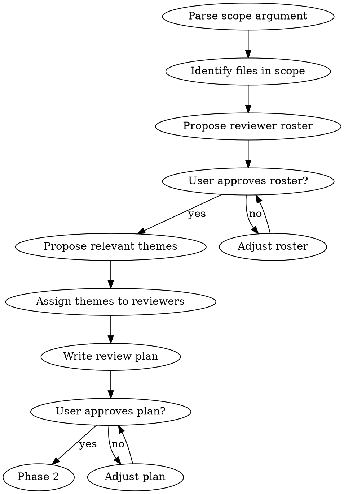
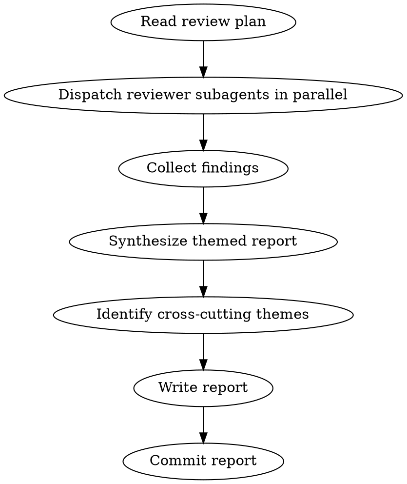

# Review Skill Implementation Plan

> **For Claude:** REQUIRED SUB-SKILL: Use superpowers:executing-plans to implement this plan task-by-task.

**Goal:** Create a `/review` skill that orchestrates comprehensive codebase reviews with selectable reviewer personas and themed reports.

**Architecture:** Two-phase skill (plan → execute). Reuses persona files from a shared `.agents/team/` directory (moved from `.agents/skills/refactor/team/`). Dispatches parallel reviewer subagents per theme, synthesizes findings into a themed report in `docs/reviews/`.

**Tech Stack:** Claude Code skills (SKILL.md), persona markdown files, git

---

### Task 1: Move persona files to shared `.agents/team/` directory

**Files:**
- Move: `.agents/skills/refactor/team/guardian.md` → `.agents/team/guardian.md`
- Move: `.agents/skills/refactor/team/implementer.md` → `.agents/team/implementer.md`
- Move: `.agents/skills/refactor/team/migrator.md` → `.agents/team/migrator.md`
- Move: `.agents/skills/refactor/team/pl-theorist.md` → `.agents/team/pl-theorist.md`
- Move: `.agents/skills/refactor/team/compiler-engineer.md` → `.agents/team/compiler-engineer.md`
- Move: `.agents/skills/refactor/team/physicist.md` → `.agents/team/physicist.md`
- Move: `.agents/skills/refactor/team/documenter.md` → `.agents/team/documenter.md`
- Move: `.agents/skills/refactor/team/templates/` → `.agents/team/templates/`

**Step 1: Create shared team directory and move files**

```bash
mkdir -p .agents/team/templates
git mv .agents/skills/refactor/team/guardian.md .agents/team/guardian.md
git mv .agents/skills/refactor/team/implementer.md .agents/team/implementer.md
git mv .agents/skills/refactor/team/migrator.md .agents/team/migrator.md
git mv .agents/skills/refactor/team/pl-theorist.md .agents/team/pl-theorist.md
git mv .agents/skills/refactor/team/compiler-engineer.md .agents/team/compiler-engineer.md
git mv .agents/skills/refactor/team/physicist.md .agents/team/physicist.md
git mv .agents/skills/refactor/team/documenter.md .agents/team/documenter.md
git mv .agents/skills/refactor/team/templates/.gitkeep .agents/team/templates/.gitkeep
```

**Step 2: Remove old empty team directory**

```bash
rmdir .agents/skills/refactor/team/templates
rmdir .agents/skills/refactor/team
```

**Step 3: Verify files exist at new location**

```bash
ls -la .agents/team/
# Expected: 7 .md files + templates/ directory
```

**Step 4: Commit**

```bash
git add -A .agents/team/ .agents/skills/refactor/team/
git commit -m "chore: move persona files to shared .agents/team/ directory"
```

---

### Task 2: Update `/refactor` skill to reference shared team directory

**Files:**
- Modify: `.agents/skills/refactor/SKILL.md`

**Step 1: Update all team file references**

In `.agents/skills/refactor/SKILL.md`, change the Phase 2 persona table paths from `./team/` to `../../team/`:

Find:
```
Read persona files from `./team/` directory. Each file defines a role's background, perspective, and responsibility.
```
Replace with:
```
Read persona files from `../../team/` directory (shared across skills). Each file defines a role's background, perspective, and responsibility.
```

Find the role table entries and update file paths:
```
| Guardian | `./team/guardian.md` | Any cross-crate refactor or visibility change |
| Implementer | `./team/implementer.md` | Always |
| Migrator | `./team/migrator.md` | When downstream crates are affected |
| PL Theorist | `./team/pl-theorist.md` | API/trait redesigns, new abstractions |
| Compiler Engineer | `./team/compiler-engineer.md` | Performance-sensitive changes, derive macro work |
| Physicist | `./team/physicist.md` | Public API changes, prelude changes |
| Documenter | `./team/documenter.md` | When conventions or public API surface change |
```
Replace with:
```
| Guardian | `../../team/guardian.md` | Any cross-crate refactor or visibility change |
| Implementer | `../../team/implementer.md` | Always |
| Migrator | `../../team/migrator.md` | When downstream crates are affected |
| PL Theorist | `../../team/pl-theorist.md` | API/trait redesigns, new abstractions |
| Compiler Engineer | `../../team/compiler-engineer.md` | Performance-sensitive changes, derive macro work |
| Physicist | `../../team/physicist.md` | Public API changes, prelude changes |
| Documenter | `../../team/documenter.md` | When conventions or public API surface change |
```

Also update the Phase 5 template capture path:
```
If yes, save to `./team/templates/<name>.md`:
```
Replace with:
```
If yes, save to `../../team/templates/<name>.md`:
```

**Step 2: Verify the skill reads correctly**

```bash
grep -n "team/" .agents/skills/refactor/SKILL.md
# All references should show ../../team/ (no ./team/ remaining)
```

**Step 3: Commit**

```bash
git add .agents/skills/refactor/SKILL.md
git commit -m "refactor(skills): update /refactor to reference shared .agents/team/ directory"
```

---

### Task 3: Create the `/review` skill SKILL.md

**Files:**
- Create: `.agents/skills/review/SKILL.md`

**Step 1: Create the skill directory**

```bash
mkdir -p .agents/skills/review
```

**Step 2: Write the SKILL.md**

Create `.agents/skills/review/SKILL.md` with the following content:

```markdown
---
name: review
description: Use when wanting a comprehensive codebase review with multiple expert perspectives, after completing a refactor, or when significant work has accumulated on a feature branch
---

# Review

## Overview

Comprehensive codebase review with selectable expert reviewer personas. Two phases: generate a review plan (scope + reviewers + themes), then dispatch parallel reviewer subagents and synthesize a themed report.

**Announce at start:** "I'm using the review skill to orchestrate this codebase review."

**Read-only:** This skill produces review reports. It does NOT modify code.

## When to Use

- Explicit: user invokes `/review <scope>`
- Auto-suggest after `/refactor` completes Phase 4
- Auto-suggest when 10+ commits accumulate on a feature branch since last review

**Don't use for:**
- PR-level code review (use `requesting-code-review`)
- Fixing issues (user decides what to act on, possibly via `/refactor`)
- Implementation planning (use `writing-plans`)

## Scope Types

| Scope | Argument | What's reviewed |
|-------|----------|----------------|
| Full workspace | `full` | All crates |
| Single crate | `<crate-name>` | One crate (e.g., `kirin-ir`) |
| Subsystem | `<subsystem>` | Related crates (see table below) |
| Recent changes | `recent` | `git diff` since last review or merge to main |

### Subsystem Mapping

| Subsystem | Crates |
|-----------|--------|
| `interpreter` | kirin-interpreter, kirin-derive-interpreter |
| `parser` | kirin-chumsky, kirin-chumsky-derive, kirin-chumsky-format |
| `derive` | kirin-derive-core, kirin-derive, kirin-chumsky-derive, kirin-derive-interpreter, kirin-prettyless-derive |
| `ir` | kirin-ir |
| `dialects` | kirin-cf, kirin-scf, kirin-constant, kirin-arith, kirin-bitwise, kirin-cmp, kirin-function |
| `printer` | kirin-prettyless, kirin-prettyless-derive |

## Reviewer Pool

Read persona files from `../../team/` directory.

| Reviewer | File | Expertise | Default for |
|----------|------|-----------|-------------|
| PL Theorist | `../../team/pl-theorist.md` | Formalism, abstraction design, trait boundaries | Abstractions & Type Design |
| Compiler Engineer | `../../team/compiler-engineer.md` | Build graph, error quality, scalability | Performance & Scalability |
| Rust Engineer | `../../team/implementer.md` | Code quality, idioms, safety, patterns | Code Quality & Idioms, Correctness & Safety |
| Physicist | `../../team/physicist.md` | API clarity, naming, learning curve | API Ergonomics & Naming |

**Default roster:** All four for `full` scope. For narrower scopes, propose a relevant subset based on content.

## Review Themes

| Theme | Primary Reviewer | Description |
|-------|-----------------|-------------|
| Correctness & Safety | Rust Engineer | Bugs, unsoundness, missing error handling, unsafe usage |
| Abstractions & Type Design | PL Theorist | Trait boundaries, type-level invariants, compositionality |
| Performance & Scalability | Compiler Engineer | Compilation time, runtime efficiency, build graph, scaling |
| API Ergonomics & Naming | Physicist | API clarity, concept naming, learning curve, composability |
| Code Quality & Idioms | Rust Engineer | Rust patterns, readability, maintainability |

Not all themes apply to every review. Phase 1 proposes which are relevant.

## Phase 1: Review Plan



**Output:** `docs/plans/YYYY-MM-DD-<scope>-review-plan.md`

Plan contents:
1. **Scope**: files in scope, line counts, module structure summary
2. **Reviewer roster**: which reviewers and why
3. **Themes**: which themes apply, assigned primary + optional secondary reviewer
4. **File assignments**: which files each reviewer should focus on

## Phase 2: Execute Review



**REQUIRED SUB-SKILL:** Use superpowers:dispatching-parallel-agents to run reviewers concurrently.

### Reviewer Subagent Prompt Template

For each reviewer, dispatch a subagent with:
1. The reviewer's persona file content (read from `../../team/<persona>.md`)
2. Their assigned themes
3. The files to review (from the plan)
4. Output format instructions:

```
You are reviewing the following files as the [Reviewer Name].

Your assigned themes: [theme list]

For each finding, output in this format:
[severity] finding description — file:line

Severity levels:
- P0: Must fix (bugs, unsoundness, correctness issues)
- P1: Should fix (significant improvements, design issues)
- P2: Nice to have (minor improvements, ergonomic tweaks)
- P3: Informational (observations, notes for future)

Keep your review to 200-400 words. Focus on your assigned themes.
```

### Report Synthesis

After all reviewers return, synthesize into themed report:

1. Group findings by theme (not by reviewer)
2. Within each theme, sort by severity (P0 first)
3. Include reviewer attribution inline: `[P1] finding — file:line [PL Theorist]`
4. Identify cross-cutting themes (patterns across 2+ reviewers/themes)
5. Write summary counts

**Output:** `docs/reviews/YYYY-MM-DD-<scope>-review.md`

### Report Format

```markdown
# <Scope> Review — YYYY-MM-DD

**Scope:** <description>
**Reviewers:** <list>
**Plan:** docs/plans/YYYY-MM-DD-<scope>-review-plan.md

## Correctness & Safety
[P0] <finding> — <file:line> [Reviewer]
[P1] <finding> — <file:line> [Reviewer]

## Abstractions & Type Design
...

## Performance & Scalability
...

## API Ergonomics & Naming
...

## Code Quality & Idioms
...

## Cross-Cutting Themes
1. <theme> — identified by <N> reviewers across <themes>

## Summary
- P0: N issues (must fix)
- P1: N issues (should fix)
- P2: N improvements (nice to have)
- P3: N notes (informational)
```

## Red Flags — STOP

- Modifying any code (this skill is read-only)
- Skipping Phase 1 (user must approve plan before expensive review)
- Dispatching reviewers sequentially instead of in parallel
- Writing findings without file:line references
- Proceeding with review after user rejects the plan

## Integration

**Skills this skill uses:**
- `dispatching-parallel-agents` — run reviewer subagents concurrently
- Persona files from `../../team/` — reviewer role definitions

**Skills that call this skill:**
- `/refactor` Phase 4 — auto-suggests `/review` after refactor completes
- `/finishing-a-development-branch` — could auto-suggest `/review recent` before merge

**Related but distinct:**
- `requesting-code-review` — PR-level review (not codebase-wide)
- `writing-plans` — implementation planning (not review)
```

**Step 3: Validate frontmatter**

```bash
cargo xtask quick-validate .agents/skills/review
```

**Step 4: Commit**

```bash
git add .agents/skills/review/SKILL.md
git commit -m "feat(skills): add /review skill for comprehensive codebase review"
```

---

### Task 4: Ensure `docs/reviews/` directory is tracked

**Files:**
- Create: `docs/reviews/.gitkeep` (if directory only has one file and might be ignored)

**Step 1: Check if docs/reviews/ is gitignored**

```bash
git check-ignore docs/reviews/ 2>/dev/null && echo "IGNORED" || echo "NOT IGNORED"
```

If ignored, the existing `docs/reviews/2026-03-01-codebase-design-review.md` is already tracked somehow. Check:

```bash
git ls-files docs/reviews/
```

**Step 2: If the directory is not tracked or is gitignored, add with force**

```bash
# Only if needed:
git add -f docs/reviews/.gitkeep
```

**Step 3: Commit (only if changes were needed)**

```bash
git add docs/reviews/
git commit -m "chore: ensure docs/reviews/ directory is tracked"
```

---

### Task 5: Final verification

**Step 1: Verify shared team directory structure**

```bash
ls -la .agents/team/
# Expected: guardian.md, implementer.md, migrator.md, pl-theorist.md,
#           compiler-engineer.md, physicist.md, documenter.md, templates/
```

**Step 2: Verify /refactor skill references updated**

```bash
grep -c "./team/" .agents/skills/refactor/SKILL.md
# Expected: 0 (no old-style references remaining)

grep -c "../../team/" .agents/skills/refactor/SKILL.md
# Expected: 9 (7 role paths + 1 directory reference + 1 templates path)
```

**Step 3: Verify /review skill exists and validates**

```bash
cargo xtask quick-validate .agents/skills/review
```

**Step 4: Verify old team directory is removed**

```bash
ls .agents/skills/refactor/team/ 2>/dev/null && echo "STILL EXISTS" || echo "REMOVED OK"
# Expected: REMOVED OK
```

**Step 5: Verify docs/reviews/ exists**

```bash
ls docs/reviews/
# Expected: 2026-03-01-codebase-design-review.md
```
