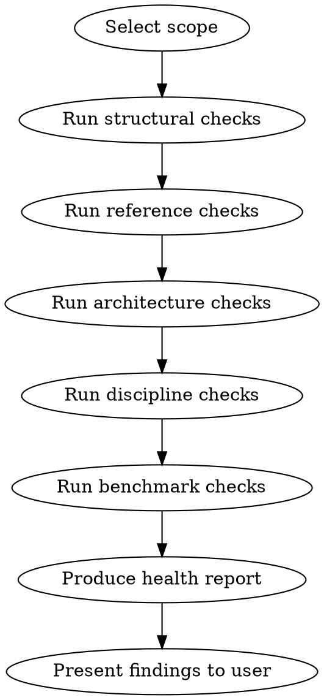

# Skill Health

Audit and maintain local skills as the project evolves. Detects drift, enforces conventions, and tracks benchmark coverage.

**Key principle:** Skills are living documents. As the project changes (crate renames, new conventions, architecture shifts), skills go stale. This skill catches that before it causes compliance failures.

## Target

Skill(s) to audit: **$ARGUMENTS**

If `all`, audit every skill in the skills directory. If a specific skill name, audit only that one. If not provided, ask what to audit.

## Health Check Categories

### 1. Structural Health

For each skill, verify:

| Check | Pass Condition |
|-------|---------------|
| Frontmatter `name` | Present, matches directory name, lowercase+hyphens only |
| Frontmatter `description` | Present, starts with "Use when", third person, no workflow summary, <1024 chars |
| `effort` field | Present on orchestrators (Layer 4) and review skills (Layer 3) |
| `argument-hint` | Present if skill accepts arguments |
| Line count | SKILL.md under 500 lines |
| Supporting files | Heavy content (>100 lines inline) extracted to supporting files |
| No `Announce at start` | Agents do this from the description — inline announcement wastes tokens |

### 2. Reference Health

| Check | Pass Condition |
|-------|---------------|
| No hardcoded project paths | No `docs/review/`, `crates/kirin-*`, `tests/roundtrip/` etc. — reference AGENTS.md |
| No hardcoded persona paths | Personas referenced by name, not by `../../.agents/team/` paths |
| Skill cross-references | Use "load the `X` skill" pattern, not `/X` or `superpowers:X` |
| AGENTS.md references valid | Sections referenced in skill actually exist in current AGENTS.md |
| Crate names current | Any crate names mentioned still exist in the workspace |

### 3. Architecture Health

| Check | Pass Condition |
|-------|---------------|
| Layer assignment | Skill is at the correct layer per AGENTS.md Skill Architecture |
| Composition rules | Layer 3 skills are read-only (no code modification). Layer 4 composes lower layers. |
| No layer violations | Lower layers don't load higher layers |
| Review skills don't implement | Layer 3 skills end with "Next Steps" pointer, not implementation dispatch |

### 4. Discipline Health (for skills with Red Flags)

| Check | Pass Condition |
|-------|---------------|
| Red Flags present | Skills with phases/gates have a Red Flags section |
| Rationalization table | Discipline-enforcing skills have a rationalization table |
| Rationalizations address real failures | Each entry maps to an observed baseline failure, not hypothetical |
| Edge cases concrete | Rationalization "Reality" column uses specific examples, not abstract claims |

### 5. Benchmark Health

| Check | Pass Condition |
|-------|---------------|
| Pressure scenarios exist | Skill has been tested with at least 3 pressure scenarios (RED phase) |
| GREEN compliance recorded | Benchmark results documented |
| Benchmark recency | Benchmark run after most recent significant skill change |

## Process



### Running Checks

For each skill in scope:

1. Read the SKILL.md and all supporting files
2. Run each check category against the content
3. Classify each failed check:
   - **Error** — Must fix. Skill is broken or violates a hard rule.
   - **Warning** — Should fix. Skill works but drifted from conventions.
   - **Info** — Optional. Improvement opportunity.

### Producing the Report

Output a per-skill health summary:

```
## <skill-name> — <pass/warn/fail>

**Structural:** 7/7 pass
**Reference:** 4/5 pass
  - [Warning] Line 42: hardcoded path `docs/review/` — reference AGENTS.md instead
**Architecture:** 3/3 pass
**Discipline:** 2/3 pass
  - [Warning] Rationalization table missing entry for observed baseline failure: "skip pre-flight for simple renames"
**Benchmark:** 0/3 pass
  - [Error] No pressure scenarios recorded for this skill
```

For `all` audits, also produce a summary table:

```
| Skill | Structural | Reference | Architecture | Discipline | Benchmark | Status |
|-------|-----------|-----------|-------------|-----------|-----------|--------|
| triage-review | 7/7 | 5/5 | 3/3 | 3/3 | 3/3 | PASS |
| dialect-dev | 7/7 | 5/5 | 3/3 | 3/3 | 3/3 | PASS |
| refactor | 7/7 | 5/5 | 3/3 | 2/3 | 0/3 | WARN |
| feature-dev | 6/7 | 5/5 | 3/3 | 2/3 | 0/3 | WARN |
```

## When to Run

- **After project restructuring** — crate renames, directory moves, AGENTS.md changes
- **After modifying a skill** — verify the change didn't introduce drift
- **After creating a new skill** — verify it follows all conventions
- **Periodically** — monthly or after 10+ commits to skills/
- **Before a triage-review** — ensure review skill itself is healthy

## Red Flags — STOP

- Silently ignoring check failures instead of reporting them
- Modifying skills during the audit (this skill is read-only — report, don't fix)
- Skipping benchmark health because "testing is separate" — benchmark coverage is part of skill health
- Reporting a skill as PASS when it has unrecorded pressure scenarios

## Rationalization Table

| Temptation | Rationalization | Reality |
|-----------|----------------|---------|
| Skip benchmark checks | "Pressure testing is a separate activity" | Untested skills have ~33% compliance. A skill without benchmarks is a skill you hope works. |
| Auto-fix during audit | "I can see the fix, just do it" | Audit and fix are separate concerns. Fixing during audit risks introducing new issues without the user's review. Report findings, let the user decide. |
| Mark warnings as info | "It still works" | Warnings accumulate into drift. Today's warning is tomorrow's failure when the project changes again. |

## Integration

This skill is a **Layer 1 primitive** — it serves all other skills.

**Position in the skill lifecycle:**

```
ion-cli (scaffold) → skill-creator (draft, eval, benchmark) → skill-health (audit conventions)
```

`skill-creator` ensures the skill **works** (triggers, compliance, benchmarks). This skill ensures the skill **fits the project** (layer, references, conventions). Run this after `skill-creator` finishes, or periodically on existing skills.

**Skills this skill audits:** All local skills in the skills directory.

**When benchmark checks fail:** Use the `skill-creator` skill (external, managed via ion-cli) to run or re-run pressure scenario benchmarks. This skill detects missing benchmarks; `skill-creator` produces them.

**Skills that should trigger this skill:**
- After finishing skill creation/iteration with `skill-creator`, run health check
- After creating a new skill with `ion skill new`, run health check on it
