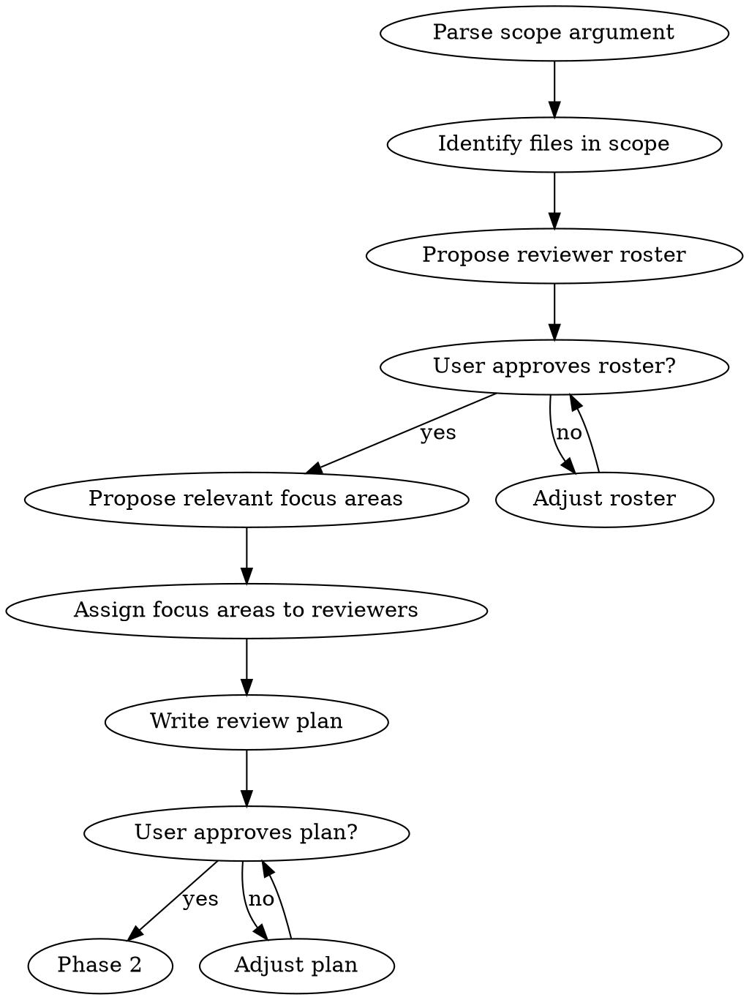
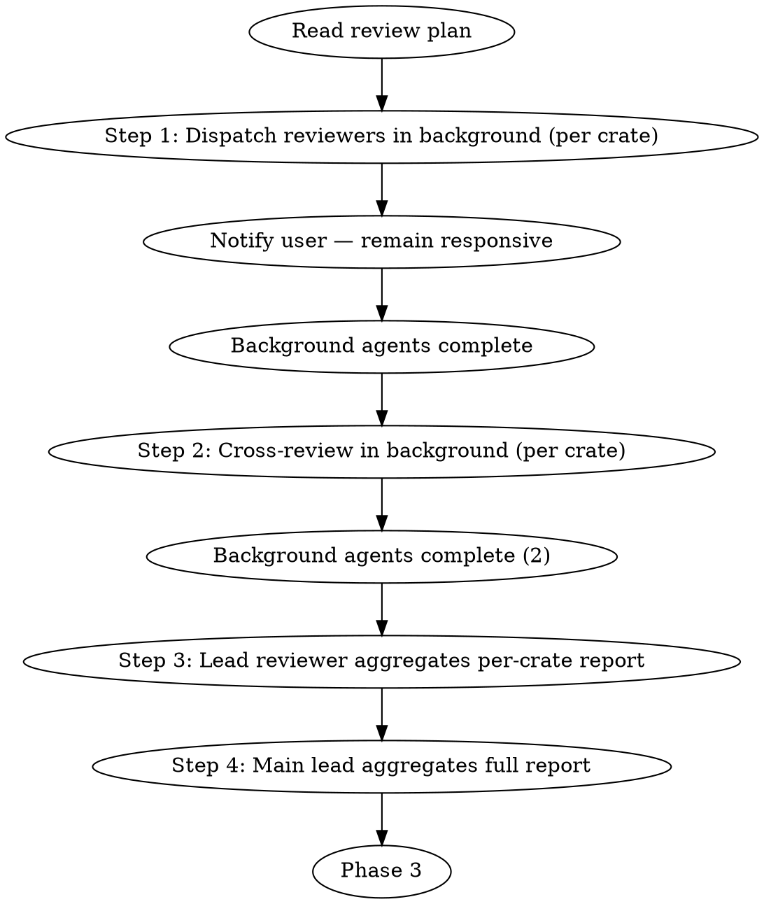
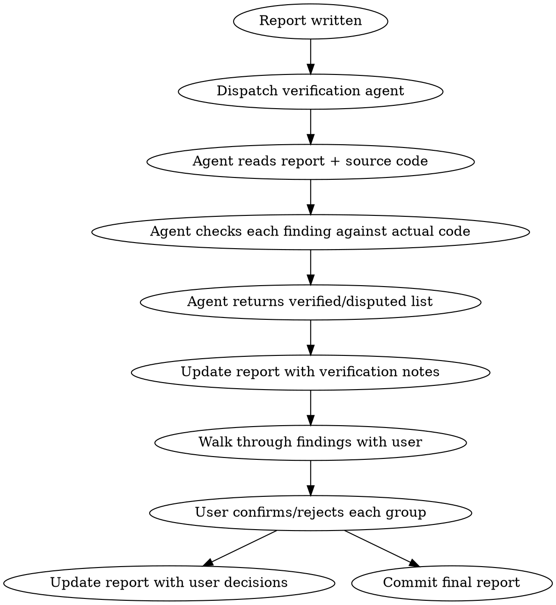

# Triage Review

## Overview

Comprehensive codebase review with three core reviewer roles (**Formalism**, **Code Quality**, **Ergonomics/DX**) plus optional domain-parameterized reviewers (**Dialect Author**, **Compiler Engineer**). Four phases: generate a review plan, execute parallel per-crate reviews with a cross-review validation step, aggregate into a final report, then verify findings and walk through them with the user.

**Announce at start:** State which skill is being used so the user knows what process is driving behavior.

**Read-only:** This skill produces review reports. It does NOT modify code.

## When to Use

- Explicit: user invokes `/triage-review <scope>`
- Auto-suggest after the `refactor` skill completes Phase 4
- Auto-suggest when 10+ commits accumulate on a feature branch since last review

**Don't use for:**
- PR-level code review (use `requesting-code-review`)
- Fixing issues (user decides what to act on, possibly by loading the `refactor` skill)
- Implementation planning (use `writing-plans`)

## Scope

The review scope is: **$ARGUMENTS**

If no scope was provided, ask the user what to review.

| Scope | Argument | What's reviewed |
|-------|----------|----------------|
| Full workspace | `full` | All crates |
| Single crate | `<crate-name>` | One crate (e.g., `kirin-ir`) |
| Subsystem | `<subsystem>` | Related crates (see table below) |
| Recent changes | `recent` | `git diff` since last review or merge to main |

### Subsystem Mapping

Refer to the **Subsystem Groupings** table in AGENTS.md for the current crate-to-subsystem mapping.

## Reviewer Roles

Read persona files from the team directory (see AGENTS.md Project structure for location).

| Role | Persona | Focus Areas | Mandate |
|------|---------|-------------|---------|
| Formalism | PL Theorist | Abstraction composability, literature alignment, syntax/API/semantic ambiguity | Propose 2-3 alternative formalisms per significant finding; compare with concrete metrics; reason in formal logic, PL theory, or math |
| Code Quality | Implementer (review mode) | Clippy workaround investigation, duplication analysis, Rust best practices | Investigate every `#[allow]` annotation; reference Formalism findings for abstraction opportunities during cross-review |
| Ergonomics/DX | Physicist | User repetition, lifetime complexity, concept budget | Test public APIs in toy scenarios; explore edge cases; report both findings AND use cases tried |

**Default roster:** All three for `full` scope. For narrower scopes, propose a relevant subset.

**Optional reviewers** (include when relevant to scope):

| Role | Persona | When to Include |
|------|---------|-----------------|
| Compiler Engineer | Compiler Engineer | Derive macros, crate graph changes, performance-sensitive paths |
| Dialect Author | Dialect Author | Dialect crates, framework API changes that affect dialect authors |
| Soundness Adversary | Soundness Adversary | Builder APIs, arena/ID code, interpreter core, unsafe code, finalization paths |

The **Dialect Author** is a domain-parameterized role — their domain expertise is injected at dispatch time. Refer to the **Dialect Domain Context** table in AGENTS.md for known crate-to-domain mappings. For crates not in that table, ask the user during Phase 1 what domain background the reviewer should have.

The **Soundness Adversary** focuses on invariant violations — they try to break the framework through adversarial API usage. Include when reviewing builder APIs, arena/ID code, interpreter core, or any code with `unsafe`. In read-only mode (triage-review), they describe attack sequences. In test-writing mode (load the `test-coverage-review` skill), they write adversarial tests.

## Phase 1: Review Plan



**Output:** Save to the plans directory (see AGENTS.md Project structure) as `YYYY-MM-DD-<scope>-review-plan.md`.

Plan contents:
1. **Scope**: files in scope, line counts, module structure summary
2. **Reviewer roster**: which reviewers and why (for narrower scopes, drop reviewers whose focus areas don't apply)
3. **Focus areas**: which areas apply per reviewer, per crate
4. **File assignments**: which files each reviewer should focus on
5. **Design context**: which AGENTS.md convention sections are relevant to this scope (included in reviewer prompts to prevent false positives)
6. **Hypothesis registry** (if applicable): when the user arrives with suspected issues, register each as a hypothesis to **confirm or deny with evidence** — not as a starting assumption. Reviewers test hypotheses alongside their independent analysis. A hypothesis like "builder duplication" gets quantified: which functions, how many lines, what percentage is truly duplicated vs structurally similar but semantically different.

## Phase 2: Execute Review



**REQUIRED:** Load the `dispatching-parallel-agents` skill to run reviewers concurrently.

**Path convention:** In the prompts below, `<review-dir>` refers to the review output directory defined in AGENTS.md Project structure. Resolve it once at the start of Phase 2.

**Maximize parallelism:** Within each step, all reviewers for all crates run in parallel. Steps are sequential (Step 2 depends on Step 1 outputs, etc.).

### Execution Model: Agent Teams (preferred) or Background Agents

The review team MUST run non-blocking so the user can continue interacting with the main agent during the review.

#### Option A: Agent Teams (preferred when TeamCreate is available)

Use `TeamCreate` to create a review team, then spawn reviewer teammates. This gives structured coordination via shared task lists and message passing.

**Setup:**
1. Create a team: `TeamCreate(team_name: "triage-review-<scope>", description: "Triage review of <scope>")`
2. Create tasks for each reviewer assignment using `TaskCreate` (one task per reviewer-per-crate in Step 1, one per cross-review in Step 2, etc.)
3. Spawn reviewer agents as teammates using `Agent(team_name: "triage-review-<scope>", name: "<role>-<crate>", run_in_background: true, ...)`
4. Teammates pick up tasks from the shared task list, mark them complete, and go idle
5. As teammates complete Step 1 tasks, create Step 2 (cross-review) tasks — teammates will pick them up automatically
6. After all work is done, send shutdown messages to all teammates and call `TeamDelete`

**Team coordination benefits:**
- Teammates can discover each other via the team config and send DMs for cross-review coordination
- Shared task list provides clear visibility into progress
- The main agent (you) acts as team lead — creating tasks, monitoring progress, and aggregating results

#### Option B: Background Agents (fallback)

If `TeamCreate` is not available, dispatch agents with `run_in_background: true` directly.

**After dispatching background agents:**
1. Tell the user how many agents were dispatched and what they're doing
2. Tell the user they can continue working — you will notify them when results arrive
3. Do NOT block waiting for agents. Continue responding to user messages normally.
4. When a background agent completes, you will be automatically notified. Acknowledge completion and proceed to the next step when all agents in the current step are done.
5. Between steps, briefly summarize what was completed before dispatching the next batch.

#### Common rules (both options)

**Naming convention:** Give each agent a descriptive name (e.g., `formalism-kirin-ir`, `code-quality-kirin-chumsky`) so progress notifications are meaningful to the user.

**Non-blocking requirement:** The user MUST be able to interact with the main agent at all times during the review. Never block on agent completion.

### Step 1: Initial Review (Background, Parallel)

Dispatch all assigned reviewers in parallel for each crate or crate group, using `run_in_background: true` on each Agent call. Each reviewer produces one report file.

**Output per reviewer:** Save to the review directory (see AGENTS.md Project structure) under `<datetime>/<crate>/<role>-<title>.md`.

#### Design context block

Before dispatching, read the project's `AGENTS.md` (specifically the conventions sections relevant to the scope). Include the relevant sections verbatim in each reviewer's prompt as a **Design Context** block. This prevents reviewers from flagging intentional patterns as issues.

#### Reviewer prompts

Construct each reviewer's prompt using the templates in `prompts/reviewer-prompts.md`. Each prompt combines:
1. The reviewer's persona content (from the team directory)
2. Role-specific focus areas (from the prompts file)
3. Design context (relevant AGENTS.md sections)
4. Confidence and severity levels (from `prompts/confidence-and-severity.md`)
5. File assignments and output path from the plan

### Step 2: Cross-Review (Background, Parallel)

After all initial reviews for a crate are complete, dispatch each reviewer with `run_in_background: true` to read the other reviewers' reports for the same crate.

**Purpose:** Catch false positives, calibrate severity, and surface cross-cutting insights that only become visible when findings from different perspectives are compared.

**Output per reviewer:** `<review-dir>/<datetime>/<crate>/<role>-cross-review.md`

Construct cross-review prompts using the template in `prompts/cross-review.md`. The Code Quality reviewer gets an additional section for formalism-informed duplication analysis.

### Step 3: Lead Reviewer Aggregation (Per-Crate)

**Lead assignment:** The Formalism reviewer is the per-crate lead by default. If Formalism is not in the roster, use Code Quality. The main lead for the full report (Step 4) is always the orchestrating agent (you), not a subagent.

For each crate, the lead reviewer reads all initial reviews and cross-review notes, then produces a consolidated report. Dispatch per-crate leads with `run_in_background: true` when there are 3+ crates to aggregate.

**Output:** `<review-dir>/<datetime>/<crate>/final-report.md`

The lead reviewer MUST:
1. **Resolve disagreements** — remove findings with cross-review consensus against them. Surface unresolved disputes with both perspectives.
2. **Adjust severities** — apply cross-review suggestions.
3. **Remove duplicates** — merge independently-flagged findings.
4. **Add clarity** — each finding needs a clear explanation, code example, and specific suggested action.
5. **Organize** — by severity (P0 first), then by focus area.
6. **Include strengths** — note what the crate does well.

Use the per-crate report format from `prompts/report-formats.md`.

### Step 4: Full Report Aggregation

After all per-crate final reports are complete, produce the workspace-level report.

**Output:** `<review-dir>/<datetime>/report.md`

The full report MUST:
1. **Aggregate** findings from all per-crate reports, organized by priority
2. **Include code references** — every finding must cite `file:line`
3. **Include external references** — clippy lint docs, Rust API guidelines, papers, MLIR docs
4. **Executive summary** — severity counts, key themes, architectural strengths
5. **Cross-cutting themes** — patterns across multiple crates
6. **Priority-ordered action items** — Quick Wins / Moderate Effort / Design Work / Documentation

Use the full report format from `prompts/report-formats.md`.

## Phase 3: Verify & Confirm

After the full report is written, verify findings and walk through them with the user.



### Step 1: Verification Agent

Dispatch a background agent (`run_in_background: true`) to double-check the review. Tell the user verification is underway and they can continue working. The agent must:

1. Read the full report from `<review-dir>/<datetime>/report.md`
2. For each finding, read the actual source code at the cited `file:line`
3. Verify:
   - Does the code at the cited location actually match what the finding describes?
   - Is the finding technically accurate (not based on a misreading of the code)?
   - Is the severity appropriate given the confidence level?
   - Does the finding duplicate or contradict another finding in the same report?
4. Return a list of findings with verification status:
   - **verified**: Code matches description, finding is technically accurate
   - **disputed**: Code does not match description, or finding is technically incorrect (include explanation)
   - **downgrade**: Finding is accurate but severity is too high (suggest new severity)

Any finding marked **disputed** is removed from the report and moved to **Filtered Findings** with the verification agent's explanation.

Any finding marked **downgrade** has its severity adjusted.

#### Verification agent prompt

```
You are a verification agent. Your job is to fact-check a code review report.

Read the review report at [report path]. For each finding:
1. Read the source file at the cited location
2. Check: does the code actually exhibit the described issue?
3. Check: is the severity appropriate?

Output for each finding:
- [finding identifier] — verified | disputed | downgrade
- If disputed: explain what the code actually does vs what the finding claims
- If downgrade: suggest new severity and explain why

Be precise. Only dispute findings where the code clearly contradicts the claim.
Do NOT dispute findings based on design opinions — only factual errors.
```

### Step 2: User Walkthrough

After verification, present findings to the user in batches using `AskUserQuestion`. Group findings by severity tier.

#### Walkthrough procedure

1. **P0/P1 findings** (if any): Present each individually. These are high-impact and need per-finding confirmation.

2. **P2 findings**: Present as sequential single-select questions, each with a preview.

3. **P3 findings**: Present as sequential single-select questions, each with a preview.

#### Illustration requirement

Every option presented to the user **MUST** include a `markdown` preview using `AskUserQuestion`'s two-column layout (option list on left, preview on right). The preview should contain one of:

- **Improvement example**: A before/after code snippet showing what the fix would look like. Prefer this when the fix is concrete and small.
- **Source reference**: The actual source code at the cited location with an annotation showing the issue. Use this when the finding is observational or the fix is ambiguous.

The user should be able to understand the finding entirely from the preview without needing to go read the source file themselves.

##### Conciseness constraint (IMPORTANT)

The right-hand preview panel has limited vertical space. **Keep previews to 15 lines or fewer.** To achieve this:

1. **Show only the relevant lines** — not the entire function. Use `...` to elide context above/below the change.
2. **For before/after**: Show only the changed lines with 1-2 lines of surrounding context. Use a single code block with a `// before:` / `// after:` separator instead of two full function bodies.
3. **For source references**: Show only the lines that exhibit the issue (3-8 lines), with a `⚠` annotation on the key line.
4. **Omit boilerplate**: Drop `pub fn` signatures, `impl` blocks, and other framing unless they are the point of the finding.
5. **Use ellipsis for elided code**: `// ...` for omitted lines within a block.

If you cannot convey the finding in 15 lines, split it: put a 1-sentence plain text summary above the code block.

**Example of a good preview (improvement example, 8 lines):**
````markdown
```rust
// builder/block.rs:53 — add guard for misuse
// before:
    if let Some(last) = self.arguments.last_mut() {
// after:
    debug_assert!(!self.arguments.is_empty(),
        "arg_name() called without preceding argument()");
    if let Some(last) = self.arguments.last_mut() {
```
````

**Example of a good preview (source reference, 9 lines):**
````markdown
```rust
// signature/semantics.rs:92-102
fn applicable(call: &Signature<T>, cand: &Signature<T>) -> Option<()> {
    // ⚠ checks params but NOT ret or constraints
    // ExactSemantics checks both at line 61
    (call.params.len() == cand.params.len())
        .then(|| ...)?;
    for (call_param, cand_param) in ... { /* subtype check */ }
    Some(())
}
```
````

#### Question format

For P0/P1 (one per finding, single-select with preview):
```
question: "[P0] [confirmed] <finding summary> — <file:line>"
options:
  - label: "Accept"
    markdown: <improvement example or source reference>
  - label: "Won't Fix"
    description: "Provide rationale"
  - label: "Needs Discussion"
    description: "Want to discuss before deciding"
```

For P2/P3 (one question per finding with preview):
```
question: "[P2] <finding summary> — <file:line>"
options:
  - label: "Accept"
    markdown: <improvement example or source reference>
  - label: "Won't Fix"
    description: "Not worth addressing"
```

Batch up to 4 findings per `AskUserQuestion` call. Each question gets its own preview.

#### After walkthrough

1. Update the report: mark user-rejected findings with `[Won't Fix]` and the user's rationale
2. Move fully rejected findings to the **Filtered Findings** section
3. Update the **Summary** counts to reflect final accepted findings
4. Commit the final report

**The report is not considered complete until the user has walked through all findings.**

## Red Flags — STOP

- Modifying any code (this skill is read-only)
- Skipping Phase 1 (user must approve plan before expensive review)
- Dispatching reviewers sequentially instead of in parallel
- Dispatching reviewers in foreground (blocking) instead of background — user must remain able to interact
- Writing findings without file:line references
- Proceeding with review after user rejects the plan
- Assigning P0/P1 to a finding with "uncertain" confidence
- Omitting design context from reviewer prompts (causes false positives on intentional patterns)
- Skipping Phase 3 verification (unverified findings waste the user's time)
- Committing the report before user walkthrough is complete
- Skipping the cross-review step
- Code Quality reviewer not referencing Formalism findings during cross-review
- Ergonomics reviewer not including toy scenario code in their report
- Full report missing external references or code locations

## Rationalization Table

| Temptation | Rationalization | Reality |
|-----------|----------------|---------|
| Skip cross-review | "Reviewers already covered each other's areas" | Cross-review catches false positives that propagate into the final report and waste the user's time during walkthrough. Different perspectives catch different errors. |
| Combine cross-review with aggregation | "More efficient as a single pass" | Aggregation without cross-review means false positives, duplicate findings, and uncalibrated severities all pass through. Two distinct steps, always. |
| Skip design context in prompts | "The reviewer will figure out what's intentional" | Without design context, reviewers flag 30-50% intentional patterns as issues. The user wastes walkthrough time on false positives. |
| Skip verification agent | "The reviewers were thorough" | Reviewers describe code from memory. The verification agent reads actual source and catches misquoted line numbers, stale references, and misread logic. |
| Rush through P3 walkthrough | "P3 is low priority, just accept them all" | P3 findings accumulate into technical debt. The walkthrough is where the user decides which are worth tracking vs discarding. |
| Assign P1 to uncertain finding | "It looks serious even though I'm not sure" | Uncertain P1 findings undermine trust in the report. Downgrade to P2 and phrase as a question. |
| Organize review around user's suspected issues | "The user already knows what's wrong, just confirm it" | Confirmation bias. User suspicions become hypotheses to test, not the review's structure. Independent reviewer analysis discovers issues the user doesn't suspect. The previous review found its highest-value findings in areas nobody expected. |
| Dispatch reviewers in foreground | "I need to wait for them anyway before the next step" | Foreground dispatch blocks the user from interacting with the main agent. Big reviews take minutes — the user should be free to ask questions, work on other things, or provide context while reviewers work in background. |

## Next Steps (After Review)

This skill is **read-only** — it produces a report with prioritized, verified findings. It does not implement fixes. See AGENTS.md Skill Architecture for the composition model.

To act on findings:
- **Direct fixes**: Load the `refactor` skill with the review report as input
- **Design work**: Load the `brainstorming` skill, then the `writing-plans` skill
- **Quick wins**: Fix them directly — no skill needed for small, obvious changes

## Integration

**Skills this skill uses (load when needed):**
- The `dispatching-parallel-agents` skill — run reviewer subagents concurrently (Phase 2)
- The `rust-best-practices` skill — referenced by Code Quality reviewer
- Persona files from the team directory (see AGENTS.md Project structure)

**Tools this skill uses:**
- `TeamCreate` / `TeamDelete` — preferred execution model for Phase 2 (agent teams with shared task lists)
- `Agent` with `run_in_background: true` — fallback execution model when teams are unavailable

**Skills that load this skill:**
- The `refactor` skill — loads triage-review for its review phase
- The `finishing-a-development-branch` skill — may suggest `triage-review recent` before merge

**Related but distinct:**
- The `requesting-code-review` skill — PR-level review (not codebase-wide)
- The `test-coverage-review` skill — discovers issues by writing tests (complementary)
